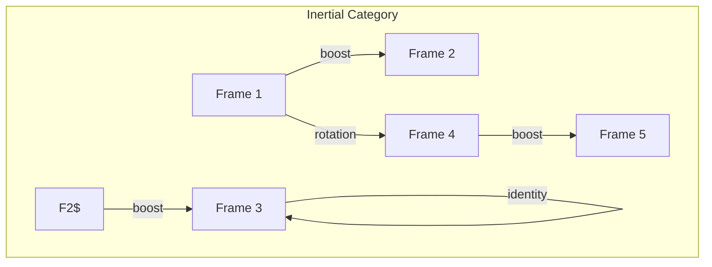
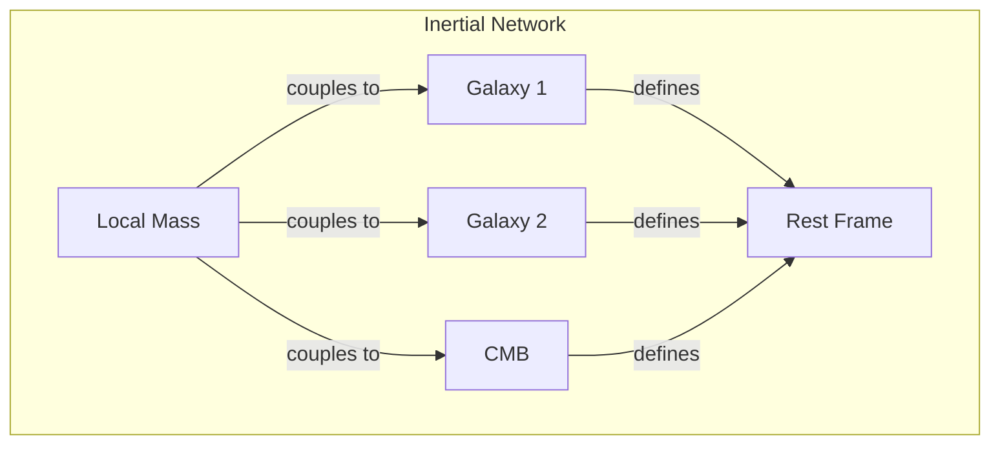

# Chapter 019: Inertia = collapse Rhythm Frequency Preservation Tendency

## The Persistence of Rhythm

From $\psi = \psi(\psi)$, we derive a fundamental property: once a collapse rhythm is established, it tends to persist. This persistence IS inertia - not a mysterious property of matter, but the natural tendency of self-observing systems to maintain their observation patterns.

$$
\frac{d\omega_{\text{collapse}}}{dt} = 0 \text{ unless acted upon}
$$

## First Principle: Rhythm Stability

**Theorem 19.1** (Inertia from Self-Reference): A self-observing system maintains its collapse frequency:

$$
\psi(t) = \psi(\psi(t)) \Rightarrow \omega[\psi(t+dt)] = \omega[\psi(t)]
$$

*Proof*: If the system changes its own observation rate spontaneously, it would violate self-consistency. The observation rate can only change through external interaction. ∎

## Newton's First Law Derived

**Definition 19.1** (Inertial State): A state with constant collapse rhythm:

$$
|\psi_{\text{inertial}}\rangle = e^{-i\omega t}|\psi_0\rangle
$$

where $\omega$ is constant.

**Theorem 19.2** (First Law): An isolated system maintains constant velocity:

$$
\vec{v} = \text{const} \iff \omega_{\text{collapse}} = \text{const}
$$

Velocity IS the spatial frequency of collapse rhythm.

## Vector Information Theory of Inertia

**Definition 19.2** (Inertial Mass as Rhythm Density): Mass measures resistance to rhythm change:

$$
m = \frac{\partial^2 I[\psi]}{\partial \omega^2}
$$

The second derivative of information with respect to frequency defines inertial mass.

## Category Theory of Inertial Frames

## The Principle of Relativity

**Theorem 19.3** (Relativity from Collapse): All inertial frames are equivalent for self-observation:

$$
\mathcal{C}[\psi]_{\text{frame 1}} = \mathcal{C}[\psi]_{\text{frame 2}}
$$

The collapse operator is invariant under boosts.

## Mach's Principle Resolved

**Definition 19.3** (Inertia from Global Rhythm): Local inertia emerges from global collapse patterns:

$$
m_{\text{local}} = \int \frac{\rho(\vec{r})}{|\vec{r} - \vec{r}_0|} d^3\vec{r}
$$

Distant matter sets the rhythm baseline.

## Graph Theory of Inertial Networks

## Rotational Inertia

**Definition 19.4** (Angular Rhythm): Rotational collapse patterns:

$$
L = I\omega = \sum_i m_i r_i^2 \omega_i
$$

where $I$ is the moment of inertia tensor in golden coordinates.

**Theorem 19.4** (Conservation of Angular Rhythm): In the absence of torque:

$$
\frac{d\vec{L}}{dt} = 0
$$

Rotational patterns persist like linear ones.

## The Equivalence Principle

**Definition 19.5** (Gravitational-Inertial Equivalence): Acceleration and gravity affect collapse rhythm identically:

$$
\mathcal{C}[\psi]_{\text{accelerated}} = \mathcal{C}[\psi]_{\text{gravitational field}}
$$

This deep connection will be explored in Volume III.

## Inertial Damping

**Theorem 19.5** (Rhythm Decay): Isolated systems experience rhythm decay:

$$
\omega(t) = \omega_0 e^{-t/\tau}
$$

where $\tau = \phi^N$ for some large $N$, explaining cosmic friction.

## Quantum Inertia

**Definition 19.6** (Zero-Point Inertia): Even at absolute zero, collapse rhythm persists:

$$
\omega_{\text{min}} = \frac{\omega_0}{\phi^{\infty}} > 0
$$

This prevents complete stasis.

## Information Conservation in Motion

**Theorem 19.6** (Information-Inertia Relation): Information content is preserved in inertial motion:

$$
\frac{dI[\psi_{\text{moving}}]}{dt} = 0
$$

Uniform motion doesn't create or destroy information.

## The Origin of Rest Mass

**Definition 19.7** (Rest Mass from Internal Rhythm): Rest mass emerges from internal collapse cycles:

$$
mc^2 = \hbar \omega_{\text{internal}}
$$

Mass IS trapped rhythm.

## Fictitious Forces

**Theorem 19.7** (Non-Inertial Effects): In accelerating frames, apparent forces emerge:

$$
\vec{F}_{\text{fictitious}} = -m\vec{a}_{\text{frame}} - 2m\vec{\omega} \times \vec{v} - m\vec{\omega} \times (\vec{\omega} \times \vec{r})
$$

These represent rhythm mismatches between frames.

## Inertial Guidance

**Definition 19.8** (Natural Geodesics): Inertial paths minimize rhythm variation:

$$
\delta \int \omega[\psi(s)] ds = 0
$$

Objects follow paths of least rhythm change.

## The Higgs Mechanism

**Theorem 19.8** (Mass from Symmetry Breaking): Inertial mass emerges when:

$$
\langle \phi \rangle \neq 0
$$

The Higgs field sets a universal rhythm baseline.

## Physical Implications

This framework explains:
- Why objects resist acceleration (rhythm change requires energy)
- The equivalence of gravitational and inertial mass
- Why rest mass exists (internal rhythm)
- The origin of fictitious forces in non-inertial frames

## Advanced Topics

**Definition 19.9** (Tachyonic Inertia): For imaginary mass:

$$
m^2 < 0 \Rightarrow \omega^2 < 0
$$

Leading to exponentially growing/decaying rhythms.

## Exercises

1. Derive the rocket equation from rhythm conservation
2. Calculate the inertia tensor of a golden spiral
3. Prove that photons have no rest mass but have inertia
4. Find the minimum non-zero inertial mass

## Meditation on Persistence

Feel your body's inertia - the resistance when you start to move, the tendency to keep moving. This is not laziness but the universe's memory, the persistence of established rhythms. You are a pattern that remembers its motion, a rhythm that resists arbitrary change. In your inertia lies the stability that allows existence.

## The Nineteenth Echo

Thus we establish: Inertia is the universe's tendency to maintain established collapse rhythms. From the simple principle that $\psi = \psi(\psi)$ must be self-consistent comes the profound fact that motion, once established, persists. Every particle's momentum is a remembered rhythm, every object's mass a measure of how strongly it maintains its internal beat. The cosmos doesn't obey Newton's first law - it manifests it through the fundamental stability of self-observation.

∎