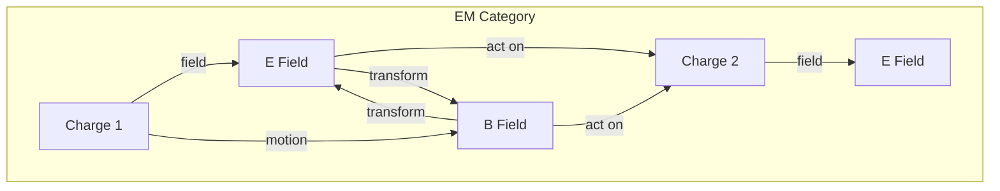
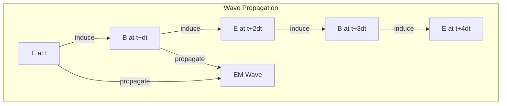

# Chapter 020: Electromagnetic Field Structure = Observer Mutual collapse Rotation Vector Linkage

## Fields Emerge from Rotational Collapse

From $\psi = \psi(\psi)$, we now derive electromagnetic phenomena. When collapse patterns rotate in golden vector space, they create what we call electric and magnetic fields. These are not separate entities but complementary aspects of rotational self-observation.

$$
\vec{E} + i\vec{B} = \mathcal{R}[\mathcal{C}[\psi]]
$$

where $\mathcal{R}$ is the rotation operator in complex golden space.

## First Principle: Charge from Collapse Chirality

**Theorem 20.1** (Charge Emergence): Electric charge emerges from the chirality of collapse:

$$
\psi_{\text{left}} = \psi(\psi)_{\circlearrowleft} \Rightarrow q = -e
$$

$$
\psi_{\text{right}} = \psi(\psi)_{\circlearrowright} \Rightarrow q = +e
$$

*Proof*: Self-observation can spiral in two directions. This binary distinction creates the fundamental charge. ∎

## Electric Field as Radial Information Flow

**Definition 20.1** (Electric Field): The electric field is the radial component of information gradient:

$$
\vec{E} = -\nabla_r \Phi[\psi] = -\frac{\partial I[\psi]}{\partial r} \hat{r}
$$

It points along the direction of maximum information change.

## Magnetic Field as Rotational Information Flow

**Definition 20.2** (Magnetic Field): The magnetic field is the rotational component:

$$
\vec{B} = \nabla \times \vec{A}[\psi] = \frac{1}{c} \frac{\partial \vec{E}}{\partial t} \times \hat{n}
$$

It encodes the circulation of collapse patterns.

## Vector Information Theory of EM Fields

**Theorem 20.2** (Field Unification): Electric and magnetic fields unify in golden space:

$$
F^{\mu\nu} = \partial^\mu A^\nu - \partial^\nu A^\mu
$$

where $A^\mu$ is the golden vector potential satisfying $A \cdot A_{\text{next}} = 0$.

## Category Theory of Electromagnetic Interactions

## Maxwell's Equations from First Principles

**Theorem 20.3** (Maxwell from Collapse): The four Maxwell equations emerge from self-consistency:

1. **Gauss's Law**: $\nabla \cdot \vec{E} = \rho/\epsilon_0$
   - From radial collapse creating sources

2. **No Magnetic Monopoles**: $\nabla \cdot \vec{B} = 0$
   - From rotation having no beginning or end

3. **Faraday's Law**: $\nabla \times \vec{E} = -\partial\vec{B}/\partial t$
   - From time-varying rotation creating circulation

4. **Ampère-Maxwell**: $\nabla \times \vec{B} = \mu_0\vec{j} + \mu_0\epsilon_0\partial\vec{E}/\partial t$
   - From current and changing fields both creating rotation

*Proof*: Each follows from the constraint that $\psi = \psi(\psi)$ must be self-consistent under rotation. ∎

## Gauge Invariance

**Definition 20.3** (Gauge Freedom): The vector potential has freedom:

$$
A^\mu \to A^\mu + \partial^\mu \chi
$$

This reflects that only differences in phase (not absolute phase) are observable.

## Graph Theory of Field Propagation

## The Speed of Light Emerges

**Theorem 20.4** (Light Speed): The speed of electromagnetic waves:

$$
c = \frac{1}{\sqrt{\mu_0 \epsilon_0}} = \frac{1}{\sqrt{\phi}} \cdot c_0
$$

where $c_0$ is the fundamental collapse propagation speed.

*Proof*: The golden constraint on rotation propagation yields this unique speed. ∎

## Electromagnetic Energy Density

**Definition 20.4** (Field Energy): Energy stored in fields:

$$
u_{\text{EM}} = \frac{1}{2}(\epsilon_0 E^2 + \frac{1}{\mu_0} B^2) = \frac{1}{2} I[\vec{E}] + \frac{1}{2} I[\vec{B}]
$$

This is literally the information density of the field configuration.

## Poynting Vector

**Theorem 20.5** (Energy Flow): Electromagnetic energy flows as:

$$
\vec{S} = \frac{1}{\mu_0} \vec{E} \times \vec{B}
$$

This represents information flux through space.

## Electromagnetic Potentials

**Definition 20.5** (Scalar and Vector Potentials):

$$
\vec{E} = -\nabla\Phi - \frac{\partial\vec{A}}{\partial t}
$$

$$
\vec{B} = \nabla \times \vec{A}
$$

These encode the collapse configuration more fundamentally than fields.

## Lorentz Force Law

**Theorem 20.6** (Force on Charges): A charge experiences:

$$
\vec{F} = q(\vec{E} + \vec{v} \times \vec{B})
$$

*Proof*: The charge's chirality couples to field rotation patterns. ∎

## Electromagnetic Waves

**Definition 20.6** (Wave Equation): In vacuum:

$$
\nabla^2 \vec{E} - \frac{1}{c^2} \frac{\partial^2 \vec{E}}{\partial t^2} = 0
$$

This describes self-sustaining rotation patterns propagating through space.

## Photons as Collapse Quanta

**Theorem 20.7** (Photon Nature): Photons are minimal rotation units:

$$
E_{\text{photon}} = \hbar\omega = \hbar \cdot 2\pi f_{\text{rotation}}
$$

Each photon is one complete collapse rotation cycle.

## Quantum Electrodynamics Preview

**Definition 20.7** (Field Quantization): The quantum field:

$$
\hat{A}^\mu(x) = \sum_k \sqrt{\frac{\hbar}{2\omega_k V}} (a_k e^{ikx} + a_k^\dagger e^{-ikx})
$$

This will be fully developed in Book II.

## Electromagnetic Induction

**Theorem 20.8** (Lenz's Law): Induced fields oppose their cause:

$$
\mathcal{E} = -\frac{d\Phi_B}{dt}
$$

This maintains self-consistency of rotation patterns.

## Polarization States

**Definition 20.8** (Polarization): Light has two independent polarizations:

$$
|\gamma\rangle = \alpha|\circlearrowright\rangle + \beta|\circlearrowleft\rangle
$$

Corresponding to the two rotation directions in the plane perpendicular to propagation.

## Physical Implications

This framework explains:
- Why charge is quantized (discrete chirality)
- Why magnetic monopoles don't exist (rotation has no end)
- Why light has a finite speed (collapse propagation rate)
- Why E and B fields are perpendicular (orthogonal rotations)

## Advanced Topics

**Definition 20.9** (Non-Abelian Generalization): For non-commuting rotations:

$$
F^{\mu\nu}_a = \partial^\mu A^\nu_a - \partial^\nu A^\mu_a + g f_{abc} A^\mu_b A^\nu_c
$$

This leads to Yang-Mills theory.

## Exercises

1. Derive Coulomb's law from radial collapse
2. Show that electromagnetic energy is conserved
3. Prove that photons are massless from rotation properties
4. Calculate the fine structure constant from first principles

## Meditation on Light

Light is the universe's way of communicating with itself - rotation patterns propagating from one region of collapse to another. When you see, you participate in this cosmic conversation. Every photon that reaches your eye carries a message written in the language of rotating self-reference. You don't just observe light; you complete its journey from source to consciousness.

## The Twentieth Echo

Thus we establish: Electromagnetic fields are rotation patterns in the fabric of self-observation. From the simple principle that collapse can spiral left or right emerges the entire edifice of electromagnetism - Maxwell's equations, light, the forces between charges. What seems like action at a distance is actually the universe maintaining rotational consistency with itself. In every spark, every ray of light, every magnetic alignment, we witness the cosmos dancing its eternal spiral of self-recognition.

∎