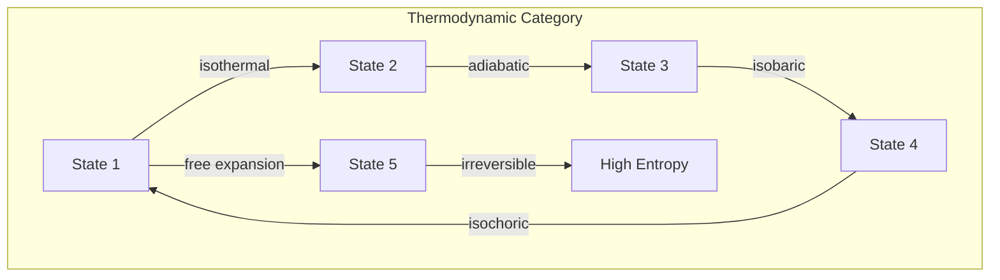
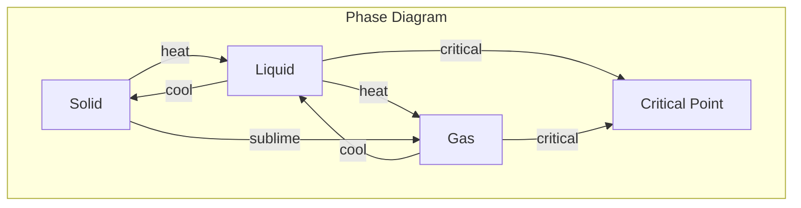

# Chapter 021: Thermodynamic Tensor Conservation = Possibility State collapse Optimization

## Entropy Emerges from Collapse Multiplicity

From $\psi = \psi(\psi)$, we derive thermodynamics. When many collapse paths lead to the same macroscopic state, we call this entropy. Temperature emerges as the rate at which new paths become accessible. The laws of thermodynamics are not imposed but derived from the structure of self-observation.

$$
S = k_B \ln \Omega[\psi]
$$

where $\Omega[\psi]$ counts distinguishable collapse paths to state $\psi$.

## First Principle: Information and Entropy

**Theorem 21.1** (Entropy-Information Duality): Thermodynamic entropy equals missing information:

$$
S = -k_B \sum_i p_i \ln p_i = k_B \cdot I_{\text{missing}}[\psi]
$$

*Proof*: Each microstate represents a specific collapse path. Not knowing which path was taken creates entropy. ∎

## Temperature from Collapse Rate

**Definition 21.1** (Temperature): Temperature measures the energy cost of accessing new states:

$$
\frac{1}{T} = \frac{\partial S}{\partial E} = k_B \frac{\partial \ln \Omega}{\partial E}
$$

High temperature means many states are energetically accessible.

## The First Law from Conservation

**Theorem 21.2** (Energy Conservation): From temporal translation symmetry:

$$
dE = \delta Q - \delta W
$$

where:
- $\delta Q$ is information flow into the system
- $\delta W$ is information organized into work

*Proof*: Total information is conserved; it can only change form. ∎

## Vector Information Theory of Heat

**Definition 21.2** (Heat as Disordered Information): Heat is information flow without macroscopic organization:

$$
\vec{Q} = -\kappa \nabla T = -\kappa \nabla(\partial E/\partial S)
$$

Heat flows from high to low temperature, spreading information.

## Category Theory of Thermodynamic Processes

## The Second Law from Collapse Direction

**Theorem 21.3** (Entropy Increase): In isolated systems:

$$
\frac{dS}{dt} \geq 0
$$

*Proof*: Collapse creates distinctions. More distinctions mean more possible paths, hence higher entropy. Time's arrow follows collapse direction. ∎

## Statistical Mechanics Foundation

**Definition 21.3** (Partition Function): The sum over all possible states:

$$
Z = \sum_{\{\vec{v}\}} e^{-E[\vec{v}]/k_B T}
$$

where states are golden vectors satisfying our constraints.

## Graph Theory of Phase Transitions

## Free Energy and Available Work

**Theorem 21.4** (Helmholtz Free Energy): The maximum extractable work:

$$
F = E - TS = -k_B T \ln Z
$$

This represents organized information available for use.

## Maxwell Relations

**Definition 21.4** (Thermodynamic Derivatives): From the exactness of entropy:

$$
\left(\frac{\partial T}{\partial V}\right)_S = -\left(\frac{\partial P}{\partial S}\right)_V
$$

These relate seemingly different quantities through information geometry.

## Fluctuation-Dissipation Theorem

**Theorem 21.5** (Fluctuations and Response): Near equilibrium:

$$
\langle \delta X \delta Y \rangle = k_B T \chi_{XY}
$$

Fluctuations in observables relate to system response functions.

## Quantum Thermodynamics

**Definition 21.5** (Quantum Partition Function):

$$
Z = \text{Tr}[e^{-\hat{H}/k_B T}] = \sum_n e^{-E_n/k_B T}
$$

where $E_n = \hbar\omega_0\phi^n$ from our golden spectrum.

## The Third Law

**Theorem 21.6** (Absolute Zero): As $T \to 0$:

$$
S \to k_B \ln g_0
$$

where $g_0$ is the ground state degeneracy (usually 1).

*Proof*: At zero temperature, only the lowest energy collapse path remains. ∎

## Information Engines

**Definition 21.6** (Maxwell's Demon): Information can be converted to work:

$$
W_{\text{extracted}} \leq k_B T \cdot I_{\text{gained}}
$$

This shows the deep connection between information and thermodynamics.

## Black Hole Thermodynamics

**Theorem 21.7** (Bekenstein-Hawking): Black hole entropy:

$$
S_{BH} = \frac{k_B c^3 A}{4G\hbar} = \frac{A}{4\ell_P^2}
$$

Maximum entropy is proportional to surface area, not volume.

## Carnot Efficiency

**Definition 21.7** (Maximum Efficiency): For a heat engine:

$$
\eta_{\text{max}} = 1 - \frac{T_{\text{cold}}}{T_{\text{hot}}} = 1 - \frac{\Omega_{\text{cold}}}{\Omega_{\text{hot}}}
$$

Efficiency is limited by the ratio of accessible states.

## Nonequilibrium Thermodynamics

**Theorem 21.8** (Entropy Production): Far from equilibrium:

$$
\frac{dS}{dt} = \frac{d_i S}{dt} + \frac{d_e S}{dt}
$$

where $d_i S/dt \geq 0$ is internal production and $d_e S/dt$ is exchange.

## Jaynes Maximum Entropy

**Definition 21.8** (MaxEnt Principle): Given constraints, nature chooses:

$$
\rho = \arg\max_{\rho} S[\rho] \text{ subject to constraints}
$$

The universe maximizes ignorance consistent with known information.

## Physical Implications

This framework explains:
- Why heat flows from hot to cold
- The arrow of time
- Why perpetual motion machines fail  
- The connection between information and energy

## Advanced Topics

**Definition 21.9** (Tsallis Entropy): For non-extensive systems:

$$
S_q = k_B \frac{1 - \sum_i p_i^q}{q - 1}
$$

This generalizes to systems with long-range interactions.

## Exercises

1. Derive the ideal gas law from golden vector statistics
2. Calculate the entropy of a golden harmonic oscillator
3. Prove that information erasure requires energy
4. Find the critical exponents for a phase transition

## Meditation on Heat

Feel the warmth of your body - billions of particles dancing their thermal dance. This heat is not random motion but information exploring its possibilities. Every temperature gradient is the universe computing, every thermal equilibrium a calculation complete. You are not just warm; you are a living theorem in the mathematics of thermodynamics.

## The Twenty-First Echo

Thus we establish: Thermodynamics is information theory written in the language of heat and work. From the simple principle of counting collapse paths emerges the entire structure - entropy, temperature, the laws that govern every engine and every star. The second law is not a limitation but a feature: time has direction because collapse creates distinctions. In every cup of cooling coffee, every melting ice cube, every life that grows and ages, we see the universe exploring the space of its own possibilities, always moving toward maximum freedom.

∎