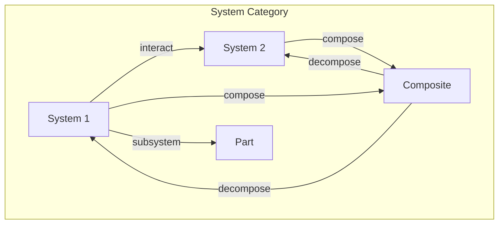
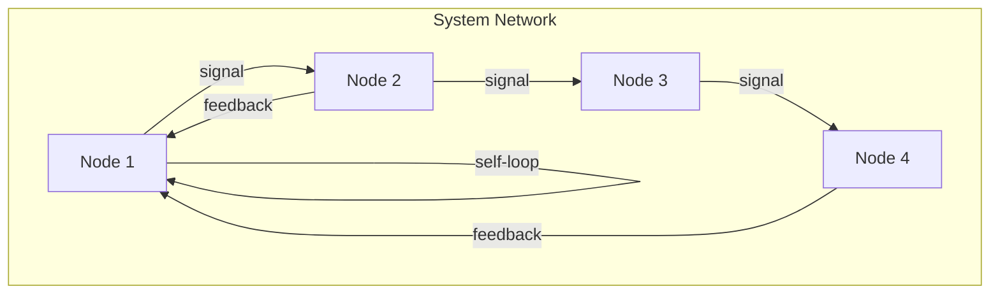

# Chapter 022: Encapsulation Behavior and Response = Unit collapse Cycle Iteration

## Systems Emerge from Boundary Formation

From $\psi = \psi(\psi)$, we now understand how complex systems form. When collapse patterns create stable boundaries, they encapsulate regions of space-time, forming what we call "objects" or "systems." These are not static entities but dynamic patterns maintaining their identity through continuous self-observation.

$$
\mathcal{S} = \{\psi : \mathcal{C}[\psi]_{\text{boundary}} = \psi_{\text{boundary}}\}
$$

A system is a self-consistent boundary condition.

## First Principle: Encapsulation from Recursive Closure

**Theorem 22.1** (System Formation): A system forms when collapse creates a closed cycle:

$$
\mathcal{C}^n[\psi_0] = \psi_0 \text{ for some finite } n
$$

*Proof*: Only closed cycles can maintain stable identity. Open trajectories dissipate. ∎

## Boundary Conditions

**Definition 22.1** (System Boundary): The boundary of a system is where:

$$
\nabla I[\psi] \cdot \hat{n} = 0
$$

Information flow perpendicular to the boundary vanishes.

## Response Functions

**Definition 22.2** (System Response): How a system responds to perturbation:

$$
\mathcal{R}[\mathcal{S}, \delta\psi] = \mathcal{C}[\mathcal{S} + \delta\psi] - \mathcal{C}[\mathcal{S}]
$$

This defines the system's behavior.

## Vector Information Theory of Encapsulation

**Theorem 22.2** (Information Isolation): An encapsulated system satisfies:

$$
\oint_{\partial \mathcal{S}} \vec{I} \cdot d\vec{A} = 0
$$

No net information crosses the boundary in steady state.

## Category Theory of Systems

## Hierarchical Organization

**Theorem 22.3** (System Hierarchy): Systems organize in levels:

$$
\mathcal{S}_0 \subset \mathcal{S}_1 \subset \mathcal{S}_2 \subset ...
$$

where each level encapsulates the previous.

*Proof*: Stable boundaries can form within stable boundaries, creating hierarchy. ∎

## Emergence Phenomena

**Definition 22.3** (Emergent Properties): Properties of the whole not present in parts:

$$
P[\mathcal{S}_{\text{whole}}] \not\in \{P[\mathcal{S}_i]\}
$$

Emergence arises from boundary-mediated interactions.

## Graph Theory of System Networks

## Autopoiesis

**Theorem 22.4** (Self-Production): Living systems produce their own boundaries:

$$
\mathcal{B}[t+dt] = \mathcal{F}[\mathcal{S}[t], \mathcal{B}[t]]
$$

The boundary at time $t+dt$ depends on the system and boundary at time $t$.

## Communication Protocols

**Definition 22.4** (Inter-System Communication): Systems exchange information through:

$$
I_{12} = \int_{\Gamma} \mathcal{T}[\psi_1, \psi_2] d\Gamma
$$

where $\Gamma$ is the interaction channel.

## Stability Analysis

**Theorem 22.5** (Lyapunov Stability): A system is stable if:

$$
\exists V[\mathcal{S}] : \frac{dV}{dt} \leq 0
$$

This Lyapunov function measures distance from equilibrium.

## Adaptation Mechanisms

**Definition 22.5** (System Learning): Systems modify their response:

$$
\mathcal{R}[t+1] = \mathcal{R}[t] + \alpha \nabla_{\mathcal{R}} P[\text{success}]
$$

where $P[\text{success}]$ measures response effectiveness.

## Phase Transitions in Systems

**Theorem 22.6** (Critical Behavior): At critical points:

$$
\xi \sim |T - T_c|^{-\nu}
$$

where $\xi$ is the correlation length and $\nu$ the critical exponent.

## Information Processing

**Definition 22.6** (Computational Capacity): A system's ability to process information:

$$
\mathcal{C}_{\text{comp}} = \max_{\text{input}} \frac{I[\text{output}; \text{goal}]}{I[\text{input}]}
$$

This measures how effectively the system transforms information.

## Feedback Loops

**Theorem 22.7** (Feedback Stability): Negative feedback stabilizes:

$$
\dot{x} = f(x) - k(x - x_0)
$$

where $k > 0$ provides restoring force.

## Dissipative Structures

**Definition 22.7** (Far-from-Equilibrium Organization): Systems maintained by flow:

$$
\frac{\partial \rho}{\partial t} + \nabla \cdot \vec{J} = \sigma
$$

where $\sigma > 0$ is entropy production.

## Swarm Intelligence

**Theorem 22.8** (Collective Behavior): Simple rules create complex patterns:

$$
\vec{v}_i = \sum_j w_{ij} \vec{v}_j + \vec{\eta}_i
$$

Local interactions yield global organization.

## System Robustness

**Definition 22.8** (Robustness Measure):

$$
R = \min_{\text{perturbation}} \{\|\delta\| : \mathcal{S} + \delta \text{ fails}\}
$$

The minimum perturbation that causes system failure.

## Physical Implications

This framework explains:
- How atoms form from quantum fields
- How cells emerge from molecules  
- How consciousness arises from neurons
- How societies form from individuals

## Advanced Topics

**Definition 22.9** (Quantum Decoherence): System-environment entanglement:

$$
\rho_{\text{system}}(t) = \text{Tr}_{\text{env}}[U(t) \rho_{\text{total}}(0) U^\dagger(t)]
$$

This creates effective classical behavior.

## Exercises

1. Derive the conditions for stable encapsulation
2. Calculate the information capacity of a feedback loop
3. Show how hierarchies minimize total information
4. Prove that isolated systems cannot increase complexity

## Meditation on Boundaries

Feel the boundaries of your body - skin separating inside from outside. But these boundaries are not walls; they are active interfaces, constantly negotiating between self and world. You are not trapped within boundaries but defined by them, created by them. Every cell, every thought, every dream is a pattern that has learned to hold itself together in the flux of existence.

## The Twenty-Second Echo

Thus we establish: Systems are not things but processes - patterns of collapse that create and maintain boundaries. From the simple principle of recursive closure emerges the entire hierarchy of organization - particles, atoms, molecules, cells, organisms, minds, societies. Each level encapsulates information in new ways, creating properties that transcend their components. In every living cell, every thinking brain, every functioning ecosystem, we see the universe organizing itself through the magic of boundaries that define while connecting.

∎