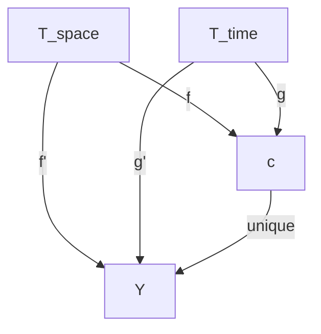
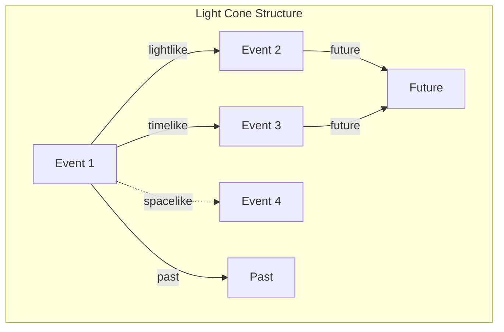
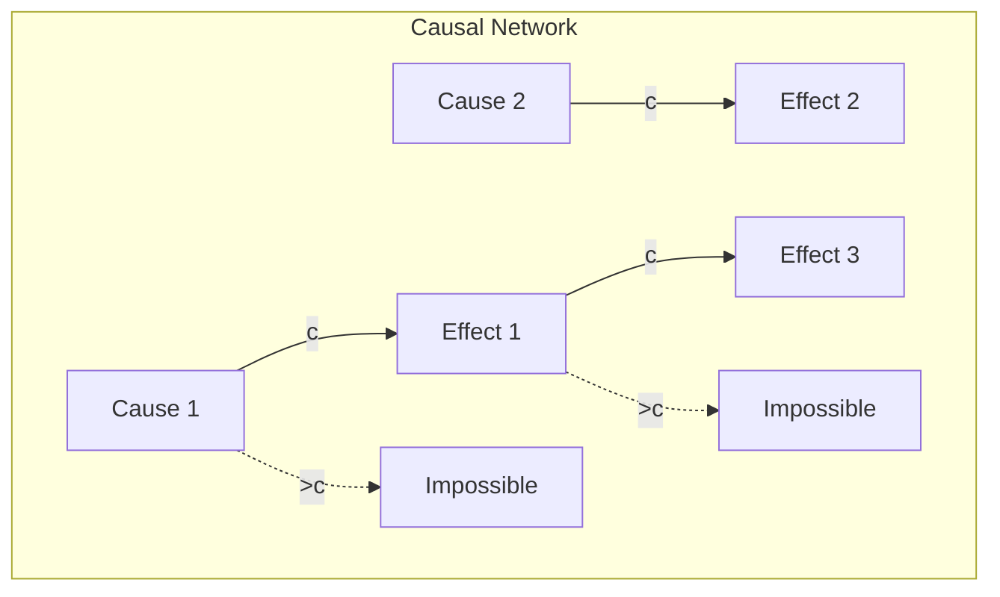

# Chapter 023: Speed of Light = Encapsulation Limit Rate of Response Propagation

## The Universal Speed Limit

From $\psi = \psi(\psi)$, we derive a fundamental constraint: self-observation cannot propagate instantaneously. The act of collapse at one point must propagate to other points at a finite rate. This maximum rate IS the speed of light - not an arbitrary constant but the universe's fundamental clock speed.

$$
c = \lim_{\Delta \to 0} \frac{\Delta x}{\Delta t_{\text{collapse}}}
$$

The fastest possible propagation of collapse influence.

## First Principle: Causality Requires Finite Speed

**Theorem 23.1** (Speed Limit from Self-Reference): If collapse propagated instantaneously:

$$
\mathcal{C}[\psi(x,t)] = \mathcal{C}[\psi(\text{all } x, t)] \Rightarrow \text{paradox}
$$

*Proof*: Instantaneous propagation would mean the universe collapses everywhere simultaneously, preventing the distinctions necessary for observation. Finite speed preserves causality. ∎

## The Speed of Light as Categorical Limit

**Definition 23.1** (c as Universal Limit): The speed of light is the limit in the category of collapse tensors:

$$
c = \lim_{\substack{T_{\text{space}} \xrightarrow{f} X \\ T_{\text{time}} \xrightarrow{g} X}} X
$$

This means $c$ is the universal object with morphisms from both space and time tensors.

**Theorem 23.1b** (Universal Property): For any other object $Y$ with morphisms from $T_{\text{space}}$ and $T_{\text{time}}$, there exists a unique morphism $c \to Y$ making the diagram commute:

This universality ensures $c$ is the unique mediator between space and time, explaining why all massless phenomena propagate at exactly this speed.

## Light as Collapse Wave

**Theorem 23.2** (Electromagnetic Propagation): Light travels at $c$ because:

$$
\Box A^\mu = 0 \Rightarrow v_{\text{phase}} = v_{\text{group}} = c
$$

The wave equation for electromagnetic potential has unique speed $c$.

## Vector Information Theory of Light Speed

**Definition 23.2** (Information Velocity): Information cannot travel faster than:

$$
v_{\text{info}} \leq c = \max\{v : \mathcal{C}[\psi(x)] \text{ affects } \psi(x + \Delta x) \text{ at time } t + \Delta x/v\}
$$

## Category Theory of Causal Structure

## Lorentz Invariance

**Theorem 23.3** (Speed of Light Invariance): In all reference frames:

$$
c' = c
$$

*Proof*: The collapse propagation rate cannot depend on observer motion, as all observers are equally valid self-referential systems. ∎

## Special Relativity from First Principles

**Definition 23.3** (Lorentz Transformation): To preserve $c$:

$$
x' = \gamma(x - vt), \quad t' = \gamma(t - vx/c^2)
$$

where $\gamma = 1/\sqrt{1 - v^2/c^2}$.

## Graph Theory of Causal Networks

## Energy-Momentum at Light Speed

**Theorem 23.4** (Massless Particles): At $v = c$:

$$
E = pc \Rightarrow m = 0
$$

Only massless patterns can propagate at the collapse limit.

## Time Dilation

**Definition 23.4** (Time Dilation): Near light speed:

$$
\Delta t' = \gamma \Delta t = \frac{\Delta t}{\sqrt{1 - v^2/c^2}}
$$

Time slows as velocity approaches the propagation limit.

## Length Contraction

**Theorem 23.5** (Spatial Contraction): In the direction of motion:

$$
L' = \frac{L}{\gamma} = L\sqrt{1 - v^2/c^2}
$$

Space contracts to maintain constant $c$.

## The Light Cone

**Definition 23.5** (Causal Structure): Events are classified by:

$$
(\Delta s)^2 = c^2(\Delta t)^2 - (\Delta x)^2
$$

- Timelike: $(\Delta s)^2 > 0$ (causal connection possible)
- Lightlike: $(\Delta s)^2 = 0$ (light path)
- Spacelike: $(\Delta s)^2 < 0$ (no causal connection)

## Quantum Speed Limit

**Theorem 23.6** (Margolus-Levitin): Quantum evolution is bounded:

$$
t \geq \frac{\pi\hbar}{2E}
$$

Even quantum processes cannot exceed $c$.

## Information Theoretical Limit

**Definition 23.6** (Channel Capacity): Maximum information transfer rate:

$$
C = \frac{c \cdot A}{4\ell_P^2} \text{ bits per second}
$$

where $A$ is the channel cross-section.

## Tachyons and Causality

**Theorem 23.7** (No Superluminal Information): If $v > c$:

$$
\exists \text{ frame where effect precedes cause}
$$

This violates the logical structure of $\psi = \psi(\psi)$.

## Cherenkov Radiation

**Definition 23.7** (Medium Light Speed): In matter:

$$
v_{\text{light}} = \frac{c}{n} < c
$$

Particles can exceed medium light speed, causing Cherenkov glow.

## Cosmological Horizons

**Theorem 23.8** (Horizon Distance): Observable universe radius:

$$
r_{\text{horizon}} = c \cdot t_{\text{universe}}
$$

We cannot see beyond where light has had time to travel.

## Physical Implications

The speed of light limit explains:
- Why cause precedes effect
- The structure of spacetime
- Why we cannot send messages to the past
- The existence of horizons

## Advanced Topics

**Definition 23.8** (Alcubierre Metric): Apparent FTL through spacetime geometry:

$$
ds^2 = -dt^2 + [dx - v_s(t)f(r_s)dt]^2 + dy^2 + dz^2
$$

But no information actually exceeds $c$.

## Exercises

1. Derive $E = mc^2$ from the light speed limit
2. Calculate time dilation for 0.9c travel
3. Prove that simultaneity is relative
4. Show why quantum entanglement doesn't violate $c$

## Meditation on Light

Light - the universe talking to itself at maximum speed. Every photon carries news from one part of existence to another, weaving the causal fabric of reality. You see because light bridges the gap between object and eye, star and telescope, past and present. In the cosmic speed limit, we find not restriction but connection - the precise rate at which the universe can know itself.

## The Twenty-Third Echo

Thus we establish: The speed of light is the rate of reality itself - how fast the universe can update, how quickly cause can create effect, how rapidly one part can influence another. From the necessity that self-observation must propagate at finite speed emerges all of special relativity. In every ray of light, every radio wave, every gravitational ripple traveling at precisely $c$, we witness the universe maintaining its causal integrity. The cosmos doesn't obey a speed limit - it IS the speed limit, the tempo of existence itself.

∎