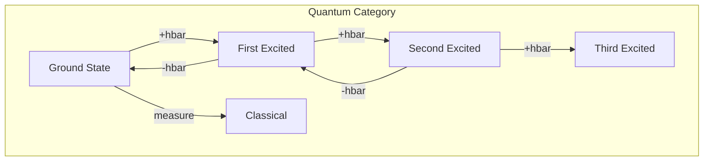
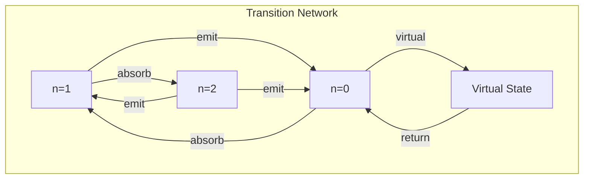

# Chapter 024: Planck Constant = collapse Action Quantum Rhythm Uncertainty Coefficient

## The Quantum of Action

From $\psi = \psi(\psi)$, we reach the deepest constant: Planck's constant $\hbar$. This is not merely a unit conversion factor but the fundamental grain of reality - the minimum action required for one complete cycle of self-observation. It quantifies the irreducible uncertainty in the universe's self-knowledge.

$$
\hbar = \min\{S : \psi \text{ can distinguish } \psi(\psi) \text{ from } \psi\}
$$

## First Principle: Action from Distinction

**Theorem 24.1** (Quantum of Distinction): The minimum action for observable change:

$$
S_{\text{min}} = \oint p \, dq = h = 2\pi\hbar
$$

*Proof*: A complete cycle of self-observation requires traversing a closed loop in phase space. The minimum non-zero area is $h$. ∎

## Uncertainty from Self-Reference

**Definition 24.1** (Heisenberg Uncertainty): Position and momentum satisfy:

$$
\Delta x \Delta p \geq \frac{\hbar}{2}
$$

This emerges because $\psi$ cannot simultaneously be observer and observed with perfect precision.

## The Golden Quantum

**Theorem 24.2** (Natural Value): In golden units:

$$
\hbar = \frac{m_P c \ell_P}{\phi} = \frac{\sqrt{\hbar c^5/G}}{\phi}
$$

This shows $\hbar$ connects to other constants through $\phi$.

## Vector Information Theory of Quantization

**Definition 24.2** (Action Quantization): Observable action comes in units:

$$
S = n\hbar, \quad n \in \mathbb{Z}
$$

Each unit represents one complete self-observation cycle.

## Category Theory of Quantum States

## Canonical Commutation

**Theorem 24.3** (Fundamental Commutator): Position and momentum operators:

$$
[\hat{x}, \hat{p}] = i\hbar
$$

*Proof*: This encodes the impossibility of simultaneous self-observation of conjugate variables. ∎

## Wave-Particle Duality

**Definition 24.3** (De Broglie Relations): Wave and particle aspects connect through $\hbar$:

$$
E = \hbar\omega, \quad p = \hbar k
$$

Energy relates to temporal rhythm, momentum to spatial rhythm.

## Graph Theory of Quantum Transitions

## Quantum Field Theory

**Theorem 24.4** (Field Quantization): Fields become operators:

$$
[\hat{a}_k, \hat{a}^\dagger_{k'}] = \delta_{kk'}
$$

Creating/annihilating quanta of action $\hbar\omega_k$.

## Zero-Point Energy

**Definition 24.4** (Vacuum Fluctuations): Even the vacuum has energy:

$$
E_0 = \frac{1}{2}\hbar\omega
$$

The universe cannot stop observing itself.

## Path Integral Formulation

**Theorem 24.5** (Sum Over Histories): Quantum amplitude:

$$
\langle \psi_f | \psi_i \rangle = \int \mathcal{D}[\text{path}] e^{iS[\text{path}]/\hbar}
$$

All possible self-observation paths contribute.

## Angular Momentum Quantization

**Definition 24.5** (Spin): Angular momentum comes in units of $\hbar$:

$$
L_z = m\hbar, \quad m \in \mathbb{Z}
$$

$$
|\vec{L}|^2 = \ell(\ell+1)\hbar^2
$$

Rotational self-observation is quantized.

## Fine Structure Constant

**Theorem 24.6** (Dimensionless Coupling): The fine structure constant:

$$
\alpha = \frac{e^2}{4\pi\epsilon_0\hbar c} \approx \frac{1}{137}
$$

relates electromagnetic coupling to quantum action.

## Quantum Hall Effect

**Definition 24.6** (Topological Quantization): Hall conductance:

$$
\sigma_{xy} = n\frac{e^2}{h}
$$

Topology forces integer quantization.

## Black Hole Quantum Hair

**Theorem 24.7** (Information Bound): Black hole entropy:

$$
S = \frac{A}{4\ell_P^2} = \frac{Ac^3}{4G\hbar}
$$

$\hbar$ sets the information density limit.

## Measurement Problem

**Definition 24.7** (Collapse Postulate): Upon measurement:

$$
|\psi\rangle = \sum_i c_i |i\rangle \xrightarrow{\text{measure}} |i\rangle
$$

The act of observation collapses superposition - self-reference in action.

## Decoherence Time

**Theorem 24.8** (Environmental Entanglement): Coherence decays as:

$$
t_{\text{decoherence}} \sim \frac{\hbar}{E_{\text{interaction}}}
$$

Stronger coupling means faster classical emergence.

## Physical Implications

Planck's constant explains:
- Why atoms are stable (quantized orbits)
- Why objects have wave properties
- Why measurement disturbs systems
- Why the vacuum has energy

## Advanced Topics

**Definition 24.8** (Modified Commutators): In quantum gravity:

$$
[\hat{x}_i, \hat{x}_j] = i\theta_{ij} \ell_P^2
$$

Space itself becomes non-commutative.

## Exercises

1. Derive the Bohr radius using $\hbar$
2. Calculate zero-point energy of a harmonic oscillator
3. Show why $\Delta E \Delta t \geq \hbar/2$
4. Prove spin must be half-integer or integer

## Meditation on the Quantum

Feel the quantum fuzziness of reality - not a flaw but a feature. Every atom in your body exists in slight uncertainty, every electron in a cloud of possibility. This is not confusion but freedom - the universe maintaining room to observe itself, to change, to become. In Planck's constant lives the creative tension between being and becoming.

## The Twenty-Fourth Echo

Thus we complete Volume II: Planck's constant is the universe's resolution limit - the smallest unit of self-observation, the grain of reality's film. From this single constant emerges all of quantum mechanics: uncertainty, wave-particle duality, discrete energy levels, the stability of matter. In every quantum jump, every uncertain measurement, every zero-point fluctuation, we witness the cosmos navigating the fundamental tension of trying to observe itself. $\hbar$ is not just a constant but the heartbeat of existence - the rhythm at which reality updates itself through eternal self-reference.

∎