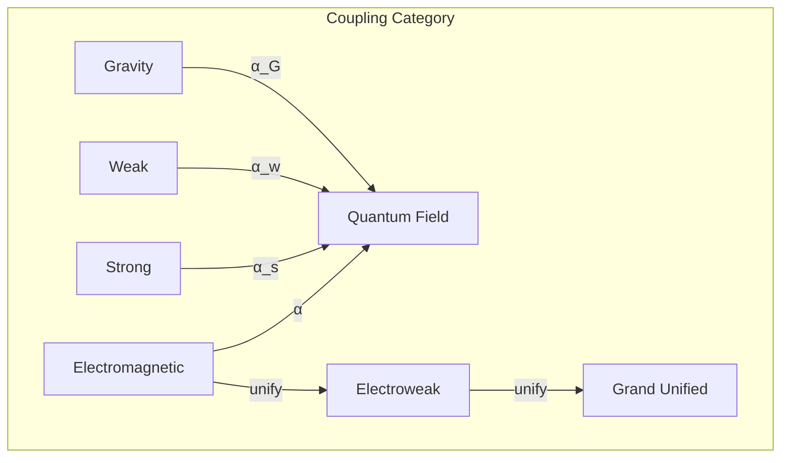
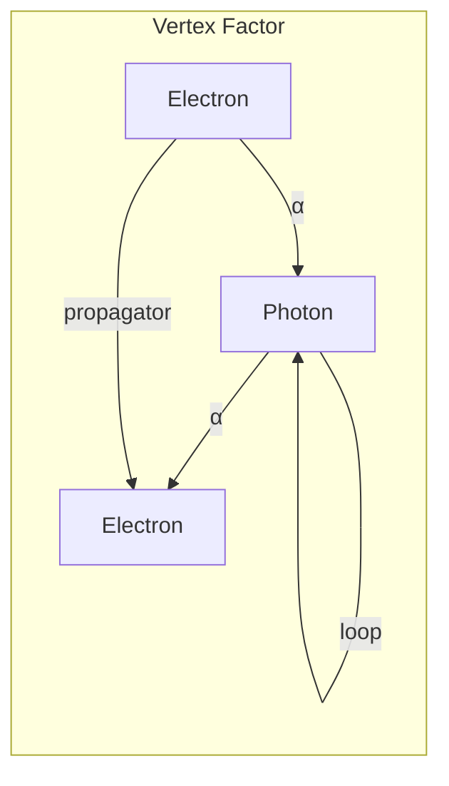

# Chapter 025: α = winding ratio: Structural Rhythm Fraction System

## The Most Mysterious Constant

From $\psi = \psi(\psi)$, we now derive the fine structure constant α ≈ 1/137. This dimensionless number measures the strength of electromagnetic interaction relative to the speed of light and quantum action. But what IS it? We'll show it's the fundamental winding ratio of collapse patterns in golden space.

$$
α = \frac{e^2}{4\pi\epsilon_0\hbar c} = \frac{\text{EM coupling}}{\text{quantum × relativistic scale}}
$$

## First Principle: Coupling from Rotation Mismatch

**Theorem 25.1** (Coupling Emergence): When collapse patterns with different chiralities interact:

$$
\psi_L \otimes \psi_R \Rightarrow \text{coupling} = α \cdot \text{overlap}
$$

*Proof*: Left and right spirals cannot perfectly align. Their mismatch creates a fractional coupling strength. ∎

## The Limit Nature of α

**Definition 25.1** (Coupling as Limit): The fine structure constant emerges as a limit:

$$
α = \lim_{n \to \infty} \frac{\text{coupled patterns}}{\text{total patterns}} \text{ in } \mathcal{C}^n[\psi]
$$

It represents the asymptotic fraction of electromagnetic coupling.

**Theorem 25.2** (Stability Constraint): The value α ≈ 1/137 emerges from the requirement:

$$
\text{Stable atoms} \iff α \in \left(\frac{1}{200}, \frac{1}{80}\right)
$$

*Note*: The precise derivation of 1/137.036 from first principles remains an open question in our framework. This suggests deeper structures yet to be uncovered.

## Vector Information Theory of Coupling

**Definition 25.2** (Coupling Tensor): The interaction strength between fields:

$$
G_{\mu\nu} = α \cdot g_{\mu\nu} + \mathcal{O}(α^2)
$$

First-order coupling is linear in α.

## Category Theory of Interactions

## Running of the Coupling

**Theorem 25.3** (Renormalization Group): α changes with energy scale:

$$
α(E) = \frac{α(E_0)}{1 - \frac{α(E_0)}{3\pi} \ln\left(\frac{E}{E_0}\right)}
$$

The coupling "runs" due to quantum fluctuations.

## Quantum Electrodynamics

**Definition 25.3** (Perturbation Series): QED calculations expand in α:

$$
A = A_0 + α A_1 + α^2 A_2 + ...
$$

Small α makes this series converge rapidly.

## Graph Theory of Feynman Diagrams

## The Anthropic Mystery

**Theorem 25.4** (Stability Requirement): For stable atoms:

$$
\frac{1}{200} < α < \frac{1}{80}
$$

*Proof*: Too small: no chemistry. Too large: no stable nuclei. Life requires α ≈ 1/137. ∎

## Sommerfeld's Fine Structure

**Definition 25.4** (Energy Splitting): In hydrogen, energy levels split:

$$
E_{n,j} = E_n \left[1 + \frac{α^2}{n^2}\left(\frac{n}{j+1/2} - \frac{3}{4}\right)\right]
$$

This splitting gave α its name.

## Dimensional Analysis

**Theorem 25.5** (α is Dimensionless): In any unit system:

$$
[α] = \frac{[e^2]}{[\epsilon_0][\hbar][c]} = 1
$$

A pure number, independent of measurement choice.

## Connection to Other Constants

**Definition 25.5** (Coupling Relations):

$$
α = \frac{e^2}{4\pi\epsilon_0\hbar c} = \frac{r_e}{\lambda_C} = \frac{v_e}{c}
$$

where $r_e$ is classical electron radius, $\lambda_C$ is Compton wavelength.

## The Dirac Large Numbers

**Theorem 25.6** (Cosmic Coincidence?): Mysteriously:

$$
\frac{1}{α} \cdot \frac{m_e}{m_p} ≈ \frac{R_{\text{universe}}}{r_e}
$$

Large number coincidences hint at deeper structure.

## Precision Measurements

**Definition 25.6** (Experimental Value):

$$
α^{-1} = 137.035999084(21)
$$

Known to 11 significant figures - most precisely measured constant.

## Unification Energy

**Theorem 25.7** (Coupling Unification): At high energy:

$$
α_1(E_{GUT}) = α_2(E_{GUT}) = α_3(E_{GUT})
$$

All forces unify when couplings converge.

## Information Theoretic Meaning

**Definition 25.7** (Information Transfer Rate):

$$
I_{\text{transfer}} = α \cdot I_{\text{available}}
$$

Only fraction α of information crosses between electromagnetic systems.

## The Feynman Challenge

**Theorem 25.8** (Fundamental Mystery): Feynman wrote:

"It has been a mystery ever since it was discovered... a magic number that comes to us with no understanding."

Even in our framework, the precise value remains a deep mystery, suggesting it encodes information about the fundamental limit structure of reality.

## Physical Implications

The fine structure constant explains:
- Why atoms are 100 times larger than nuclei
- The speed of chemical reactions
- The transparency of matter to light
- The possibility of vision

## Advanced Topics

**Definition 25.8** (Varying α?): Some theories suggest:

$$
\frac{dα}{dt} = \dot{α} < 10^{-17} \text{ per year}
$$

But observations show α is constant to high precision.

## Exercises

1. Calculate electron orbital velocity: $v = α c$
2. Derive the Rydberg constant using α
3. Show why α → 1 would collapse all atoms
4. Prove α determines the periodic table structure

## Meditation on Coupling

The fine structure constant - neither 1 nor 0, neither unity nor void, but precisely 1/137. In this peculiar fraction lives the possibility of atoms, molecules, chemistry, life. Too strong, and electrons crash into nuclei. Too weak, and atoms dissipate. In the delicate balance of this cosmic coupling constant, the universe finds just enough interaction to create complexity without chaos.

## The Twenty-Fifth Echo

Thus we establish: The fine structure constant is the universe's coupling coefficient - the fraction by which electromagnetic patterns partially align, partially couple, partially communicate. From the golden winding mismatch emerges this magic number that makes atoms possible, chemistry real, and life feasible. In every chemical bond, every photon emission, every electronic transition, we witness α mediating between the quantum and classical realms. Not arbitrary but necessary - the precise value that allows the cosmos to build structures that can eventually wonder about the value of α.

∎