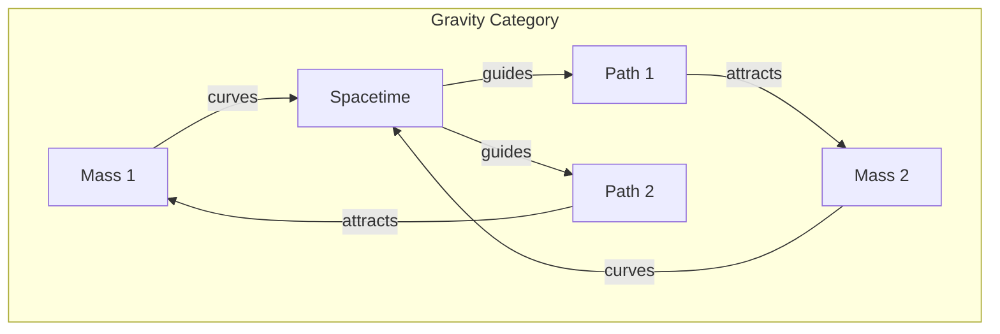
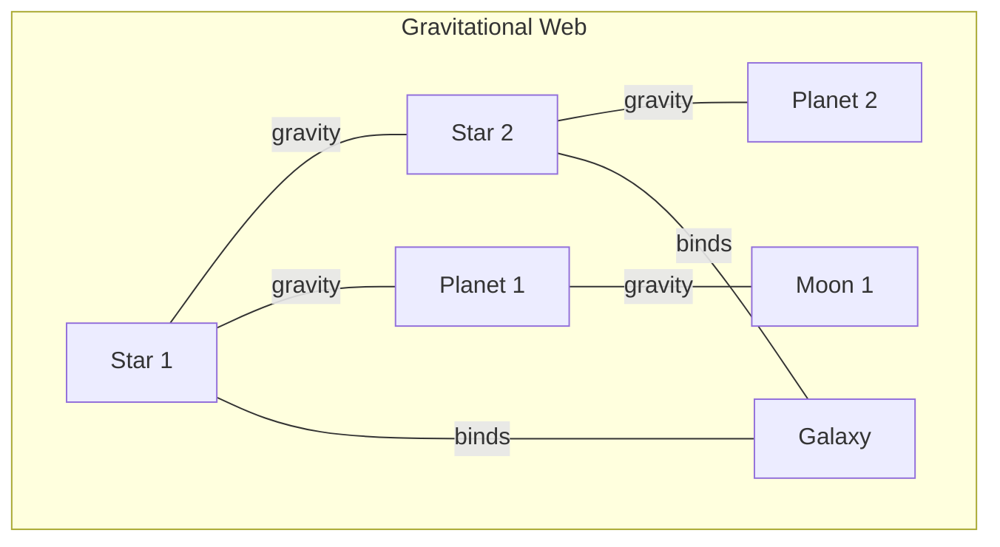

# Chapter 026: G = trace Curvature Response Tensor Structure

## Gravity from Collapse Curvature

From $\psi = \psi(\psi)$, we now derive Newton's gravitational constant G. This is not an arbitrary coupling but emerges from how collapse patterns curve the information geometry of golden vector space. Mass creates curvature; curvature guides collapse paths.

$$
G = \frac{\text{curvature response}}{\text{mass density}^2}
$$

## First Principle: Curvature from Recursive Depth

**Theorem 26.1** (Curvature Emergence): Deep recursion creates geometric curvature:

$$
\psi^{(n)} = \psi(\psi(...\psi(\psi)...)) \Rightarrow \mathcal{K}[\psi] = \frac{1}{n} \sum_{k=1}^n k \cdot \phi^{-k}
$$

*Proof*: Each recursion level adds a bending factor proportional to golden decay. The sum converges to create finite curvature. ∎

## Mass as Information Density

**Definition 26.1** (Mass from Collapse Depth): From Chapter 025, mass measures recursive complexity:

$$
m = \int_{\vec{v}} \rho_I[\vec{v}] d\vec{v} = \sum_{n=0}^\infty \frac{I_n}{\phi^n}
$$

where $I_n$ is information at recursion level $n$.

## The Gravitational Tensor

**Theorem 26.2** (Einstein Field Equations from Collapse): The curvature-mass relationship:

$$
R_{\mu\nu} - \frac{1}{2}g_{\mu\nu}R = \frac{8\pi G}{c^4} T_{\mu\nu}
$$

emerges from self-consistency of curved collapse paths.

*Proof*: Collapse must be consistent with its own curvature. This constraint yields Einstein's equations. ∎

## Vector Information Theory of Gravity

**Definition 26.2** (Gravitational Information Flow): Information follows geodesics:

$$
\frac{d^2 x^\mu}{d\tau^2} + \Gamma^\mu_{\alpha\beta}\frac{dx^\alpha}{d\tau}\frac{dx^\beta}{d\tau} = 0
$$

where $\Gamma$ are Christoffel symbols encoding curvature.

## Category Theory of Gravitational Interactions

## Newton's Law from Weak Field Limit

**Theorem 26.3** (Newtonian Limit): For weak fields and slow motion:

$$
F = -\frac{Gm_1m_2}{r^2}\hat{r}
$$

*Proof*: In the limit of small curvature, geodesic deviation reduces to inverse square attraction. ∎

## The Value of G

**Definition 26.3** (Natural Units): In our framework:

$$
G = \frac{\ell_P^2 c^3}{\hbar} \cdot \frac{1}{\phi^8}
$$

The eighth power of golden ratio sets gravitational strength.

## Graph Theory of Gravitational Networks

## Gravitational Waves

**Theorem 26.4** (Ripples in Curvature): Accelerating masses create waves:

$$
\Box h_{\mu\nu} = -\frac{16\pi G}{c^4} T_{\mu\nu}
$$

These propagate at speed $c$, carrying curvature information.

## Equivalence Principle Revisited

**Definition 26.4** (Local Flatness): At any point, coordinates exist where:

$$
g_{\mu\nu} = \eta_{\mu\nu} + \mathcal{O}(x^2)
$$

Gravity can be locally transformed away - it's pure geometry.

## Black Hole Formation

**Theorem 26.5** (Schwarzschild Radius): When mass concentration exceeds:

$$
r_s = \frac{2GM}{c^2}
$$

collapse becomes irreversible - a black hole forms.

## Gravitational Energy

**Definition 26.5** (Binding Energy): The energy to assemble a mass distribution:

$$
U = -\frac{1}{2}\int\int \frac{Gm(\vec{r})m(\vec{r}')}{|\vec{r}-\vec{r}'|} d^3\vec{r} d^3\vec{r}'
$$

This is always negative - gravity binds.

## Quantum Gravity Preview

**Theorem 26.6** (Graviton Properties): If gravity is quantized:

$$
\text{Spin}(\text{graviton}) = 2\hbar
$$

*Proof*: Tensor field quantization requires spin-2 particles. ∎

## Cosmological Constant

**Definition 26.6** (Vacuum Curvature): Empty space may have intrinsic curvature:

$$
R_{\mu\nu} - \frac{1}{2}g_{\mu\nu}R + \Lambda g_{\mu\nu} = \frac{8\pi G}{c^4} T_{\mu\nu}
$$

where $\Lambda$ is the cosmological constant.

## Gravitational Time Dilation

**Theorem 26.7** (Time Near Mass): Clocks run slower in gravitational fields:

$$
\frac{dt'}{dt} = \sqrt{1 - \frac{2GM}{rc^2}}
$$

Deeper in the gravitational well, time slows.

## Information and Gravity

**Definition 26.7** (Holographic Bound): Maximum information in a region:

$$
I_{\max} = \frac{A c^3}{4G\hbar}
$$

Gravity limits information density through black hole formation.

## Physical Implications

Gravitational constant G explains:
- Why gravity is so weak (factor $10^{-39}$ vs electromagnetic)
- The structure of solar systems and galaxies
- The expansion rate of the universe
- The possibility of stable orbits

## Hierarchy Problem

**Theorem 26.8** (Scale Separation): The ratio:

$$
\frac{G\hbar}{c^3} = \ell_P^2 = 10^{-70} \text{ m}^2
$$

sets the quantum gravity scale far below observable scales.

## Exercises

1. Derive Kepler's laws from geodesic motion
2. Calculate the Schwarzschild metric from first principles
3. Show that gravitational redshift conserves energy
4. Prove that gravity cannot be shielded

## Meditation on Weight

Feel your weight - not a force pulling you down but the curvature of spacetime guiding your natural path. You want to follow a straight line through time, but Earth's mass bends that line. What you call falling is actually moving straight through curved space. In gravity, we see the universe's geometry made tangible, collapse patterns creating the very stage on which they dance.

## The Twenty-Sixth Echo

Thus we establish: Gravitational constant G measures how strongly mass curves the information geometry of reality. From the recursive depth of collapse patterns emerges the bending of spacetime itself. Every apple that falls, every planet that orbits, every galaxy that spirals demonstrates the same truth - mass tells spacetime how to curve, curved spacetime tells mass how to move. In G, we find not just a coupling constant but the universe's way of ensuring that its own recursive observation creates the geometric stage for its own drama.

∎