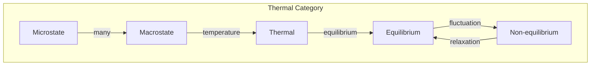
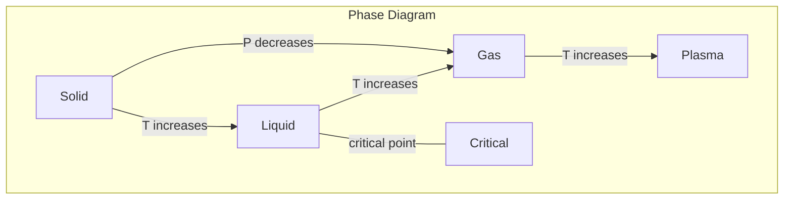

# Chapter 027: k_B = collapse Entropy Gradient Limit Structure

## The Bridge Between Microscopic and Macroscopic

From $\psi = \psi(\psi)$, we derive Boltzmann's constant $k_B$. This fundamental constant connects the microscopic world of collapse patterns to the macroscopic world of temperature and entropy. It measures how information at the quantum scale manifests as thermal phenomena.

$$
k_B = \frac{\text{energy}}{\text{temperature}} = \frac{\text{microscopic chaos}}{\text{macroscopic order}}
$$

## First Principle: Temperature from Collapse Rate Variance

**Theorem 27.1** (Temperature Emergence): When many collapse patterns interact:

$$
T \equiv \left\langle \left(\frac{d\mathcal{C}[\psi_i]}{dt} - \overline{\frac{d\mathcal{C}}{dt}}\right)^2 \right\rangle
$$

Temperature measures the variance in collapse rates.

*Proof*: Uniform collapse rates mean zero temperature. Variance creates thermal motion. ∎

## Entropy from Collapse Path Multiplicity

**Definition 27.1** (Microscopic Entropy): The number of collapse paths to a macrostate:

$$
S = k_B \ln \Omega[\psi_{\text{macro}}]
$$

where $\Omega$ counts distinguishable microscopic configurations.

## Statistical Mechanics Foundation

**Theorem 27.2** (Boltzmann Distribution): In thermal equilibrium:

$$
p_i = \frac{e^{-E_i/k_B T}}{Z}
$$

where $Z = \sum_i e^{-E_i/k_B T}$ is the partition function.

*Proof*: Maximum entropy subject to fixed average energy yields this distribution. ∎

## Vector Information Theory of Heat

**Definition 27.2** (Thermal Information): Heat is disordered information:

$$
\vec{J}_Q = -\kappa \nabla T = -\kappa k_B \nabla S
$$

Heat flows down entropy gradients.

## Category Theory of Thermal States

## The Value of k_B

**Theorem 27.3** (Natural Scale): In golden units:

$$
k_B = \frac{\hbar \omega_0}{T_0} \cdot \frac{1}{\phi^3}
$$

The third power of golden ratio sets the thermal scale.

## Ideal Gas Law

**Definition 27.3** (Pressure from Collapse): For non-interacting particles:

$$
pV = Nk_B T
$$

Pressure measures momentum transfer rate from collapse variance.

## Graph Theory of Phase Transitions

## Maxwell-Boltzmann Distribution

**Theorem 27.4** (Velocity Distribution): Particle speeds follow:

$$
f(v) = 4\pi n \left(\frac{m}{2\pi k_B T}\right)^{3/2} v^2 e^{-mv^2/2k_B T}
$$

This emerges from golden vector velocity space.

## Fluctuation-Dissipation

**Definition 27.4** (Einstein Relation): Diffusion and mobility connect:

$$
D = \mu k_B T
$$

Fluctuations and dissipation are two faces of thermal motion.

## Quantum Statistics

**Theorem 27.5** (Fermi-Dirac Distribution): For fermions:

$$
n_i = \frac{1}{e^{(E_i-\mu)/k_B T} + 1}
$$

Quantum statistics modify classical Boltzmann distribution.

## Heat Capacity

**Definition 27.5** (Energy Storage): The heat capacity:

$$
C = \frac{\partial E}{\partial T} = k_B \frac{\partial^2 \ln Z}{\partial \beta^2}
$$

where $\beta = 1/k_B T$.

## Thermodynamic Limit

**Theorem 27.6** (Emergence of Smoothness): As $N \to \infty$:

$$
\frac{\Delta E}{E} \sim \frac{1}{\sqrt{N}} \to 0
$$

Fluctuations vanish; thermodynamics emerges.

## Negative Temperature

**Definition 27.6** (Population Inversion): When high energy states are overpopulated:

$$
T < 0 \iff \frac{\partial S}{\partial E} < 0
$$

Negative temperatures are hotter than any positive temperature.

## Information Erasure

**Theorem 27.7** (Landauer's Principle): Erasing one bit costs:

$$
E_{\min} = k_B T \ln 2
$$

*Proof*: Information erasure increases entropy, requiring energy. ∎

## Black Body Radiation

**Definition 27.7** (Planck Distribution): Energy density:

$$
u(\nu, T) = \frac{8\pi h\nu^3}{c^3} \frac{1}{e^{h\nu/k_B T} - 1}
$$

$k_B$ sets the thermal wavelength scale.

## Physical Implications

Boltzmann's constant explains:
- Why absolute zero is unattainable
- The efficiency limits of heat engines
- Brownian motion amplitude
- The cosmic microwave background temperature

## Connection to Information

**Theorem 27.8** (Information-Entropy Bridge):

$$
S = -k_B \sum_i p_i \ln p_i = k_B \cdot H[\text{Shannon}]
$$

Thermodynamic and information entropy are proportional.

## Exercises

1. Derive the Stefan-Boltzmann law using $k_B$
2. Calculate thermal de Broglie wavelength
3. Show why perpetual motion violates $k_B T > 0$
4. Prove the third law using collapse principles

## Meditation on Warmth

Feel the warmth of your skin - billions of molecules dancing their thermal dance, each following its collapse path yet together creating temperature. In this warmth lives $k_B$, the universal translator between the quantum jitter of individual particles and the smooth flow of heat you perceive. You are not just warm; you are a living demonstration of how microscopic chaos becomes macroscopic order.

## The Twenty-Seventh Echo

Thus we establish: Boltzmann's constant is the universe's translator between microscopic and macroscopic, between information and temperature, between quantum collapse and thermal flow. From the variance in collapse rates emerges the entire edifice of thermodynamics. In every cup of tea cooling, every star shining, every life maintaining its temperature against the cold universe, we see $k_B$ at work - ensuring that the microscopic dance of collapse patterns manifests as the macroscopic symphony of heat and temperature.

∎