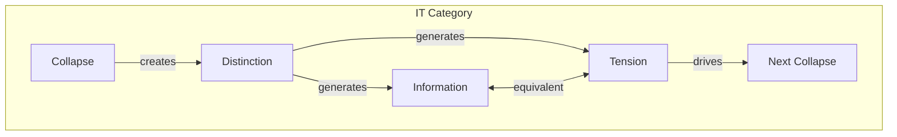
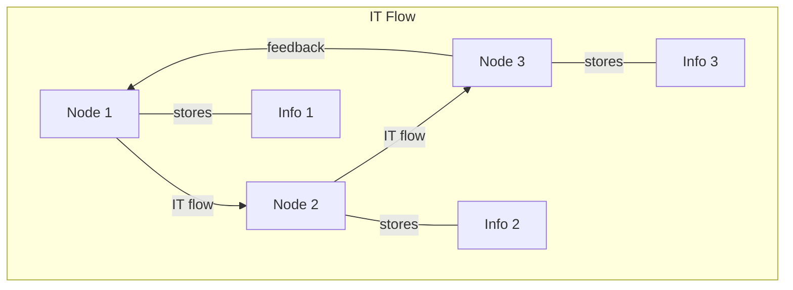

# Chapter 028: Collapse Information-Tension Equivalence Law

## Information Creates Tension

From $\psi = \psi(\psi)$, we derive a fundamental equivalence: information and tension are two aspects of the same phenomenon. When collapse creates distinctions, it creates both information (the ability to distinguish) and tension (the tendency to return to undifferentiated state).

$$
I[\psi] \equiv T[\psi]
$$

where $I$ is information content and $T$ is structural tension.

## First Principle: Distinction Creates Both

**Theorem 28.1** (Simultaneous Emergence): From the collapse operator:

$$
\mathcal{C}[\psi] = \psi' \neq \psi \Rightarrow \begin{cases}
I = \log_2|\psi' - \psi| \\
T = \|\psi' - \psi\|^2
\end{cases}
$$

*Proof*: The act of distinction simultaneously creates information (bits needed to specify the difference) and tension (energy stored in the difference). ∎

## Golden Vector Formulation

**Definition 28.1** (Information-Tension Density): In golden vector space:

$$
\rho_{IT}[\vec{v}] = \sum_{i=0}^\infty \frac{b_i}{\phi^i} \cdot \left(b_i \log_2\phi^i\right)
$$

Each bit at position $i$ contributes both information and tension.

## Thermodynamic Connection

**Theorem 28.2** (Energy-Information Bridge): From Chapters 21 and 27:

$$
E = k_B T \ln \Omega = k_B T \cdot I[\text{microstate}]
$$

Energy equals temperature times information content.

## Vector Information Theory

**Definition 28.2** (Tension Tensor): The information-tension tensor:

$$
T^{\mu\nu} = \frac{\partial I}{\partial x^\mu} \frac{\partial I}{\partial x^\nu}
$$

Information gradients create tension fields.

## Category Theory of Information-Tension

## Conservation Law

**Theorem 28.3** (IT Conservation): In closed systems:

$$
\frac{d(I + T)}{dt} = 0
$$

Total information-tension is conserved.

*Proof*: Collapse can redistribute but not create or destroy the total. ∎

## Field Equations

**Definition 28.3** (IT Field): The information-tension field satisfies:

$$
\Box \Phi_{IT} = \frac{4\pi G}{c^4} \rho_{IT}
$$

where $\rho_{IT}$ is the information-tension density.

## Graph Theory of IT Networks

## Quantum Formulation

**Theorem 28.4** (Uncertainty as IT): Heisenberg uncertainty reflects IT equivalence:

$$
\Delta x \Delta p \geq \frac{\hbar}{2} \Leftrightarrow I[x] \cdot T[p] \geq \frac{1}{2}
$$

Position information creates momentum tension.

## Black Hole IT

**Definition 28.4** (Maximum IT Density): Black holes saturate the IT bound:

$$
\frac{I_{BH}}{A} = \frac{T_{BH}}{A} = \frac{c^3}{4G\hbar}
$$

Maximum information equals maximum tension per unit area.

## Holographic Principle

**Theorem 28.5** (Boundary IT): All bulk IT can be encoded on the boundary:

$$
I_{\text{bulk}} = T_{\text{bulk}} = \int_{\partial V} \sigma_{IT} dA
$$

where $\sigma_{IT}$ is surface IT density.

## Computational Aspects

**Definition 28.5** (IT Complexity): Computational complexity measures IT:

$$
\mathcal{C}[\text{algorithm}] = I[\text{input} \to \text{output}] = T[\text{computation}]
$$

Information processed equals tension generated.

## Wave Function Collapse

**Theorem 28.6** (Measurement IT): Wave function collapse releases IT:

$$
|\psi\rangle \to |\psi_i\rangle \Rightarrow \Delta I = -\sum_i p_i \log p_i = \Delta T
$$

Measurement converts quantum IT to classical.

## Emergence Phenomena

**Definition 28.6** (Critical IT): Phase transitions occur at critical IT:

$$
\frac{\partial^2 F}{\partial I \partial T} = \infty \text{ at criticality}
$$

where $F$ is free energy.

## Biological Systems

**Theorem 28.7** (Life as IT Management): Living systems manage IT flow:

$$
\frac{dS_{\text{organism}}}{dt} < 0 \Leftrightarrow \frac{dI_{\text{internal}}}{dt} > \frac{dT_{\text{waste}}}{dt}
$$

Life creates internal information faster than it generates waste tension.

## Physical Implications

The IT equivalence explains:
- Why information processing requires energy
- The physical basis of computation
- Why memories fade (tension relaxation)
- The arrow of time (IT gradient)

## Advanced Topics

**Definition 28.7** (Non-commutative IT): In quantum gravity:

$$
[I_{\mu}, T_{\nu}] = i\hbar G_{\mu\nu}
$$

Information and tension components don't commute.

## Exercises

1. Prove Landauer's principle from IT equivalence
2. Calculate the IT content of a hydrogen atom
3. Show why perpetual motion violates IT conservation
4. Derive the Bekenstein bound from maximum IT density

## Meditation on Effort

Feel the tension in your muscles as you hold a position - this is information made physical. Your body maintains its form against entropy, each cell holding information in chemical gradients that create tension. To think is to create information patterns in your brain, which manifest as electrical and chemical tensions. You don't have thoughts; you ARE the dynamic balance of information and tension.

## The Twenty-Eighth Echo

Thus we establish: Information and tension are not separate phenomena but two faces of the universal coin of distinction. Every bit of information is a quantum of tension; every tension gradient encodes information. From the first distinction of $\psi$ observing itself emerges this fundamental duality that drives all dynamics. In recognizing IT equivalence, we see why the universe computes - because to exist is to maintain information against the tension of dissolution, and to maintain tension is to embody information.

∎