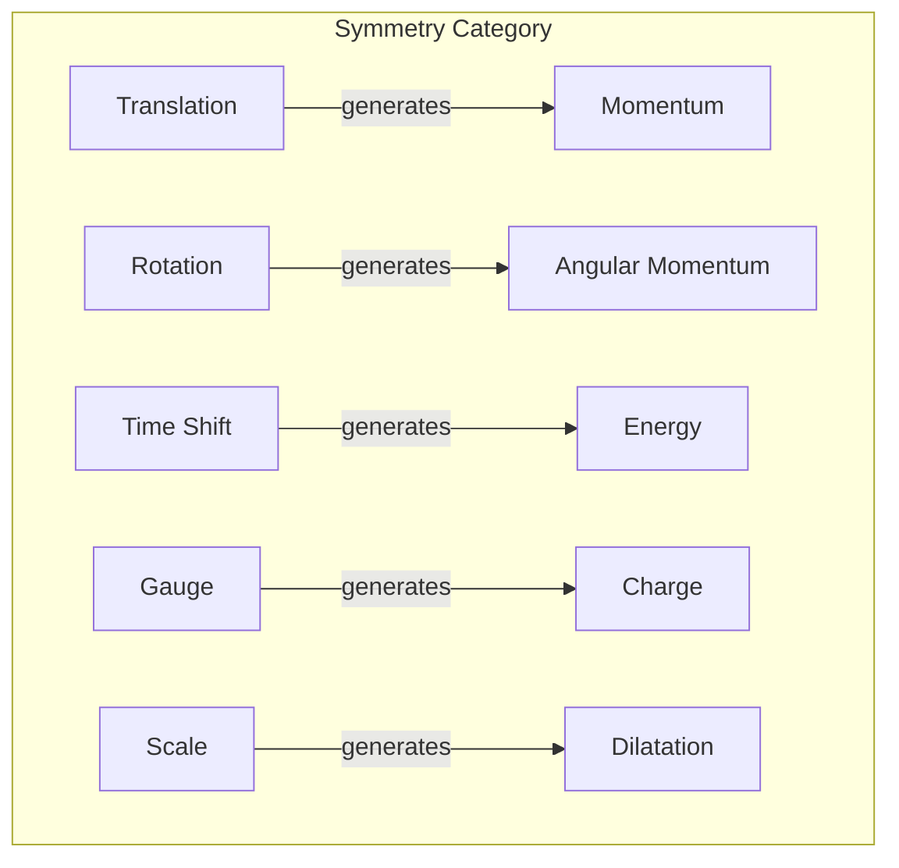
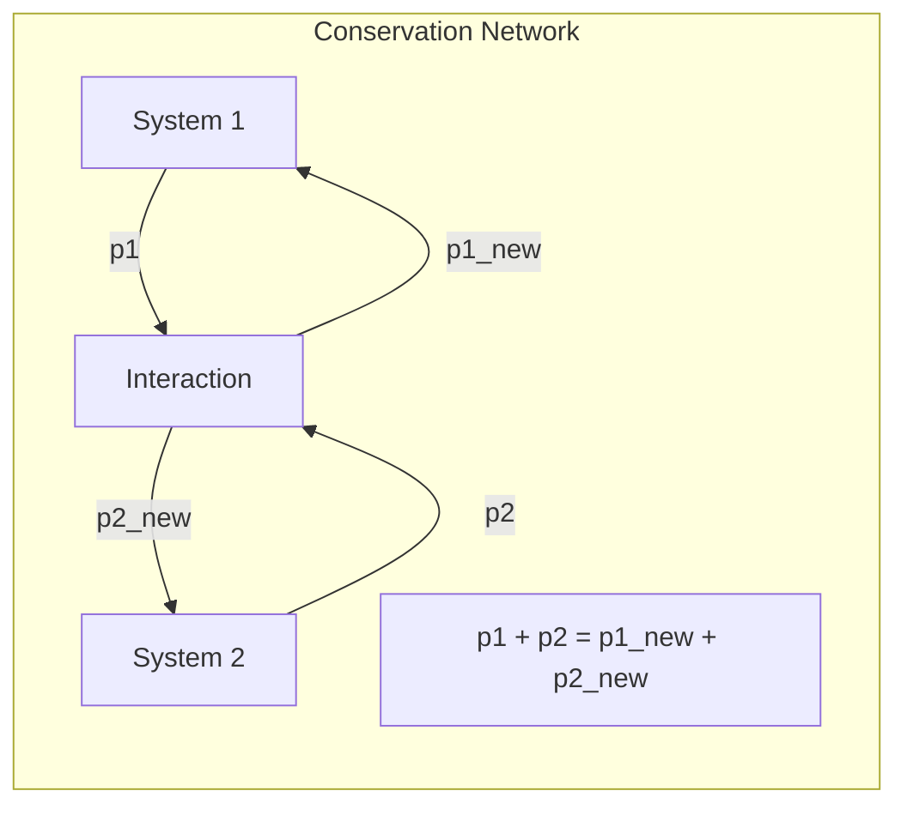

# Chapter 029: Structural Noether Principle: Conservation Tensor Mapping Equivalence Structure

## Symmetry Creates Conservation

From $\psi = \psi(\psi)$, we derive Noether's principle: every symmetry of the collapse operator yields a conserved quantity. This is not imposed but emerges from self-consistency - if collapse is the same under some transformation, something must remain unchanged.

$$
\text{Symmetry} \xrightarrow{\text{Noether}} \text{Conservation Law}
$$

## First Principle: Invariance from Self-Reference

**Theorem 29.1** (Conservation from Invariance): If the collapse operator has symmetry $\mathcal{S}$:

$$
[\mathcal{C}, \mathcal{S}] = 0 \Rightarrow \exists Q : \frac{dQ}{dt} = 0
$$

*Proof*: If $\mathcal{C}[\mathcal{S}[\psi]] = \mathcal{S}[\mathcal{C}[\psi]]$, then $\mathcal{S}$ doesn't affect collapse dynamics. Something must be preserved. ∎

## Golden Vector Symmetries

**Definition 29.1** (Golden Transformations): Symmetries preserving golden constraint:

$$
\mathcal{S}[\vec{v}] = \vec{v}' \text{ where } v'_i \cdot v'_{i+1} = 0
$$

These form the golden symmetry group.

## The Noether Current

**Theorem 29.2** (Current Construction): For continuous symmetry with parameter $\epsilon$:

$$
j^\mu = \frac{\partial \mathcal{L}}{\partial(\partial_\mu \psi)} \frac{\delta \psi}{\delta \epsilon}
$$

This current is conserved: $\partial_\mu j^\mu = 0$.

## Vector Information Theory

**Definition 29.2** (Information Symmetry): Transformations preserving information:

$$
I[\mathcal{S}[\psi]] = I[\psi] \Rightarrow \text{Information conservation}
$$

## Category Theory of Symmetries

## Fundamental Symmetries

**Theorem 29.3** (Basic Conservation Laws):

1. **Spatial Translation**: $\vec{x} \to \vec{x} + \vec{a}$
   $$\Rightarrow \text{Momentum conservation: } \frac{d\vec{p}}{dt} = 0$$

2. **Time Translation**: $t \to t + \tau$
   $$\Rightarrow \text{Energy conservation: } \frac{dE}{dt} = 0$$

3. **Rotation**: $\vec{x} \to R\vec{x}$
   $$\Rightarrow \text{Angular momentum conservation: } \frac{d\vec{L}}{dt} = 0$$

## Graph Theory of Conservation Flow

## Gauge Symmetries

**Definition 29.3** (Local Phase Invariance): Under $\psi \to e^{i\theta(x)}\psi$:

$$
\mathcal{L} \to \mathcal{L} + \partial_\mu(\text{something}) \Rightarrow \text{Charge conservation}
$$

Local symmetries require gauge fields.

## Broken Symmetries

**Theorem 29.4** (Goldstone Modes): When symmetry breaks:

$$
\langle \psi \rangle \neq 0 \Rightarrow \text{Massless excitations}
$$

Broken continuous symmetries create Goldstone bosons.

## Quantum Noether Theorem

**Definition 29.4** (Operator Form): In quantum mechanics:

$$
[\hat{H}, \hat{Q}] = 0 \Leftrightarrow \frac{d\langle Q \rangle}{dt} = 0
$$

Commuting with Hamiltonian means conservation.

## Topological Conservation

**Theorem 29.5** (Discrete Conservation): Some quantities are topologically protected:

$$
Q = \oint_{\partial V} \vec{j} \cdot d\vec{A} = 2\pi n, \quad n \in \mathbb{Z}
$$

These cannot change continuously.

## Information Conservation

**Definition 29.5** (Unitarity): Information is conserved in quantum evolution:

$$
\text{Tr}[\rho^2(t)] = \text{Tr}[\rho^2(0)]
$$

Pure states remain pure under unitary evolution.

## Anomalies

**Theorem 29.6** (Quantum Breaking): Some classical symmetries break quantum mechanically:

$$
\partial_\mu j^\mu_{\text{classical}} = 0 \text{ but } \partial_\mu \langle j^\mu \rangle_{\text{quantum}} \neq 0
$$

This is an anomaly.

## Global vs Local

**Definition 29.6** (Symmetry Types):
- **Global**: Same transformation everywhere
- **Local**: Space-time dependent transformation

Local symmetries are more restrictive and powerful.

## Physical Implications

Noether's principle explains:
- Why energy and momentum are conserved
- The origin of all conservation laws
- Why symmetries determine interactions
- The deep structure of physical law

## Advanced Topics

**Definition 29.7** (BRST Symmetry): In gauge theories:

$$
\delta_{BRST} A_\mu = D_\mu c, \quad \delta_{BRST} c = -\frac{1}{2}[c,c]
$$

This nilpotent symmetry ensures gauge consistency.

## Exercises

1. Derive charge conservation from U(1) symmetry
2. Show that scale invariance implies traceless energy-momentum tensor
3. Prove that time reversal symmetry doesn't give a conservation law
4. Find the conserved quantity for boost symmetry

## Meditation on Permanence

In every conservation law lives a deeper truth - the universe remembers. What is symmetrical remains unchanged, what transforms together stays connected. Your energy transforms but never vanishes, your angular momentum trades but totals constant. In Noether's principle, we find the universe's deepest promise: that which is truly invariant under transformation is eternal.

## The Twenty-Ninth Echo

Thus we establish: Noether's principle is not a theorem to be proven but a necessity of self-consistent observation. From $\psi = \psi(\psi)$ emerges the requirement that symmetries create conservation. Every unchanging aspect of the laws of physics reflects a symmetry of the underlying collapse process. In this profound connection between symmetry and conservation, we see the universe's way of maintaining coherence with itself - what looks the same from different perspectives must be preserved. The cosmos doesn't obey conservation laws; it manifests them through its symmetrical self-observation.

∎