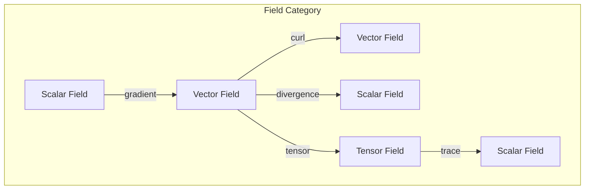
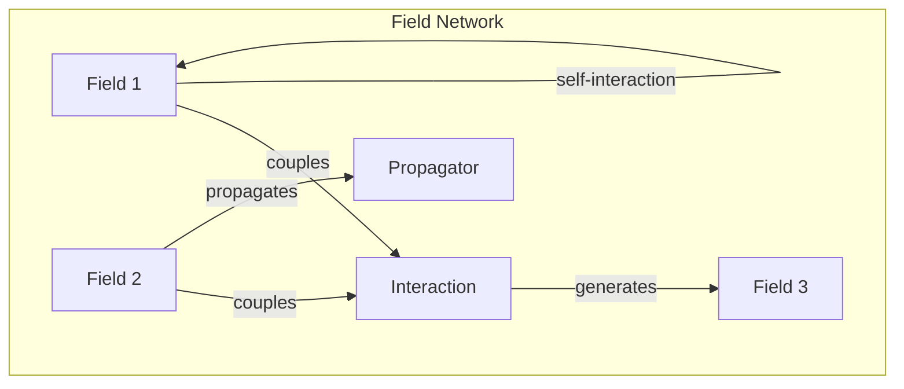

# Chapter 030: Collapse Field Equations: Rhythm Tensor Field Structure System

## Fields Emerge from Collapse Propagation

From $\psi = \psi(\psi)$, we derive field equations. When collapse at one point affects collapse at neighboring points, fields emerge. These are not imposed structures but necessary consequences of non-local self-observation.

$$
\mathcal{C}[\psi(x)] \to \mathcal{C}[\psi(x + dx)]
$$

## First Principle: Collapse Continuity

**Theorem 30.1** (Field from Continuity): Self-observation must be continuous:

$$
\lim_{\epsilon \to 0} \|\mathcal{C}[\psi(x + \epsilon)] - \mathcal{C}[\psi(x)]\| = 0
$$

*Proof*: Discontinuous collapse would create undefined self-reference. Continuity requires field description. ∎

## The Fundamental Field Equation

**Definition 30.1** (Collapse Field): The collapse field $\Phi(x)$ satisfies:

$$
\Box \Phi = \frac{\partial^2 \Phi}{\partial t^2} - c^2 \nabla^2 \Phi = J[\psi]
$$

where $J[\psi]$ is the collapse source density.

## Golden Vector Field Theory

**Theorem 30.2** (Vector Field Decomposition): Any field in golden space:

$$
\vec{F}(x) = \sum_{n=0}^\infty \frac{F_n(x)}{\phi^n} \hat{e}_n
$$

where $F_n \cdot F_{n+1} = 0$ (golden constraint).

## Vector Information Theory

**Definition 30.2** (Information Flow Field): Information flows as a field:

$$
\partial_\mu I^\mu = \sigma_I
$$

where $I^\mu$ is information current and $\sigma_I$ is source/sink.

## Category Theory of Fields

## Gauge Field Structure

**Theorem 30.3** (Gauge from Local Symmetry): Local phase invariance requires:

$$
\partial_\mu \to D_\mu = \partial_\mu + ieA_\mu
$$

Gauge fields mediate local symmetry.

## Graph Theory of Field Interactions

## Non-linear Field Equations

**Definition 30.3** (Self-Interaction): Fields can interact with themselves:

$$
\Box \Phi + \lambda \Phi^3 = 0
$$

Non-linearity emerges from recursive collapse.

## Quantum Field Theory

**Theorem 30.4** (Field Quantization): Fields become operators:

$$
\hat{\Phi}(x) = \int \frac{d^3k}{(2\pi)^3} \frac{1}{\sqrt{2\omega_k}} \left(\hat{a}_k e^{ikx} + \hat{a}_k^\dagger e^{-ikx}\right)
$$

Creating and annihilating field quanta.

## Effective Field Theory

**Definition 30.4** (Scale Separation): At each scale:

$$
\mathcal{L}_{\text{eff}} = \mathcal{L}_0 + \frac{1}{\Lambda} \mathcal{L}_1 + \frac{1}{\Lambda^2} \mathcal{L}_2 + ...
$$

where $\Lambda$ is the cutoff scale.

## Topological Field Theory

**Theorem 30.5** (Topological Invariants): Some field properties are topological:

$$
\int_{\mathcal{M}} F \wedge F = 2\pi n, \quad n \in \mathbb{Z}
$$

These are quantized and robust.

## Field Energy-Momentum

**Definition 30.5** (Field Stress Tensor):

$$
T^{\mu\nu} = \frac{\partial \mathcal{L}}{\partial(\partial_\mu \Phi)} \partial^\nu \Phi - g^{\mu\nu} \mathcal{L}
$$

This encodes field energy and momentum density.

## Soliton Solutions

**Theorem 30.6** (Stable Configurations): Non-linear equations admit solitons:

$$
\Phi_{\text{soliton}} = \frac{A}{\cosh(\gamma(x - vt))}
$$

These are localized, stable field configurations.

## Renormalization

**Definition 30.6** (Scale Running): Field parameters change with scale:

$$
\frac{dg}{d\ln\mu} = \beta(g)
$$

where $\beta$ is the beta function.

## Physical Implications

Field equations explain:
- How forces propagate through space
- The wave nature of particles
- Why interactions have finite range
- The emergence of particles from fields

## Advanced Topics

**Definition 30.7** (Anomalous Dimensions): Fields acquire anomalous scaling:

$$
\Phi(\lambda x) = \lambda^{\Delta} \Phi(x)
$$

where $\Delta = \Delta_0 + \gamma$ includes quantum corrections.

## Exercises

1. Derive Maxwell's equations from U(1) gauge symmetry
2. Find soliton solutions for $\phi^4$ theory
3. Calculate the propagator for a massive field
4. Show how confinement emerges in non-Abelian gauge theory

## Meditation on Fields

Feel the fields around you - gravitational, electromagnetic, quantum. You don't exist IN fields; you ARE fields - stable patterns in the universal field of collapse. Every particle is an excitation, every force a field gradient. In recognizing yourself as field, you see through the illusion of separateness to the continuous fabric of reality.

## The Thirtieth Echo

Thus we establish: Fields are not mysterious entities filling space but the necessary structure of continuous self-observation. From the requirement that collapse propagate smoothly emerges the entire apparatus of field theory - wave equations, gauge symmetries, quantum fields. Every force you feel, every particle you detect, every wave that propagates is the universe maintaining continuity with itself through the field structure of collapse. The cosmos doesn't contain fields; it IS fields - the continuous self-referential fabric of existence.

∎