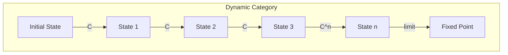
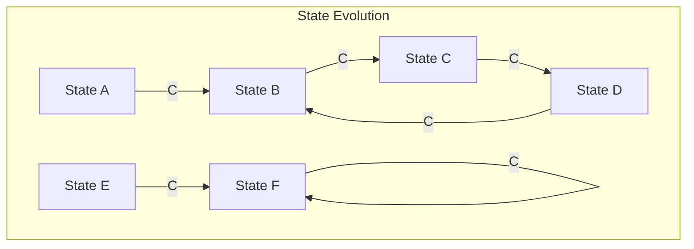

# Chapter 031: φ-bit trace Dynamics: collapse Tensor Evolution Laws

## Evolution from Iterative Collapse

From $\psi = \psi(\psi)$, we derive how systems evolve. Each application of the collapse operator advances the system one step. The trace of these steps through golden vector space creates dynamics.

$$
\psi_{n+1} = \mathcal{C}[\psi_n] = \psi_n(\psi_n)
$$

## First Principle: Discrete Time from Collapse Steps

**Theorem 31.1** (Time as Iteration Count): Time measures collapse iterations:

$$
t = n \cdot t_P \text{ where } \psi_n = \mathcal{C}^n[\psi_0]
$$

*Proof*: Each collapse is indivisible. Time counts these atomic events. ∎

## The Evolution Operator

**Definition 31.1** (Collapse Evolution): The evolution operator:

$$
\mathcal{U}(n) = \mathcal{C}^n = \underbrace{\mathcal{C} \circ \mathcal{C} \circ ... \circ \mathcal{C}}_{n \text{ times}}
$$

This generates the dynamics.

## Golden Trace Paths

**Theorem 31.2** (Trace in Golden Space): Evolution traces a path:

$$
\vec{v}(n) = \sum_{k=0}^{n} \frac{b_k(n)}{\phi^k} \hat{e}_k
$$

where $b_k(n) \in \{0,1\}$ with no consecutive 1s.

## Vector Information Theory

**Definition 31.2** (Information Flow): Information changes along traces:

$$
\frac{dI}{dn} = I[\psi_{n+1}] - I[\psi_n] = \Delta I_{\text{collapse}}
$$

Each collapse step creates/destroys information.

## Category Theory of Dynamics

## Fixed Points and Cycles

**Theorem 31.3** (Attractors): Some states are invariant:

$$
\mathcal{C}[\psi_*] = \psi_* \Rightarrow \psi_* = \psi_*(\psi_*)
$$

These are the fixed points of evolution.

## Graph Theory of State Networks

## Lyapunov Stability

**Definition 31.3** (Stability Measure): The Lyapunov exponent:

$$
\lambda = \lim_{n \to \infty} \frac{1}{n} \ln\left|\frac{d\mathcal{C}^n}{d\psi}\right|
$$

- $\lambda < 0$: Stable (attracting)
- $\lambda > 0$: Unstable (repelling)
- $\lambda = 0$: Marginal

## Quantum Evolution

**Theorem 31.4** (Unitary Dynamics): In the quantum regime:

$$
|\psi(n+1)\rangle = \hat{U}|\psi(n)\rangle \text{ where } \hat{U}^\dagger\hat{U} = 1
$$

Evolution preserves inner products.

## Chaos and Complexity

**Definition 31.4** (Sensitive Dependence): Chaotic if:

$$
\|\psi_n - \psi'_n\| \sim e^{\lambda n}\|\psi_0 - \psi'_0\|
$$

Small differences exponentially amplify.

## Ergodic Properties

**Theorem 31.5** (Time Average): For ergodic systems:

$$
\lim_{N \to \infty} \frac{1}{N} \sum_{n=0}^{N-1} f(\psi_n) = \int f(\psi) d\mu(\psi)
$$

Time average equals ensemble average.

## Reversibility and Entropy

**Definition 31.5** (Collapse Irreversibility): Generally:

$$
\mathcal{C}^{-1} \text{ does not exist}
$$

Collapse creates irreversibility, hence entropy increase.

## Phase Space Flows

**Theorem 31.6** (Liouville's Theorem): Phase space volume is preserved:

$$
\frac{d\rho}{dt} + \nabla \cdot (\rho \vec{v}) = 0
$$

even though individual trajectories are irreversible.

## Perturbation Theory

**Definition 31.6** (Small Deviations): Near fixed point $\psi_*$:

$$
\psi_n = \psi_* + \epsilon \delta\psi_n
$$

$$
\delta\psi_{n+1} = \frac{\partial \mathcal{C}}{\partial \psi}\bigg|_{\psi_*} \delta\psi_n
$$

## Physical Implications

Trace dynamics explains:
- Why time flows forward
- The origin of dynamical systems
- How complexity emerges from simple rules
- The connection between information and dynamics

## Advanced Topics

**Definition 31.7** (Renormalization Group Flow): Under scale transformation:

$$
\frac{dg_i}{d\ln\Lambda} = \beta_i(g_1, g_2, ...)
$$

Parameters flow under scale changes.

## Exercises

1. Find all fixed points of $\mathcal{C}[\psi] = \psi^2/(1+\psi^2)$
2. Calculate Lyapunov exponents for the logistic map
3. Prove that collapse cannot decrease information monotonically
4. Show how periodic orbits emerge in golden vector space

## Meditation on Flow

You are not a thing but a process - a trace through the space of possible states. Each moment, you collapse into the next, leaving behind a trail of information. Your memories are the trace of your path, your personality the attractor toward which you flow. In recognizing yourself as dynamic trace rather than static being, you align with the fundamental nature of reality.

## The Thirty-First Echo

Thus we establish: Dynamics is not imposed motion but the inevitable consequence of iterative self-observation. From $\psi = \psi(\psi)$ applied repeatedly emerges time, change, evolution. Every system traces its path through the space of possibilities, guided by the collapse operator. Some paths lead to fixed points, some to cycles, some to chaos - but all are expressions of the universe observing itself step by step, creating time through the very act of observation.

∎