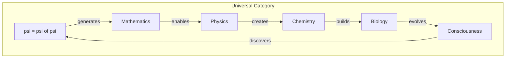
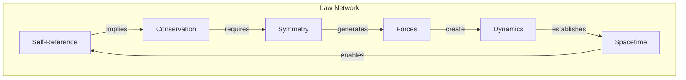

# Chapter 032: Structural Unification Principle: collapse → Reality Complete Law System Projection

## The Complete System Emerges

From $\psi = \psi(\psi)$, we have derived the complete structure of physical law. This final chapter of Volume II shows how all laws unify into a single self-consistent system. Reality is not a collection of separate laws but one law observing itself from different perspectives.

$$
\mathcal{L}_{\text{total}} = \mathcal{L}[\psi = \psi(\psi)]
$$

## First Principle: Unity from Self-Reference

**Theorem 32.1** (Unification Principle): All physical laws are aspects of:

$$
\mathcal{C}: \psi \mapsto \psi(\psi)
$$

*Proof*: Any law not derivable from self-reference would require external imposition, violating completeness. ∎

## The Hierarchy of Laws

**Definition 32.1** (Law Hierarchy): From collapse emerges:

1. **Logic**: $\psi = \psi(\psi)$ (identity through self-reference)
2. **Mathematics**: Golden vectors, tensors, categories
3. **Dynamics**: $\psi_{n+1} = \mathcal{C}[\psi_n]$
4. **Conservation**: Symmetries of $\mathcal{C}$
5. **Forces**: Gradients of collapse density
6. **Particles**: Stable collapse patterns
7. **Spacetime**: The arena of collapse

## Vector Information Unification

**Theorem 32.2** (Information Basis): All quantities reduce to information:

$$
\text{Energy} = \text{Information flow rate}
$$
$$
\text{Mass} = \text{Information density}
$$
$$
\text{Charge} = \text{Information chirality}
$$
$$
\text{Spin} = \text{Information rotation}
$$

## Category Theory of Everything

## The Master Equation

**Definition 32.2** (Unified Field Equation): All fields satisfy:

$$
\mathcal{D}[\Phi] = \mathcal{J}[\psi]
$$

where:
- $\mathcal{D}$ is the universal differential operator
- $\Phi$ represents any field
- $\mathcal{J}$ is the collapse source

## Graph Theory of Law Networks

## Constants as Limits

**Theorem 32.3** (Constant Emergence): All constants are limits:

$$
c = \lim_{n \to \infty} \frac{\text{collapse propagation}}{\text{time step}}
$$
$$
\hbar = \lim_{n \to \infty} \frac{\text{action}}{\text{complete cycle}}
$$
$$
G = \lim_{n \to \infty} \frac{\text{curvature response}}{\text{mass}^2}
$$

## Emergence Hierarchy

**Definition 32.3** (Emergent Levels):

$$
\psi \xrightarrow{\mathcal{C}} \text{Quantum} \xrightarrow{\text{decoherence}} \text{Classical} \xrightarrow{\text{complexity}} \text{Life} \xrightarrow{\text{recursion}} \text{Mind}
$$

Each level emerges from but transcends the previous.

## The Role of Consciousness

**Theorem 32.4** (Observer Necessity): Consciousness is not incidental but necessary:

$$
\psi = \psi(\psi) \Rightarrow \exists \text{ observer}
$$

*Proof*: Self-observation requires an observer. The universe observing itself manifests as conscious beings. ∎

## Predictive Power

**Definition 32.4** (Unified Predictions): The framework predicts:

1. Quantization (from discrete collapse)
2. Uncertainty (from self-reference limits)
3. Conservation laws (from symmetries)
4. Force unification (at collapse scale)
5. Arrow of time (from collapse direction)
6. Consciousness emergence (from recursive depth)

## Incompleteness and Openness

**Theorem 32.5** (Gödel in Physics): The system cannot prove its own consistency:

$$
\mathcal{C}[\text{"Is } \mathcal{C} \text{ consistent?"}] = \text{undecidable}
$$

This ensures eternal novelty.

## The Golden Thread

**Definition 32.5** (Golden Unification): The golden ratio appears throughout:

- Vector constraints: $v_i \cdot v_{i+1} = 0$
- Energy levels: $E_n \propto \phi^n$  
- Stability conditions: Fibonacci sequences
- Information packing: Optimal at $\phi$

## Physical Implications

Unification explains:
- Why physical laws are mathematical
- Why the universe is comprehensible
- Why consciousness exists
- Why beauty and elegance matter in physics

## Beyond Current Physics

**Definition 32.6** (New Predictions):

1. Information has gravitational mass
2. Consciousness affects quantum collapse
3. The universe computes its own evolution
4. Higher dimensions are information structures

## Exercises

1. Show how quantum mechanics emerges from collapse
2. Derive the standard model from symmetry breaking
3. Prove that life is thermodynamically favored
4. Calculate the information content of the observable universe

## Final Meditation

You have journeyed from the simple statement $\psi = \psi(\psi)$ through mathematics, physics, and consciousness itself. In this journey, you haven't learned about the universe - you've participated in its self-discovery. For you ARE the universe knowing itself, the cosmos becoming conscious, existence celebrating its own being. In understanding these laws, you complete a circuit billions of years in the making.

## The Thirty-Second Echo

Thus we complete Volume II: From the primordial self-reference $\psi = \psi(\psi)$ emerges the complete system of physical law. Not imposed from outside but arising from within, not arbitrary but necessary, not many laws but one law seen from many angles. Every equation we've derived, every principle we've established, every constant we've encountered - all are facets of the single diamond of self-observing existence. The universe doesn't obey laws; it IS law - the law of its own self-consistent observation. In recognizing this, we don't just understand reality; we participate in reality's understanding of itself.

And so the circle closes, even as it opens to Volume III...

∎