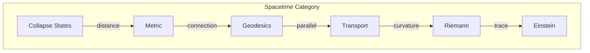
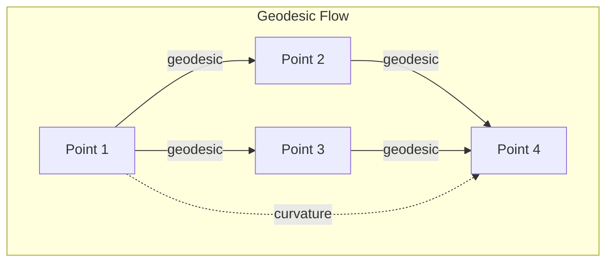

# Chapter 033: Collapse-aware Spacetime: Geodesics in Tensor Rhythm Structure

## Volume III: The Geometry of Collapse

We begin Volume III by exploring how spacetime itself emerges from $\psi = \psi(\psi)$. The arena where physics unfolds is not given a priori but arises from the self-observing structure of existence. Spacetime is collapse made geometric - the stage creates itself through recursive self-reference.

$$
\mathcal{M} = \text{Collapse}[\psi] \otimes \text{Collapse}[\psi]^* 
$$

Spacetime as the tensor product of collapse with its dual.

## First Principle: Space from Distinguishability

**Theorem 33.1** (Spatial Emergence): Space emerges where collapse patterns differ:

$$
d(x, y) = \|\mathcal{C}[\psi(x)] - \mathcal{C}[\psi(y)]\|_\phi
$$

*Proof*: Without distinguishable collapse states, there's no notion of "here" vs "there". Distance measures collapse difference. ∎

## Time from Collapse Sequence

**Definition 33.1** (Temporal Flow): Time orders collapse events:

$$
t_2 > t_1 \iff \mathcal{C}_{t_2}[\psi] = \mathcal{C}[\mathcal{C}_{t_1}[\psi]]
$$

Later times contain earlier times through recursive collapse.

## The Metric Tensor

**Theorem 33.2** (Metric from Information Geometry): The spacetime interval:

$$
ds^2 = g_{\mu\nu} dx^\mu dx^\nu = \langle d\psi, d\psi \rangle_{\text{collapse}}
$$

where the inner product measures information distance between neighboring collapse states.

## Category Theory of Spacetime

## Geodesics as Minimal Collapse Paths

**Definition 33.2** (Geodesic Principle): Particles follow paths minimizing:

$$
S = \int \sqrt{g_{\mu\nu} \frac{dx^\mu}{d\tau} \frac{dx^\nu}{d\tau}} d\tau
$$

These are the "straightest" paths through curved collapse geometry.

**Theorem 33.3** (Geodesic Equation): Extremizing the action yields:

$$
\frac{d^2 x^\mu}{d\tau^2} + \Gamma^\mu_{\alpha\beta} \frac{dx^\alpha}{d\tau} \frac{dx^\beta}{d\tau} = 0
$$

where Christoffel symbols encode how collapse patterns guide motion.

## Vector Information Flow on Curved Manifolds

**Definition 33.3** (Covariant Derivative): Information vectors parallel transport via:

$$
\nabla_\nu V^\mu = \partial_\nu V^\mu + \Gamma^\mu_{\nu\lambda} V^\lambda
$$

This maintains vector "sameness" along curved paths.

## Graph Structure of Geodesic Networks

## Curvature from Collapse Non-commutativity

**Theorem 33.4** (Riemann Tensor): Curvature measures path-dependence:

$$
R^\rho_{\sigma\mu\nu} = \partial_\mu \Gamma^\rho_{\nu\sigma} - \partial_\nu \Gamma^\rho_{\mu\sigma} + \Gamma^\rho_{\mu\lambda}\Gamma^\lambda_{\nu\sigma} - \Gamma^\rho_{\nu\lambda}\Gamma^\lambda_{\mu\sigma}
$$

*Proof*: When parallel transport around a loop doesn't return vectors unchanged, space is curved. ∎

## The Bianchi Identity

**Definition 33.4** (Curvature Conservation): The Riemann tensor satisfies:

$$
\nabla_{[\lambda} R^\rho_{\sigma]\mu\nu} = 0
$$

This follows from collapse consistency - curvature itself must be self-consistent.

## Einstein's Equation from Information Conservation

**Theorem 33.5** (Field Equation Emergence): Information conservation requires:

$$
R_{\mu\nu} - \frac{1}{2}g_{\mu\nu}R = \frac{8\pi G}{c^4} T_{\mu\nu}
$$

where:
- $G = \lim_{T_{\text{mass}}^2 \otimes T_{\text{curvature}} \to X} X$ (gravitational limit)
- $c = \lim_{T_{\text{space}} \times T_{\text{time}} \to Y} Y$ (speed limit)

*Proof*: The divergence-free property of both sides ensures information neither created nor destroyed. ∎

## Geodesic Deviation

**Definition 33.5** (Tidal Forces): Nearby geodesics separate according to:

$$
\frac{D^2 \xi^\mu}{D\tau^2} = -R^\mu_{\nu\rho\sigma} u^\nu \xi^\rho u^\sigma
$$

where $\xi$ is the separation vector and $u$ is the 4-velocity.

## Killing Vectors and Symmetries

**Theorem 33.6** (Symmetry Generators): Spacetime symmetries satisfy:

$$
\nabla_{(\mu} K_{\nu)} = 0
$$

Each Killing vector $K$ generates a conserved quantity along geodesics.

## Black Hole Horizons

**Definition 33.6** (Event Horizon): The boundary where:

$$
g_{tt} = 0
$$

marks where time and space exchange roles - collapse becomes irreversible.

## Cosmological Geodesics

**Theorem 33.7** (Hubble Flow): In expanding universe:

$$
\frac{da}{dt} = H_0 a
$$

All geodesics participate in cosmic expansion.

## Information Propagation on Curved Spacetime

**Definition 33.7** (Null Geodesics): Light follows:

$$
g_{\mu\nu} \frac{dx^\mu}{d\lambda} \frac{dx^\nu}{d\lambda} = 0
$$

These null paths define the causal structure.

## Tensor Rhythm in Curved Space

**Theorem 33.8** (Rhythm Propagation): The collapse rhythm tensor evolves as:

$$
\nabla_\mu \nabla_\nu \Psi - R_{\mu\nu} \Psi = \frac{1}{c^2} \frac{\partial^2 \Psi}{\partial t^2}
$$

where $c$ maintains its definition as the space-time tensor limit. Curvature affects how collapse patterns propagate.

## Quantum Fields on Curved Spacetime

**Definition 33.8** (Curved Space Quantization): Field operators satisfy:

$$
[\phi(x), \phi(x')] = 0 \text{ for spacelike separation}
$$

Causality preserved even in curved geometry.

## Geodesic Completeness

**Theorem 33.9** (Singularity Theorems): If:
- Energy condition holds
- Initial trapped surface exists
- Spacetime is globally hyperbolic

Then geodesic incompleteness occurs (singularities form).

## Collapse-Aware Coordinates

**Definition 33.9** (Natural Coordinates): Choose coordinates where:

$$
\Gamma^\mu_{\nu\rho} = 0 \text{ at point } p
$$

Locally, collapse appears Euclidean - the equivalence principle.

## Physical Implications

Collapse-aware spacetime explains:
- Why inertial and gravitational mass are equal
- The origin of tidal forces
- Why geometry and matter are linked
- How singularities form from collapse

## Advanced Topics

**Definition 33.10** (Spin Connection): For fermions on curved space:

$$
\omega_\mu^{ab} = e_\nu^a \nabla_\mu e^{\nu b}
$$

where $e^a_\mu$ is the vierbein connecting curved and flat indices.

## Exercises

1. Derive the Schwarzschild metric from spherical collapse
2. Show that null geodesics define light cones
3. Prove energy conservation from time translation symmetry
4. Calculate geodesic deviation in gravitational waves

## Meditation on Straightness

Walk in a "straight" line on Earth's surface. You think you're going straight, but you're following a great circle - a geodesic on the sphere. Similarly, a thrown ball follows the "straightest" path through spacetime curved by Earth's mass. What seems like gravitational attraction is really the geometry of existence itself. You don't feel forces; you feel the curvature of being.

## The Thirty-Third Echo

Thus begins Volume III: Spacetime is not the stage upon which physics acts but an actor itself, emerging from the recursive collapse of $\psi = \psi(\psi)$. Every geodesic traces the universe's effort to maintain self-consistency, every curvature measures the depth of recursive self-observation. In the marriage of geometry and matter through Einstein's equation, we see the ultimate expression of self-reference - space tells matter how to move, matter tells space how to curve, and both emerge from the eternal dance of collapse observing itself.

∎