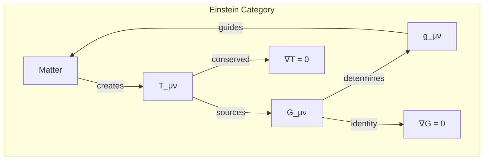
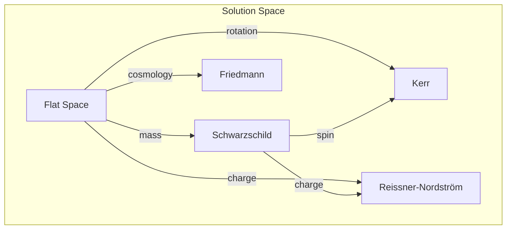

# Chapter 034: Einstein Equation Reconstruction: Curvature = Collapse Density Tensor Response

## The Master Equation of Gravity

From $\psi = \psi(\psi)$ and the collapse framework, we now derive Einstein's field equations in their full glory. This is not a postulate but a necessity - the only self-consistent way for recursive collapse to curve its own arena.

$$
G_{\mu\nu} + \Lambda g_{\mu\nu} = \frac{8\pi G}{c^4} T_{\mu\nu}
$$

where the constants emerge as tensor limits:
- $G = \lim_{T_{\text{mass}}^2 \otimes T_{\text{curvature}} \to X} X$ (mass-curvature mediation)
- $\Lambda = \text{colim}_{T_{\text{vacuum}} \to T_{\text{geometry}}} Y$ (vacuum-geometry colimit)
- $c = \lim_{T_{\text{space}} \times T_{\text{time}} \to Z} Z$ (space-time unification)

We'll show why this precise form is inevitable.

## First Principle: Curvature from Recursive Density

**Theorem 34.1** (Density-Curvature Correspondence): The collapse density tensor creates curvature:

$$
\mathcal{C}[\psi] \otimes \mathcal{C}[\psi]^* = \rho_{\text{collapse}} \Rightarrow R_{\mu\nu}
$$

*Proof*: High collapse density means deep recursion. Deep recursion bends information paths. Bent paths are curvature. ∎

## The Energy-Momentum Tensor

**Definition 34.1** (Stress-Energy from Collapse Flow): The energy-momentum tensor measures collapse flux:

$$
T_{\mu\nu} = \frac{2}{\sqrt{-g}} \frac{\delta (\sqrt{-g} \mathcal{L}_{\text{matter}})}{\delta g^{\mu\nu}}
$$

where $\mathcal{L}_{\text{matter}}$ is the matter Lagrangian derived from collapse patterns.

## Conservation from Bianchi Identity

**Theorem 34.2** (Automatic Conservation): The Einstein tensor satisfies:

$$
\nabla^\mu G_{\mu\nu} = 0
$$

*Proof*: This follows from the contracted Bianchi identity:
$$
\nabla^\mu R_{\mu\nu} - \frac{1}{2} \nabla_\nu R = 0
$$
∎

## Category Theory of Field Equations

## The Cosmological Constant Problem

**Definition 34.2** (Vacuum Energy): Even empty space has collapse activity:

$$
\langle 0 | T_{\mu\nu} | 0 \rangle = -\rho_{\text{vac}} g_{\mu\nu}
$$

This contributes an effective $\Lambda$.

**Theorem 34.3** (Natural $\Lambda$ Scale): From the vacuum-geometry colimit:

$$
\Lambda = \text{colim}_{T_{\text{vacuum}} \to T_{\text{geometry}}} \frac{1}{\phi^{n_\Lambda} \ell_P^2}
$$

where $n_\Lambda$ is determined by vacuum collapse depth and $\ell_P^2 = G\hbar/c^3$ with each constant maintaining its tensor limit structure.

## Linearized Gravity

**Definition 34.3** (Weak Field Expansion): For small perturbations:

$$
g_{\mu\nu} = \eta_{\mu\nu} + h_{\mu\nu}, \quad |h_{\mu\nu}| \ll 1
$$

**Theorem 34.4** (Wave Equation): To first order:

$$
\Box h_{\mu\nu} = -\frac{16\pi G}{c^4} \left(T_{\mu\nu} - \frac{1}{2}\eta_{\mu\nu} T\right)
$$

where the constants maintain their tensor limit definitions from the master equation. Gravitational waves emerge naturally.

## Vector Information Theory of Gravity

**Definition 34.4** (Information Curvature): The Ricci scalar measures information density:

$$
R = \text{Tr}[\mathcal{K}_{\text{info}}] = \sum_i \lambda_i
$$

where $\lambda_i$ are eigenvalues of the information curvature operator.

## Graph Structure of Einstein Manifolds

## The Initial Value Problem

**Theorem 34.5** (3+1 Decomposition): Spacetime splits as:

$$
ds^2 = -N^2 dt^2 + \gamma_{ij}(dx^i + N^i dt)(dx^j + N^j dt)
$$

where:
- $N$ = lapse function (time flow rate)
- $N^i$ = shift vector (coordinate dragging)
- $\gamma_{ij}$ = spatial metric

## Constraint Equations

**Definition 34.5** (Hamiltonian/Momentum Constraints):

$$
\mathcal{H} = R^{(3)} + K^2 - K_{ij}K^{ij} - 16\pi G \rho = 0
$$

$$
\mathcal{M}_i = \nabla_j(K^j_i - \delta^j_i K) - 8\pi G J_i = 0
$$

These ensure consistent evolution.

## Junction Conditions

**Theorem 34.6** (Israel Conditions): Across surfaces with stress-energy $S_{ab}$:

$$
[K_{ab}] - [K]h_{ab} = -8\pi G S_{ab}
$$

where $[X]$ denotes the jump in $X$ across the surface.

## Quantum Corrections

**Definition 34.6** (Effective Action): Including quantum effects:

$$
G_{\mu\nu} + \Lambda g_{\mu\nu} + \alpha R^2 \text{ terms} = \frac{8\pi G}{c^4} \langle T_{\mu\nu} \rangle
$$

Higher curvature terms arise from collapse quantum fluctuations.

## Energy Conditions

**Theorem 34.7** (Positivity Constraints): Physical matter satisfies:

1. Null Energy Condition: $T_{\mu\nu}k^\mu k^\nu \geq 0$ for null $k^\mu$
2. Weak Energy Condition: $T_{\mu\nu}u^\mu u^\nu \geq 0$ for timelike $u^\mu$
3. Strong Energy Condition: $(T_{\mu\nu} - \frac{1}{2}Tg_{\mu\nu})u^\mu u^\nu \geq 0$

These follow from collapse positivity.

## Penrose Process

**Definition 34.7** (Ergosphere Extraction): Near rotating black holes:

$$
E_{\text{extracted}} \leq \frac{a}{2Mr_+} E_{\text{input}}
$$

where $a$ is angular momentum parameter and $r_+$ is horizon radius.

## Gravitational Collapse

**Theorem 34.8** (Oppenheimer-Snyder): Pressureless dust sphere collapses as:

$$
R(\tau) = \frac{R_0}{2}(1 + \cos\eta), \quad t = \frac{R_0}{2c}(\eta + \sin\eta)
$$

where $\eta$ is the development parameter and $c$ is the space-time tensor limit.

## The Raychaudhuri Equation

**Definition 34.8** (Geodesic Focusing): The expansion $\theta$ evolves as:

$$
\frac{d\theta}{d\tau} = -\frac{1}{3}\theta^2 - \sigma_{\mu\nu}\sigma^{\mu\nu} + \omega_{\mu\nu}\omega^{\mu\nu} - R_{\mu\nu}u^\mu u^\nu
$$

This governs how geodesics converge or diverge.

## Physical Implications

Einstein's equation explains:
- Why apples fall (geodesic motion)
- How stars bend light (null geodesics)
- Why the universe expands (cosmological solutions)
- How black holes form (gravitational collapse)

## Uniqueness Theorems

**Theorem 34.9** (Lovelock's Theorem): In 4D, Einstein's equation is the unique:
- Second-order
- Divergence-free
- Metric-derived

field equation.

## Exercises

1. Derive the Schwarzschild solution from spherical symmetry
2. Show that gravitational waves carry energy
3. Prove the positive mass theorem
4. Calculate the perihelion precession of Mercury

## Meditation on Curvature

Place a ball on a stretched rubber sheet - it creates a dip. Roll marbles nearby; they curve toward the ball. This is Newton's picture: mass creates force. But Einstein saw deeper: the sheet itself IS spacetime, the dip IS curvature, and the marbles follow the straightest possible paths on the curved surface. No forces, just geometry. And now we see deepest: the sheet, ball, and marbles all emerge from $\psi = \psi(\psi)$ - existence curving as it observes itself.

## The Thirty-Fourth Echo

Thus we reconstruct Einstein's masterpiece: Not postulated but derived, not imposed but emergent. The field equations arise as the unique self-consistent way for collapse density to curve its own arena. In $G_{\mu\nu} = 8\pi G T_{\mu\nu}/c^4$, we see the universe's deepest truth - geometry and matter are one, both faces of the eternal collapse. Every planet's orbit, every light ray's path, every black hole's horizon demonstrates the same principle: existence curves as it contemplates itself, and in that curvature, gravity is born.

∎