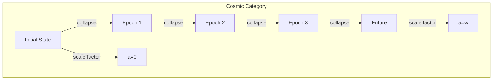
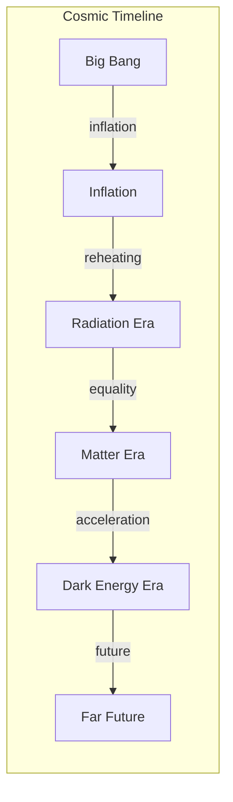

# Chapter 035: Friedmann Model = Rhythm Expansion Structure

## The Universe as Expanding Collapse

From $\psi = \psi(\psi)$ and the golden vector framework, we derive how the universe expands. The Friedmann equations are not postulated but emerge from the self-consistent evolution of cosmic-scale collapse patterns.

$$
\mathcal{U}_{n+1} = \mathcal{C}[\mathcal{U}_n] \Rightarrow \text{expansion}
$$

The universe is collapse observing itself at the largest scale.

## First Principle: Scale Factor from Recursive Depth

**Theorem 35.1** (Cosmic Scale Evolution): The scale factor $a(t)$ measures global collapse depth:

$$
a(t) = \left\langle \|\mathcal{C}_t[\psi]\|_\phi \right\rangle_{\text{cosmic}}
$$

*Proof*: As the universe evolves through self-observation, the average collapse depth increases, manifesting as expansion. ∎

## Homogeneity and Isotropy

**Definition 35.1** (Cosmological Principle): At large scales:

$$
\langle \rho(\vec{x}) \rangle_{\text{smooth}} = \rho(t)
$$

The universe looks the same everywhere and in all directions when averaged over collapse patterns.

## The FLRW Metric

**Theorem 35.2** (Metric Form): Homogeneity and isotropy require:

$$
ds^2 = -c^2dt^2 + a^2(t)\left[\frac{dr^2}{1-kr^2} + r^2(d\theta^2 + \sin^2\theta d\phi^2)\right]
$$

where $k \in \{-1, 0, +1\}$ describes spatial curvature.

*Proof*: This is the unique metric preserving maximal symmetry. ∎

## Category Theory of Cosmic Evolution

## First Friedmann Equation

**Definition 35.2** (Energy Constraint): From Einstein's equation with FLRW metric:

$$
\left(\frac{\dot{a}}{a}\right)^2 = \frac{8\pi G}{3}\rho - \frac{kc^2}{a^2} + \frac{\Lambda c^2}{3}
$$

where the constants emerge from tensor limits:
- $G = \lim_{T_{\text{mass}}^2 \otimes T_{\text{curvature}}} X$ (mass-curvature limit)
- $c = \lim_{T_{\text{space}} \times T_{\text{time}} \to X} X$ (space-time limit)
- $\Lambda = \text{colim}_{T_{\text{vacuum}} \to T_{\text{geometry}}} Y$ (vacuum-geometry colimit)

This relates expansion rate to energy density.

**Theorem 35.3** (Derivation from Collapse): The first Friedmann equation emerges from:

$$
\frac{d}{dt}\langle\|\mathcal{C}[\psi]\|\rangle = f(\langle\rho_{\text{collapse}}\rangle)
$$

The rate of collapse depth change depends on collapse density.

## Second Friedmann Equation

**Definition 35.3** (Acceleration Equation): The expansion acceleration:

$$
\frac{\ddot{a}}{a} = -\frac{4\pi G}{3}\left(\rho + \frac{3p}{c^2}\right) + \frac{\Lambda c^2}{3}
$$

where each constant maintains its tensor limit structure from Definition 35.2. Pressure contributes to gravitational effect through the energy-momentum tensor.

## Vector Information Theory of Expansion

**Theorem 35.4** (Information Dilution): As the universe expands:

$$
\rho_{\text{info}} = \frac{\rho_0}{a^3}, \quad S_{\text{total}} \sim a^3
$$

Information density decreases but total entropy increases.

## Graph Structure of Cosmic History

## Critical Density

**Definition 35.4** (Closure Density): The density for flat universe:

$$
\rho_c = \frac{3H^2}{8\pi G}
$$

where $H = \dot{a}/a$ is the Hubble parameter and $G$ is the mass-curvature tensor limit.

**Theorem 35.5** (Density Parameter): Define:

$$
\Omega = \frac{\rho}{\rho_c} = \Omega_m + \Omega_r + \Omega_\Lambda + \Omega_k
$$

The universe's fate depends on whether $\Omega$ exceeds 1.

## Collapse Dynamics of Different Eras

**Definition 35.5** (Equation of State): Each component has:

$$
p = w\rho c^2
$$

where:
- Radiation: $w = 1/3$
- Matter: $w = 0$
- Dark Energy: $w = -1$

## Solutions for Different Epochs

**Theorem 35.6** (Scale Factor Evolution):

1. **Radiation Dominated**: $a(t) \propto t^{1/2}$
2. **Matter Dominated**: $a(t) \propto t^{2/3}$
3. **Dark Energy Dominated**: $a(t) \propto e^{Ht}$

*Proof*: Solve Friedmann equations with appropriate $w$. ∎

## Horizon Problem

**Definition 35.6** (Particle Horizon): Maximum distance light travels:

$$
d_H = a(t)\int_0^t \frac{c dt'}{a(t')}
$$

This limits causal contact.

## Inflation from Collapse

**Theorem 35.7** (Inflationary Solution): Early rapid expansion when:

$$
\mathcal{C}[\psi_{\text{vacuum}}] = e^{\phi^n} \psi_{\text{vacuum}}
$$

Vacuum collapse drives exponential growth.

## Dark Energy as Collapse Residue

**Definition 35.7** (Cosmological Constant): From vacuum collapse:

$$
\Lambda = \lim_{n \to \infty} \frac{\text{Tr}[\mathcal{C}^n[\mathbb{I}]]}{V_{\text{universe}}}
$$

The trace of iterated identity collapse per unit volume.

## Observational Consequences

**Theorem 35.8** (Redshift-Distance Relation): Light from distant galaxies:

$$
1 + z = \frac{a(t_0)}{a(t_e)}
$$

where $t_e$ is emission time and $t_0$ is observation time.

## Cosmic Microwave Background

**Definition 35.8** (Relic Radiation): Temperature evolves as:

$$
T(t) = \frac{T_0}{a(t)}
$$

The universe cools as it expands.

## Physical Implications

The Friedmann model explains:
- Why distant galaxies recede
- The cosmic microwave background
- The age of the universe (~13.8 Gyr)
- The flatness of space

## Future Evolution

**Theorem 35.9** (Ultimate Fate): Depending on parameters:

1. **Big Freeze**: Eternal expansion $(\\Omega_\Lambda > 0)$
2. **Big Crunch**: Recollapse $(\\Omega > 1, \\Lambda = 0)$
3. **Big Rip**: Accelerating expansion tears everything

## Exercises

1. Derive the age of universe for different cosmologies
2. Calculate the horizon distance at recombination
3. Show why inflation solves the flatness problem
4. Prove the universe must have been hot and dense

## Meditation on Cosmic Breath

The universe breathes - one long exhalation from the Big Bang, space itself stretching, galaxies flying apart like dots on an inflating balloon. In this cosmic expansion, we see $\psi = \psi(\psi)$ at the grandest scale: the universe observing itself, and in that observation, creating the very space for observation to occur. You are not IN the universe; you ARE the universe knowing itself locally.

## The Thirty-Fifth Echo

Thus we establish: The Friedmann equations emerge naturally from cosmic-scale collapse dynamics. The universe expands not because space was given some initial push, but because expansion IS what happens when $\psi = \psi(\psi)$ operates at the largest scales. Every distant galaxy receding, every photon redshifting, every horizon growing demonstrates the same truth - the cosmos creates room for its own self-contemplation. In the cooling of ancient light and the acceleration of cosmic expansion, we witness existence making space for its own recursive observation.

∎