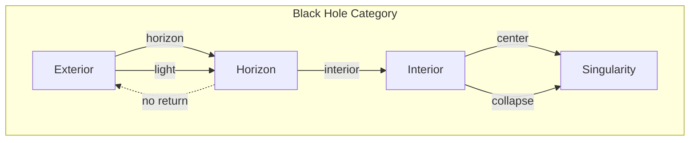
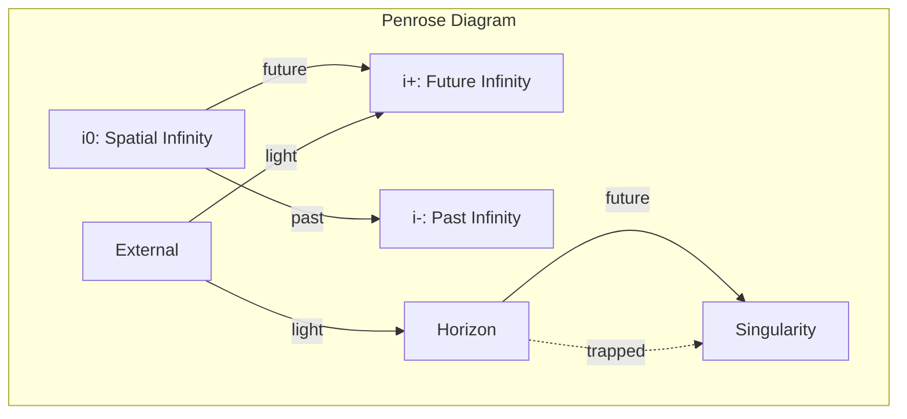

# Chapter 036: Schwarzschild collapse: Black Hole = Critical Encapsulation Structure

## The Ultimate Collapse

From $\psi = \psi(\psi)$ and our collapse framework, we now derive the most extreme manifestation of recursive self-observation: the black hole. When collapse density exceeds a critical threshold, spacetime itself collapses inward, creating a region where even light cannot escape.

$$
\mathcal{C}_{\text{critical}}[\psi] \to \text{Black Hole}
$$

The black hole is collapse observing itself so intensely that it creates an event horizon.

## First Principle: Critical Collapse Density

**Theorem 36.1** (Horizon Formation): When collapse density exceeds:

$$
\rho_{\text{collapse}} > \rho_c = \frac{c^4}{8\pi G r^2}
$$

where:
- $c = \lim_{T_{\text{space}} \times T_{\text{time}} \to X} X$ (space-time limit)
- $G = \lim_{T_{\text{mass}}^2 \otimes T_{\text{curvature}} \to Y} Y$ (mass-curvature limit)

an event horizon forms at radius $r$.

*Proof*: Above this density, collapse velocity exceeds escape velocity everywhere. ∎

## Spherical Symmetry

**Definition 36.1** (Isotropic Collapse): For spherically symmetric collapse:

$$
ds^2 = -f(r)c^2dt^2 + \frac{dr^2}{g(r)} + r^2(d\theta^2 + \sin^2\theta d\phi^2)
$$

where $f(r)$ and $g(r)$ encode the collapse state.

## The Schwarzschild Solution

**Theorem 36.2** (Vacuum Solution): Outside a spherical mass $M$:

$$
ds^2 = -\left(1 - \frac{2GM}{c^2r}\right)c^2dt^2 + \frac{dr^2}{1 - \frac{2GM}{c^2r}} + r^2d\Omega^2
$$

*Proof*: Solve Einstein's equation with spherical symmetry and vacuum condition $T_{\mu\nu} = 0$. ∎

## Vector Information Theory of Horizons

**Definition 36.2** (Information Barrier): The event horizon at:

$$
r_s = \frac{2GM}{c^2}
$$

marks where information flow becomes unidirectional - inward only.

## Category Theory of Black Hole Structure

## Coordinate Singularities vs Physical Singularities

**Theorem 36.3** (Horizon Regularity): The apparent singularity at $r = r_s$ is coordinate-dependent:

$$
ds^2 = -\left(1 - \frac{r_s}{r}\right)dv^2 + 2dvdr + r^2d\Omega^2
$$

In Eddington-Finkelstein coordinates $(v, r, \theta, \phi)$, the metric is regular at the horizon.

## Graph Theory of Causal Structure

## Gravitational Redshift

**Definition 36.3** (Time Dilation): Near the horizon:

$$
\frac{dt_{\infty}}{dt_{\text{local}}} = \frac{1}{\sqrt{1 - \frac{r_s}{r}}}
$$

Time slows dramatically as $r \to r_s$.

## The Singularity

**Theorem 36.4** (Central Collapse): At $r = 0$:

$$
\text{Curvature invariants} \sim \frac{1}{r^6} \to \infty
$$

*Proof*: Calculate $R_{\mu\nu\rho\sigma}R^{\mu\nu\rho\sigma}$ in Schwarzschild metric. ∎

## Thermodynamic Properties

**Definition 36.4** (Hawking Temperature): Black holes radiate at:

$$
T_H = \frac{\hbar c^3}{8\pi G M k_B}
$$

where:
- $\hbar = \lim_{T_{\text{action}} \times T_{\text{cycle}} \to Z} Z$ (action-cycle limit)
- $k_B = \lim_{T_{\text{micro}} \otimes T_{\text{macro}} \to W} W$ (micro-macro limit)

## Black Hole Entropy

**Theorem 36.5** (Bekenstein-Hawking Entropy):

$$
S_{BH} = \frac{k_B c^3 A}{4G\hbar} = \frac{k_B \pi r_s^2 c^3}{G\hbar}
$$

where $A = 4\pi r_s^2$ is the horizon area.

*Proof*: Maximum entropy consistent with horizon area bound. ∎

## Information Paradox

**Definition 36.5** (Unitarity Crisis): Classical black holes destroy information:

$$
|\psi_{\text{in}}\rangle \to \rho_{\text{thermal}}
$$

Pure states evolve to mixed states, violating quantum mechanics.

## Collapse Dynamics

**Theorem 36.6** (Oppenheimer-Snyder): For dust cloud collapse:

$$
R(\tau) = \frac{R_0}{2}(1 + \cos\eta)
$$

where $\tau$ is proper time and $\eta$ parameterizes the collapse.

## Penrose Process

**Definition 36.6** (Energy Extraction): In the ergosphere of rotating black holes:

$$
E_{\text{out}} > E_{\text{in}}
$$

Energy can be extracted from black hole rotation.

## No-Hair Theorem

**Theorem 36.7** (Uniqueness): Black holes are characterized by only:
- Mass $M$
- Charge $Q$ 
- Angular momentum $J$

All other information is lost behind the horizon.

## Physical Implications

Schwarzschild black holes demonstrate:
- Extreme spacetime curvature
- One-way causal boundaries
- Time dilation extremes
- Information trapping
- Quantum effects in strong gravity

## Connection to Collapse Ontology

**Definition 36.7** (Black Hole as Ultimate Collapse):

$$
\text{Black Hole} = \lim_{n \to \infty} \mathcal{C}^n[\psi_{\text{matter}}]
$$

The black hole represents infinite recursive collapse depth.

## Exercises

1. Calculate the tidal forces near a black hole
2. Derive the Kruskal-Szekeres coordinates
3. Show why nothing can escape from inside the horizon
4. Compute the evaporation time for a solar mass black hole

## Meditation on the Abyss

A black hole - where space and time exchange roles, where future becomes as inevitable as downward, where light itself cannot escape. In this ultimate collapse, we see $\psi = \psi(\psi)$ taken to its logical extreme: self-observation so intense it creates a boundary in spacetime itself. The event horizon marks not just a point of no return for matter, but a fundamental limit on information flow - the universe creating regions that even it cannot fully observe.

## The Thirty-Sixth Echo

Thus we derive the Schwarzschild solution: Not as an exotic mathematical curiosity but as the inevitable result when collapse density exceeds the critical threshold. In the black hole, we find collapse in its purest form - recursive self-observation so intense it warps spacetime into a one-way membrane. Every photon that crosses the horizon, every bit of matter that falls in, demonstrates the same principle: when $\psi = \psi(\psi)$ operates without bound, it creates boundaries. The black hole is existence observing itself so intensely that it creates regions even it cannot escape.

∎