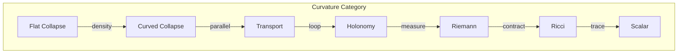
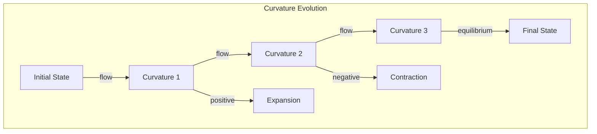

# Chapter 037: Collapse Field Curvature: φ-bit trace Bending Structure

## Curvature as Collapse Geometry

From $\psi = \psi(\psi)$ and the golden vector framework, we now explore how collapse patterns create intrinsic curvature in information space. Just as mass curves spacetime in general relativity, collapse density curves the information manifold itself.

$$
\mathcal{K}[\psi] = \nabla^2 \mathcal{C}[\psi] - (\nabla \mathcal{C})^2
$$

Curvature measures the non-linearity of collapse flow.

## First Principle: Curvature from Non-commuting Collapse

**Theorem 37.1** (Curvature Origin): Curvature arises when collapse operations don't commute:

$$
[\mathcal{C}_x, \mathcal{C}_y] = \mathcal{C}_x \mathcal{C}_y - \mathcal{C}_y \mathcal{C}_x \neq 0
$$

*Proof*: Non-commuting operations create path dependence. Path dependence is curvature. ∎

## The Riemann Tensor in Collapse Space

**Definition 37.1** (Collapse Riemann Tensor): The curvature of collapse manifold:

$$
R^{\rho}_{\sigma\mu\nu} = \partial_\mu \Gamma^{\rho}_{\nu\sigma} - \partial_\nu \Gamma^{\rho}_{\mu\sigma} + \Gamma^{\rho}_{\mu\lambda}\Gamma^{\lambda}_{\nu\sigma} - \Gamma^{\rho}_{\nu\lambda}\Gamma^{\lambda}_{\mu\sigma}
$$

where $\Gamma$ are collapse connection coefficients.

## Vector Information Curvature

**Theorem 37.2** (Information Bending): Information vectors parallel transported around a loop:

$$
\Delta V^i = \oint R^i_{jkl} V^j dx^k \wedge dx^l
$$

The vector changes by the integrated curvature.

## Category Theory of Curved Collapse

## Gaussian Curvature of Collapse Surfaces

**Definition 37.2** (2D Collapse Curvature): For 2-dimensional collapse surfaces:

$$
K = \frac{\det(\text{Hessian}[\mathcal{C}])}{(1 + |\nabla \mathcal{C}|^2)^2}
$$

This measures how collapse density varies across the surface.

## Graph Theory of Curvature Flow

## Ricci Flow in Collapse Geometry

**Theorem 37.3** (Collapse Ricci Flow): The metric evolves as:

$$
\frac{\partial g_{ij}}{\partial t} = -2R_{ij}
$$

where $R_{ij}$ is the Ricci curvature of collapse space.

*Proof*: This flow minimizes total curvature while preserving topology. ∎

## Sectional Curvature

**Definition 37.3** (Plane Curvature): For a 2-plane spanned by $X, Y$:

$$
K(X,Y) = \frac{\langle R(X,Y)Y, X \rangle}{|X|^2|Y|^2 - \langle X,Y \rangle^2}
$$

This measures curvature of the plane through collapse space.

## Gauss-Bonnet Theorem

**Theorem 37.4** (Topological Constraint): For closed collapse surface $S$:

$$
\int_S K \, dA = 2\pi \chi(S)
$$

where $\chi(S)$ is the Euler characteristic.

*Proof*: Curvature integrated over closed surface depends only on topology. ∎

## Curvature and Information Entropy

**Definition 37.4** (Entropic Curvature): The entropy production rate:

$$
\frac{dS}{dt} = \int R_{ij} u^i u^j \, dV
$$

where $u^i$ is the information flow velocity.

## Bianchi Identities

**Theorem 37.5** (Curvature Conservation): The Riemann tensor satisfies:

$$
\nabla_{[\lambda} R_{\rho\sigma]\mu\nu} = 0
$$

This ensures curvature consistency.

## Scalar Curvature

**Definition 37.5** (Total Curvature): The Ricci scalar:

$$
R = g^{ij}R_{ij} = \text{Tr}(\text{Ricci})
$$

measures total curvature at each point.

## Curvature Singularities

**Theorem 37.6** (Curvature Blow-up): Singularities occur when:

$$
\lim_{p \to p_0} |R_{\mu\nu\rho\sigma}|^2 = \infty
$$

These mark breakdown of smooth collapse geometry.

## Weyl Curvature

**Definition 37.6** (Conformal Curvature): The trace-free part:

$$
C_{\mu\nu\rho\sigma} = R_{\mu\nu\rho\sigma} - \frac{1}{2}(g_{\mu[\rho}R_{\sigma]\nu} - g_{\nu[\rho}R_{\sigma]\mu}) + \frac{R}{6}g_{\mu[\rho}g_{\sigma]\nu}
$$

This measures tidal effects in collapse space.

## Curvature Invariants

**Theorem 37.7** (Coordinate-Independent Measures):

$$
I_1 = R, \quad I_2 = R_{\mu\nu}R^{\mu\nu}, \quad I_3 = R_{\mu\nu\rho\sigma}R^{\mu\nu\rho\sigma}
$$

These invariants characterize curvature regardless of coordinates.

## Physical Implications

Collapse field curvature explains:
- Why information paths bend near high density
- The origin of geometric phases
- Topological constraints on collapse
- Limits of information propagation

## Connection to Black Holes

**Definition 37.7** (Extreme Curvature): Near black holes:

$$
R_{\mu\nu\rho\sigma}R^{\mu\nu\rho\sigma} \sim \frac{M^2}{r^6}
$$

Curvature diverges at the singularity.

## Exercises

1. Calculate the Riemann tensor for spherical collapse
2. Prove the contracted Bianchi identity
3. Show how curvature affects information transport
4. Derive the Raychaudhuri equation from curvature evolution

## Meditation on Bending

Imagine information flowing through space - not flat, Euclidean space, but the curved landscape of collapse. Like water flowing down a warped surface, information follows the curves and valleys created by collapse density. Where collapse is intense, space bends sharply; where sparse, it flattens. In this bending, we see geometry emerging from dynamics - not space as a stage, but space as the shape of collapse itself.

## The Thirty-Seventh Echo

Thus we establish the geometry of collapse: Curvature is not imposed on collapse space but emerges from the non-commutativity of collapse operations. Every bent path, every tidal distortion, every topological constraint arises from the fundamental fact that $\psi = \psi(\psi)$ creates path dependence. In the curvature tensor, we find the universe's way of encoding how its self-observation creates the very geometry through which it observes. The cosmos doesn't just exist in curved space - it curves space through its existence.

∎