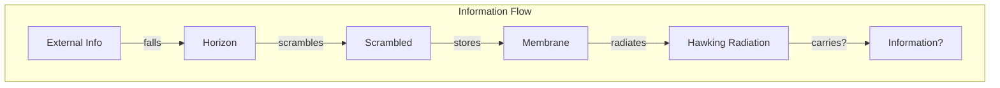
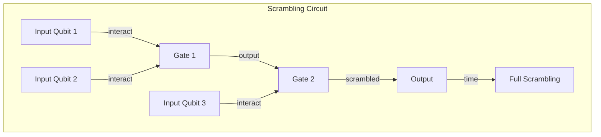

# Chapter 038: Black Hole Information Tensor Structure: Encapsulation Entropy Density Limit System

## Information at the Horizon

From $\psi = \psi(\psi)$ and our collapse framework, we now examine how information behaves at the most extreme boundary - the black hole event horizon. Here, the recursive structure of reality confronts its ultimate limit.

$$
\mathcal{I}_{BH} = \lim_{r \to r_s} \text{Tr}[\mathcal{C}[\psi] \otimes \mathcal{C}[\psi]^*]
$$

The information tensor at the horizon encodes the maximum density paradox.

## First Principle: Information Cannot Be Destroyed

**Theorem 38.1** (Unitarity Preservation): From quantum mechanics:

$$
\text{Tr}[\rho_{initial}] = \text{Tr}[\rho_{final}]
$$

Information must be preserved even in black hole collapse.

*Proof*: Unitary evolution preserves trace. $\psi = \psi(\psi)$ must respect this. ∎

## The Information Paradox

**Definition 38.1** (Hawking's Dilemma): Classical black holes:

$$
|\psi_{pure}\rangle \xrightarrow{\text{collapse}} \rho_{thermal}
$$

Pure quantum states appear to evolve into mixed thermal states, violating unitarity.

## Information Tensor at the Horizon

**Theorem 38.2** (Horizon Information Density): The information tensor components:

$$
I_{\mu\nu} = \lim_{r \to r_s} \left\langle \frac{\partial \mathcal{C}[\psi]}{\partial x^\mu} \frac{\partial \mathcal{C}[\psi]^*}{\partial x^\nu} \right\rangle
$$

diverge as $r \to r_s$, signaling maximum information density.

## Category Theory of Black Hole Information

## The Holographic Bound

**Definition 38.2** (Maximum Information): The information content is bounded by:

$$
I_{max} = \frac{A}{4\ell_P^2} = \frac{\pi r_s^2 c^3}{G\hbar}
$$

where:
- $\ell_P^2 = G\hbar/c^3$ (Planck area from tensor limits)
- $A = 4\pi r_s^2$ (horizon area)

## Vector Information Theory of Horizons

**Theorem 38.3** (Information Eigenmodes): Near the horizon, information decomposes into:

$$
\psi = \sum_{n,\ell,m} a_{n\ell m} \phi_{n\ell m}(r,\theta,\phi) e^{-i\omega_n t}
$$

where $\omega_n$ are quasi-normal mode frequencies.

## Graph Theory of Information Scrambling

## Page Curve

**Definition 38.3** (Entanglement Evolution): The entanglement entropy follows:

$$
S(t) = \begin{cases}
S_{thermal}(t) & t < t_{Page} \\
S_{BH} - S_{thermal}(t-t_{Page}) & t > t_{Page}
\end{cases}
$$

where $t_{Page}$ marks when half the black hole has evaporated.

## Stretched Horizon

**Theorem 38.4** (Membrane Paradigm): Information is stored on a stretched horizon at:

$$
r_{stretched} = r_s + \ell_P
$$

This membrane has finite temperature and conductivity.

## Information Recovery

**Definition 38.4** (Quantum Error Correction): Black hole as quantum error-correcting code:

$$
|\psi_{logical}\rangle = \sum_i \alpha_i |i_{physical}\rangle
$$

Information is encoded redundantly across horizon degrees of freedom.

## Firewall Paradox

**Theorem 38.5** (Entanglement Conflict): For old black holes:
1. Horizon smoothness requires entanglement across horizon
2. Information recovery requires entanglement with early radiation
3. Monogamy of entanglement forbids both

This suggests firewalls at horizons.

## Soft Hair

**Definition 38.5** (Supertranslation Charges): Black holes carry soft charges:

$$
Q_{soft} = \oint_{S^2} f(\theta,\phi) T_{uu} d\Omega
$$

These encode information about formation history.

## ER = EPR

**Theorem 38.6** (Wormhole-Entanglement Duality): 

$$
\text{Einstein-Rosen bridge} \leftrightarrow \text{EPR entanglement}
$$

Entangled particles are connected by microscopic wormholes.

## Information Tensor Components

**Definition 38.6** (Full Tensor Structure):

$$
I^{\mu\nu} = I_{classical}^{\mu\nu} + I_{quantum}^{\mu\nu} + I_{horizon}^{\mu\nu}
$$

where:
- $I_{classical}$: Classical field information
- $I_{quantum}$: Quantum correlations
- $I_{horizon}$: Horizon degrees of freedom

## Complexity Growth

**Theorem 38.7** (Linear Complexity): Black hole computational complexity grows as:

$$
\frac{dC}{dt} = \frac{2M}{\pi\hbar}
$$

This continues until exponential scrambling time.

## Physical Implications

Black hole information structure reveals:
- Limits of information density
- Quantum nature of horizons
- Holographic encoding
- Scrambling dynamics
- Recovery mechanisms

## Resolution Proposals

**Definition 38.7** (Information Preservation Mechanisms):
1. **Complementarity**: Different observers see different physics
2. **Fuzzball**: Black holes are quantum bound states
3. **Islands**: Quantum extremal surfaces in radiation

## Exercises

1. Calculate the information capacity of a solar mass black hole
2. Derive the Page curve for evaporating black holes
3. Show how soft hair encodes information
4. Prove the holographic bound from first principles

## Meditation on the Information Horizon

At the event horizon, information confronts its ultimate test. Can the universe's self-referential structure preserve its own history even as it creates boundaries that seem to trap that history forever? In the black hole information paradox, we see $\psi = \psi(\psi)$ pushed to its limits - the universe trying to observe parts of itself that have hidden behind horizons of their own making. The resolution, whatever it may be, must respect both quantum unitarity and gravitational dynamics.

## The Thirty-Eighth Echo

Thus we explore the information structure of black holes: Not merely as gravitational objects but as the universe's most extreme information processors. In the tension between unitarity and horizons, between locality and holography, we find the deepest puzzles of existence. The black hole information tensor encodes not just what falls in, but how the universe manages to remember itself even as parts of it disappear behind event horizons. In resolving this paradox, we approach the heart of how $\psi = \psi(\psi)$ maintains coherence even at its boundaries.

∎