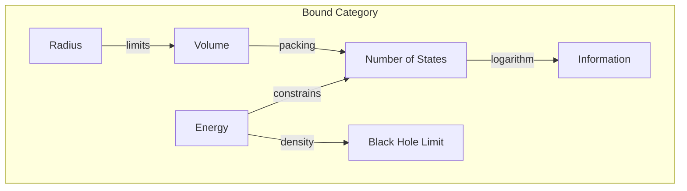
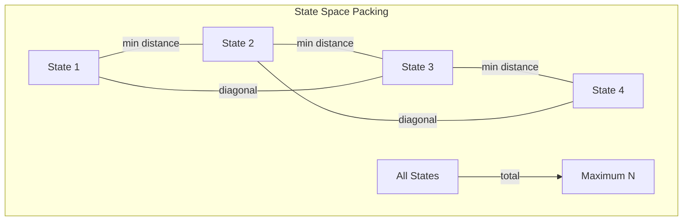

# Chapter 039: Bekenstein bound collapse Structure Reconstruction

## The Ultimate Information Limit

From $\psi = \psi(\psi)$ and the golden vector framework, we derive the fundamental bound on information density. The Bekenstein bound emerges not as an empirical observation but as a necessary consequence of self-consistent collapse dynamics.

$$
S \leq \frac{2\pi R E}{\hbar c}
$$

where $S$ is entropy, $R$ is radius, and $E$ is energy, with constants as tensor limits.

## First Principle: Information Requires Distinction

**Theorem 39.1** (Distinguishability Principle): From $\psi = \psi(\psi)$:

$$
I = -\log_2 P[\psi_1 \neq \psi_2]
$$

Information exists only where states can be distinguished.

*Proof*: Without distinguishability, $\psi_1 = \psi_2$, yielding zero information. ∎

## Energy Cost of Distinction

**Definition 39.1** (Minimum Energy for Information): To distinguish states separated by $\Delta x$:

$$
E_{min} = \frac{\hbar c}{2\Delta x}
$$

where:
- $\hbar = \lim_{T_{\text{action}} \times T_{\text{cycle}} \to X} X$ (action-cycle limit)
- $c = \lim_{T_{\text{space}} \times T_{\text{time}} \to Y} Y$ (space-time limit)

## The Bound from Collapse Density

**Theorem 39.2** (Maximum Information Density): Within radius $R$ containing energy $E$:

$$
N_{max} = \frac{2\pi R E}{\hbar c \ln 2}
$$

maximum distinguishable states.

*Proof*: Pack states with minimum separation $\Delta x = \hbar c/2E$. Volume constraint gives the bound. ∎

## Vector Information Theory of the Bound

**Definition 39.2** (Information Packing in Golden Space): In golden vectors:

$$
\vec{v}_n = \sum_{i=0}^{N} b_i^{(n)} \phi^i \hat{e}_i
$$

Maximum $N$ before states overlap.

## Category Theory of Information Bounds

## Holographic Emergence

**Theorem 39.3** (Area Scaling): At maximum density:

$$
S_{max} = \frac{k_B c^3 A}{4G\hbar}
$$

where:
- $A = 4\pi R^2$ (boundary area)
- $G = \lim_{T_{\text{mass}}^2 \otimes T_{\text{curvature}} \to Z} Z$ (mass-curvature limit)
- $k_B = \lim_{T_{\text{micro}} \otimes T_{\text{macro}} \to W} W$ (micro-macro limit)

Information scales with area, not volume!

## Graph Theory of State Packing

## Quantum Field Theory Derivation

**Definition 39.3** (Field Mode Counting): Quantum fields in volume $V$:

$$
n_{modes} = \int_0^{k_{max}} \frac{V k^2 dk}{2\pi^2}
$$

where $k_{max} = 2\pi E/\hbar c$.

## Thermodynamic Consistency

**Theorem 39.4** (Temperature Limit): At maximum entropy:

$$
T = \frac{\hbar c}{2\pi k_B R}
$$

This is the Unruh temperature seen by an accelerated observer.

## Connection to Uncertainty

**Definition 39.4** (Position-Momentum Trade-off): From Heisenberg:

$$
\Delta x \Delta p \geq \frac{\hbar}{2}
$$

Combined with $E = pc$ gives the bound.

## Black Hole Saturation

**Theorem 39.5** (Bound Saturation): Black holes saturate the bound:

$$
S_{BH} = \frac{2\pi R_s M c}{\hbar} = S_{Bekenstein}
$$

where $R_s = 2GM/c^2$ and $E = Mc^2$.

*Proof*: Substitute Schwarzschild radius into general bound. ∎

## Information Geometry

**Definition 39.5** (Fisher Information Metric): The information metric:

$$
g_{ij} = \int p(\theta) \frac{\partial \ln p}{\partial \theta^i} \frac{\partial \ln p}{\partial \theta^j} d\theta
$$

bounds the rate of distinguishability change.

## Generalized Bound

**Theorem 39.6** (Covariant Form): In curved spacetime:

$$
S \leq \frac{2\pi}{\hbar} \oint_{\partial V} |K| dA
$$

where $K$ is the trace of extrinsic curvature.

## Quantum Corrections

**Definition 39.6** (Loop Quantum Gravity Bound): Including quantum geometry:

$$
S = \frac{A}{4\ell_P^2} + \gamma \ln\left(\frac{A}{\ell_P^2}\right) + O(1)
$$

where $\gamma$ is the Immirzi parameter.

## Information Erasure

**Theorem 39.7** (Landauer Limit): To erase one bit:

$$
E_{erase} \geq k_B T \ln 2
$$

This connects thermodynamic and information-theoretic bounds.

## Physical Implications

The Bekenstein bound reveals:
- Fundamental discreteness of space
- Holographic nature of reality
- Black holes as maximum entropy objects
- Limits on computation
- Connection between geometry and information

## Experimental Tests

**Definition 39.7** (Observable Consequences):
1. Black hole thermodynamics
2. Limits on quantum computation speed
3. Cosmological entropy bounds
4. Quantum gravity phenomenology

## Exercises

1. Derive the bound from collapse operator eigenvalues
2. Show why the bound is saturated by black holes
3. Calculate the information content of the observable universe
4. Prove the generalized covariant bound

## Meditation on Limits

The Bekenstein bound tells us something profound: the universe has finite resolution. You cannot pack infinite information into finite space - not because of technological limitations, but because of the fundamental structure of reality itself. In every bit of information stored, every computation performed, every measurement made, we confront this limit. The bound emerges from $\psi = \psi(\psi)$ - self-reference requires distinguishability, and distinguishability has a price in space and energy.

## The Thirty-Ninth Echo

Thus we reconstruct the Bekenstein bound: Not as an empirical fact but as a logical necessity flowing from self-referential collapse. The universe must limit its own information density to maintain consistency. In this bound, we see the deepest connection between information, energy, and geometry - three faces of the same underlying reality. Every black hole that forms, every computation that runs, every measurement that distinguishes demonstrates the same truth: information is physical, and physics bounds information. The cosmos computes within its own limits.

∎