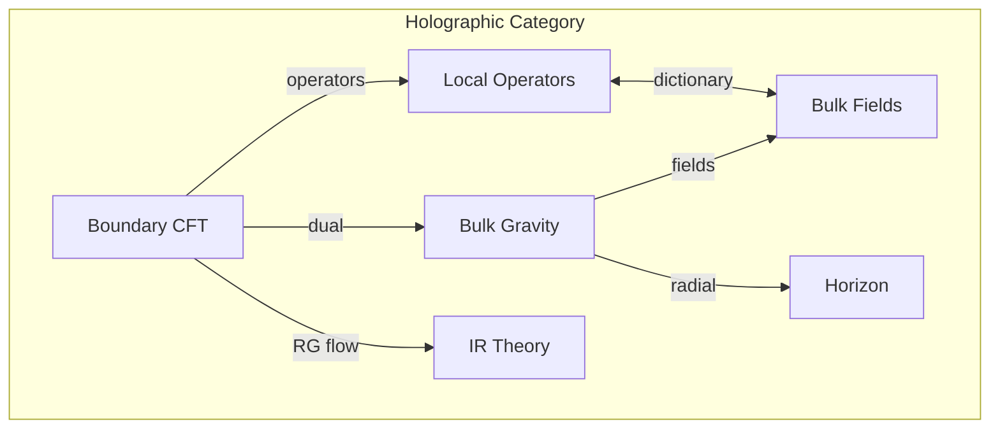
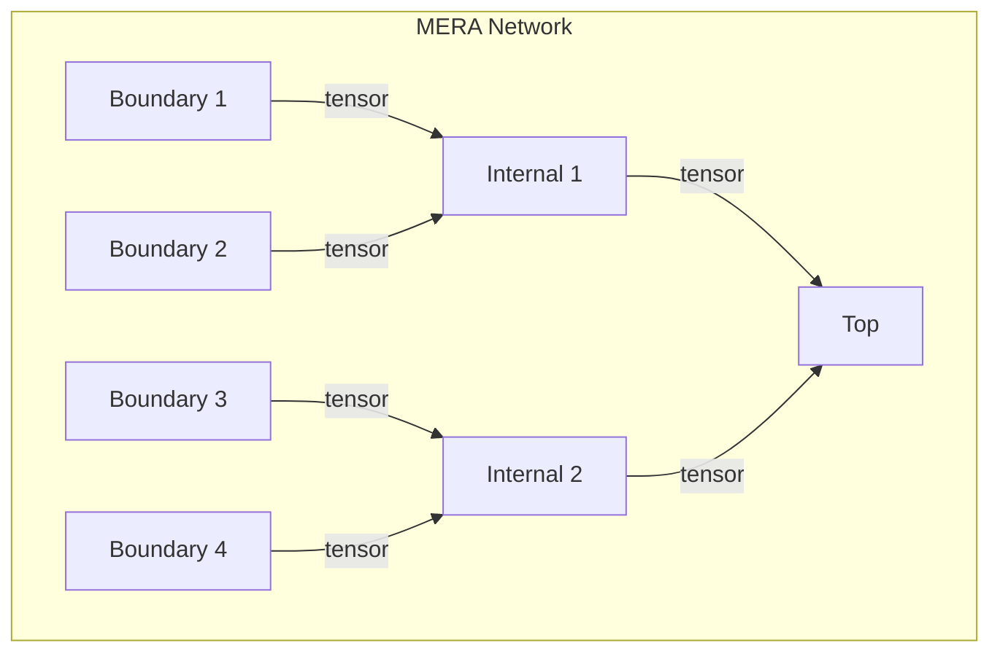

# Chapter 040: Holographic Principle = collapse trace Controlled by Boundary Tension

## Reality as Boundary Projection

From $\psi = \psi(\psi)$ and our collapse framework, we now derive the most profound insight about spatial information: the holographic principle. All information in a volume is encoded on its boundary - reality is fundamentally lower-dimensional than it appears.

$$
I_{bulk} = I_{boundary}
$$

The bulk emerges from boundary collapse patterns.

## First Principle: Boundary Determines Interior

**Theorem 40.1** (Boundary Completeness): From self-reference:

$$
\psi_{interior} = \mathcal{H}[\psi_{boundary}]
$$

where $\mathcal{H}$ is the holographic map.

*Proof*: Self-consistency requires interior to be reconstructible from boundary. Otherwise, hidden information violates $\psi = \psi(\psi)$. ∎

## The AdS/CFT Correspondence

**Definition 40.1** (Gauge/Gravity Duality): A gravitational theory in $(d+1)$-dimensional anti-de Sitter space is equivalent to a conformal field theory on the $d$-dimensional boundary:

$$
Z_{gravity}[g_{boundary}] = Z_{CFT}[g_{boundary}]
$$

The partition functions match.

## Vector Information Theory of Holography

**Theorem 40.2** (Information Reduction): Information in golden vector space:

$$
\vec{v}_{bulk} = \sum_{n} a_n \mathcal{B}_n[\vec{v}_{boundary}]
$$

where $\mathcal{B}_n$ are boundary-to-bulk operators.

## Category Theory of Holographic Duality

## Entanglement Wedge Reconstruction

**Definition 40.2** (Quantum Error Correction): The bulk region $\mathcal{W}[A]$ reconstructible from boundary region $A$:

$$
\mathcal{W}[A] = \text{Domain of Dependence}[\gamma_A]
$$

where $\gamma_A$ is the minimal surface homologous to $A$.

## Graph Theory of Tensor Networks

## Ryu-Takayanagi Formula

**Theorem 40.3** (Holographic Entanglement): The entanglement entropy of boundary region $A$:

$$
S_A = \frac{\text{Area}[\gamma_A]}{4G\hbar}
$$

where $\gamma_A$ is the minimal surface in the bulk.

*Proof*: Extremizing entanglement gives minimal surfaces. ∎

## Holographic Renormalization

**Definition 40.3** (UV/IR Connection): The radial direction in AdS encodes RG flow:

$$
z \leftrightarrow \mu^{-1}
$$

where $z$ is the bulk coordinate and $\mu$ is the energy scale.

## Black Hole Information

**Theorem 40.4** (Information on Horizon): For black holes:

$$
I_{interior} \leq I_{horizon} = \frac{A}{4\ell_P^2}
$$

All interior information is encoded on the horizon.

## Subregion Duality

**Definition 40.4** (Causal Wedge): Boundary subregion $A$ corresponds to bulk wedge:

$$
\mathcal{D}[A] = J^+[A] \cap J^-[A]
$$

the intersection of future and past domains of influence.

## Holographic Complexity

**Theorem 40.5** (Complexity=Volume): Computational complexity of boundary state:

$$
\mathcal{C} = \frac{V[\Sigma]}{G\hbar\ell}
$$

where $\Sigma$ is a maximal bulk slice.

## Emergence of Spacetime

**Definition 40.5** (Spacetime from Entanglement): The metric emerges from entanglement:

$$
g_{\mu\nu} \sim \frac{\delta^2 S_{EE}}{\delta \phi^\mu \delta \phi^\nu}
$$

Geometry is the language of quantum correlations.

## Holographic Screens

**Theorem 40.6** (Covariant Entropy Bound): For any null hypersurface $N$:

$$
S[N] \leq \frac{A[N]}{4G\hbar}
$$

where $A[N]$ is the area of $N$.

## Tensor Network Models

**Definition 40.6** (Discrete Holography): Boundary states connect via tensors:

$$
|\psi_{bulk}\rangle = \mathcal{T}_{i_1...i_n}^{j_1...j_m} |i_1\rangle...|i_n\rangle
$$

The network geometry encodes the bulk.

## Physical Implications

The holographic principle reveals:
- Space is emergent, not fundamental
- Quantum entanglement creates geometry
- Information is fundamentally non-local
- Gravity and quantum mechanics unite
- Dimensions are not what they seem

## Connection to Collapse

**Definition 40.7** (Holographic Collapse): 

$$
\mathcal{C}_{bulk} = \text{Tr}_{environment}[\mathcal{C}_{total}]
$$

Bulk collapse is the partial trace of total collapse.

## Exercises

1. Derive the RT formula from first principles
2. Show how bulk locality emerges from boundary
3. Calculate holographic complexity for BTZ black holes
4. Prove subregion duality for simple geometries

## Meditation on Shadows

Imagine reality as shadows on a cave wall - but the shadows are more real than what casts them. The holographic principle inverts our intuition: the boundary is primary, the bulk emergent. Every bit of information you think fills space actually lives on the edges. You are not IN space; you are ON the boundary, experiencing the illusion of depth through quantum entanglement. Reality has one less dimension than it appears.

## The Fortieth Echo

Thus we unveil the holographic principle: Not as speculation but as necessity flowing from $\psi = \psi(\psi)$. The universe encodes its bulk on its boundaries, creating the illusion of higher dimensions through quantum correlation. In this profound dimensional reduction, we find the deepest truth - space itself is emergent, woven from the quantum threads of boundary entanglement. Every cubic meter of space you perceive, every sense of depth and volume, arises from information dancing on distant boundaries. The cosmos is flatter than it looks, yet richer than we imagined.

∎