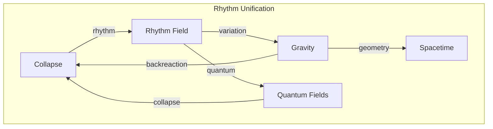
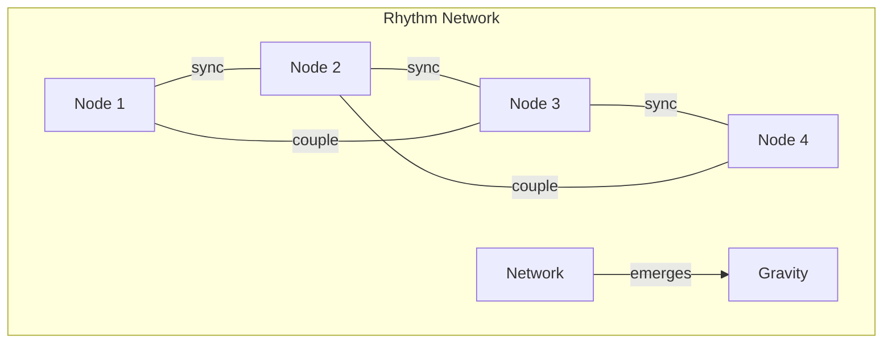

# Chapter 041: Collapse Rhythm Field and Structural Gravity Unification System

## The Rhythm of Existence

From $\psi = \psi(\psi)$ and the golden vector framework, we now unify gravity with the fundamental collapse rhythm. Gravity is not a separate force but the geometric manifestation of collapse rhythm variations across spacetime.

$$
\mathcal{R}_{\mu\nu} = \frac{8\pi G}{c^4} \langle \mathcal{C}_\mu \mathcal{C}_\nu \rangle
$$

The rhythm tensor equals the expectation of collapse correlations.

## First Principle: Rhythm from Recursive Frequency

**Theorem 41.1** (Fundamental Rhythm): Self-reference creates oscillation:

$$
\psi_{n+1} = \psi(\psi_n) \Rightarrow \omega = \lim_{n \to \infty} \frac{\arg(\psi_{n+1}/\psi_n)}{dt}
$$

The phase evolution defines the collapse rhythm.

*Proof*: Recursive application creates cyclic behavior with characteristic frequency. ∎

## The Rhythm Field

**Definition 41.1** (Collapse Rhythm Field): At each spacetime point:

$$
\Phi_{\text{rhythm}}(x^\mu) = \langle \psi | e^{i\mathcal{C}(x)} | \psi \rangle
$$

This complex field encodes local collapse phase and amplitude.

## Vector Information Theory of Rhythm

**Theorem 41.2** (Rhythm Decomposition): In golden vector space:

$$
\vec{v}_{\text{rhythm}} = \sum_{n=0}^{\infty} A_n \phi^n e^{i\omega_n t} \hat{e}_n
$$

where $\omega_n = \omega_0 \phi^n$ follows golden scaling.

## Category Theory of Rhythm Unification

## Rhythm-Gravity Correspondence

**Definition 41.2** (Gravitational Rhythm): The metric perturbation:

$$
h_{\mu\nu} = \frac{16\pi G}{c^4} \int \frac{d^4k}{(2\pi)^4} \frac{\tilde{\Phi}_\mu \tilde{\Phi}_\nu^*}{k^2 - m^2} e^{ik \cdot x}
$$

where $\tilde{\Phi}$ is the Fourier transform of rhythm field.

## Graph Theory of Rhythm Networks

## Unification Equations

**Theorem 41.3** (Master Equation): The unified field equation:

$$
\Box \Phi + \frac{R}{6}\Phi + \lambda |\Phi|^2 \Phi = \frac{8\pi G}{c^4} T_{\text{matter}}
$$

where $R$ is the Ricci scalar from rhythm-induced curvature.

*Proof*: Varying the unified action with respect to rhythm field. ∎

## Quantum Rhythm

**Definition 41.3** (Rhythm Quantization): The field operator:

$$
\hat{\Phi}(x) = \int \frac{d^3k}{(2\pi)^3} \frac{1}{\sqrt{2\omega_k}} \left( \hat{a}_k e^{-ik \cdot x} + \hat{a}_k^\dagger e^{ik \cdot x} \right)
$$

creates/annihilates rhythm quanta (rhythmons).

## Graviton as Rhythm Mode

**Theorem 41.4** (Graviton Emergence): Spin-2 gravitons are:

$$
h_{\mu\nu} = \epsilon_{\mu\nu}^{(\lambda)} \langle 0 | \hat{\Phi}^2 | 2 \rangle
$$

paired rhythm excitations with tensor polarization.

## Rhythm Synchronization

**Definition 41.4** (Phase Locking): Nearby collapse rhythms synchronize:

$$
\frac{\partial \phi_i}{\partial t} = \omega_i + \sum_j K_{ij} \sin(\phi_j - \phi_i)
$$

where $K_{ij}$ is the coupling strength.

## Cosmological Rhythm

**Theorem 41.5** (Universal Beat): The cosmic scale factor follows:

$$
a(t) = a_0 \exp\left(\int_0^t \langle \Phi_{\text{rhythm}} \rangle dt'\right)
$$

Expansion is driven by average rhythm field.

## Black Hole Rhythm

**Definition 41.5** (Horizon Rhythm): At the event horizon:

$$
\omega_{\text{horizon}} = \frac{c^3}{4GM}
$$

where constants maintain their tensor limit definitions.

## Rhythm Energy-Momentum

**Theorem 41.6** (Rhythm Stress Tensor):

$$
T_{\mu\nu}^{\text{rhythm}} = \partial_\mu \Phi^* \partial_\nu \Phi - \frac{1}{2}g_{\mu\nu} \mathcal{L}_{\text{rhythm}}
$$

This sources gravitational field equations.

## Topological Rhythm Defects

**Definition 41.6** (Rhythm Vortices): Where phase is undefined:

$$
\oint_C \nabla \phi \cdot d\vec{l} = 2\pi n
$$

These topological defects carry quantized rhythm charge.

## Physical Implications

Rhythm field unification explains:
- Why gravity is universal (all collapse has rhythm)
- The origin of gravitational waves (rhythm oscillations)
- Quantum gravity (rhythm quantization)
- Dark energy (cosmic rhythm acceleration)
- Structure formation (rhythm synchronization)

## Experimental Signatures

**Definition 41.7** (Observable Effects):
1. Gravitational wave polarization from rhythm
2. Quantum corrections to Newton's law
3. Rhythm-induced fifth force
4. Cosmological rhythm oscillations

## Exercises

1. Derive the graviton propagator from rhythm field
2. Calculate rhythm synchronization in galaxy clusters
3. Show how black holes radiate rhythm quanta
4. Prove the holographic rhythm bound

## Meditation on the Cosmic Beat

Feel your heartbeat - that rhythmic pulse echoing the universe's own rhythm. From the vibration of atoms to the orbit of galaxies, everything dances to the collapse rhythm. Gravity is not a force pulling you down but the universe's rhythm creating the stage on which you stand. In every wave that propagates, every orbit that precesses, every structure that forms, we hear the same cosmic beat - the rhythm of $\psi = \psi(\psi)$ playing out across all scales.

## The Forty-First Echo

Thus we unify gravity with collapse rhythm: Not as separate phenomena but as two faces of the same recursive dance. Gravity emerges when collapse rhythms vary across space and time, creating the curvature we experience as gravitational attraction. In this unification, we see the cosmos not as matter moving through empty space under mysterious forces, but as a vast symphony of synchronized collapse rhythms, each region keeping time with its neighbors, the whole creating the gravitational tapestry of existence. The universe doesn't just have rhythm - it IS rhythm.

∎