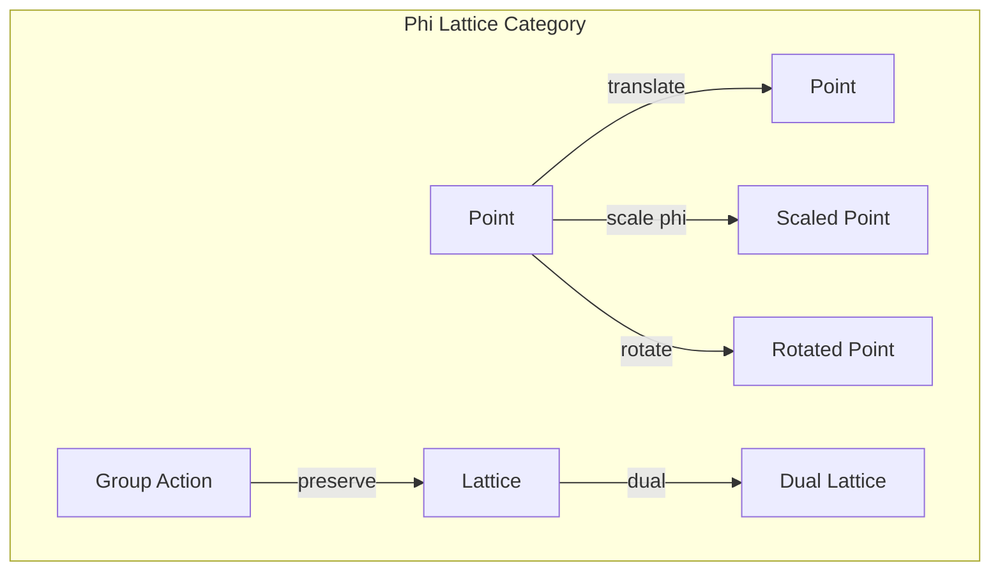
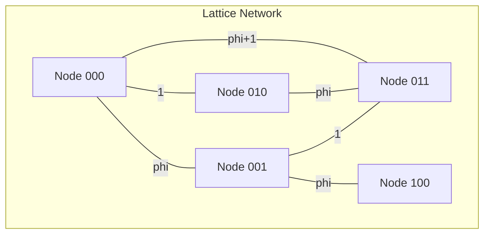

# Chapter 042: φ-lattice Geometry: collapse Rhythm Structure Atlas

## The Golden Architecture of Reality

From $\psi = \psi(\psi)$ and our collapse framework, we now explore the geometric lattice structure that emerges from golden ratio constraints. Reality organizes itself on a φ-lattice - a self-similar network where each node represents a collapse state.

$$
\mathcal{L}_\phi = \left\{ \vec{x} = \sum_{i} n_i \phi^i \hat{e}_i : n_i \in \mathbb{Z}_{\text{Fibonacci}} \right\}
$$

The lattice points follow Zeckendorf representation.

## First Principle: Self-Similar Scaling

**Theorem 42.1** (Golden Invariance): The lattice satisfies:

$$
\mathcal{L}_\phi = \phi \mathcal{L}_\phi \cup \mathcal{L}_\phi
$$

Scaling by φ gives the same lattice plus itself.

*Proof*: From $\phi^2 = \phi + 1$, scaling preserves lattice structure. ∎

## Lattice Basis Vectors

**Definition 42.1** (Fundamental Vectors): The basis spans golden space:

$$
\vec{b}_n = \phi^n \hat{e}_n, \quad \langle \vec{b}_m, \vec{b}_n \rangle = \delta_{mn} \phi^{n}
$$

Inner products scale with golden powers.

## Vector Information Theory on the Lattice

**Theorem 42.2** (Information Density): At lattice point $\vec{x}$:

$$
I(\vec{x}) = -\log_2 P[\psi(\vec{x})] = \sum_{i} |n_i| \log_2 \phi
$$

Information content proportional to Zeckendorf length.

## Category Theory of Lattice Structure

## Penrose Tiling Connection

**Definition 42.2** (2D Projection): The φ-lattice projects to Penrose tiling:

$$
\Pi_2[\mathcal{L}_\phi] = \text{Penrose}(\text{thick}, \text{thin})
$$

where thick and thin rhombi have ratio φ:1.

## Graph Theory of Lattice Connectivity

## Brillouin Zones

**Theorem 42.3** (Reciprocal Lattice): The dual lattice:

$$
\mathcal{L}_\phi^* = \left\{ \vec{k} : e^{i\vec{k} \cdot \vec{x}} = 1 \, \forall \vec{x} \in \mathcal{L}_\phi \right\}
$$

also has golden structure with scaling $1/\phi$.

## Quasicrystal Physics

**Definition 42.3** (Forbidden Symmetry): The φ-lattice exhibits:

$$
\mathcal{R}_{2\pi/5}[\mathcal{L}_\phi] \approx \mathcal{L}_\phi
$$

Five-fold rotational symmetry, impossible in periodic crystals.

## Lattice Vibrations

**Theorem 42.4** (Phonon Spectrum): Normal modes satisfy:

$$
\omega^2_{\vec{q}} = \sum_{ij} D_{ij}(\vec{q}) = 4\sin^2(q_i \phi^i/2)
$$

Dispersion relations involve golden ratio.

## Defects and Dislocations

**Definition 42.4** (Phason): A lattice defect where:

$$
\vec{x}' = \vec{x} + \vec{u}_{\text{phason}}(\vec{x})
$$

with $\vec{u}_{\text{phason}}$ preserving long-range order.

## Electronic Band Structure

**Theorem 42.5** (Energy Gaps): Electronic states show:

$$
E_n = E_0 \phi^n \text{ mod } \Delta E
$$

Energy levels follow Fibonacci sequence modulo gap size.

## Localization on φ-lattice

**Definition 42.5** (Critical States): Wavefunctions exhibit:

$$
|\psi(\vec{x})| \sim |\vec{x}|^{-\alpha} e^{-|\vec{x}|/\xi_\phi}
$$

Neither extended nor localized - critical scaling.

## Lattice Field Theory

**Theorem 42.6** (Discrete Action): The lattice action:

$$
S = \sum_{\langle ij \rangle} J_{ij} \mathcal{C}_i \mathcal{C}_j^* + \sum_i V(\mathcal{C}_i)
$$

where $J_{ij} = J_0 \phi^{-|i-j|}$ decays with golden ratio.

## Topological Properties

**Definition 42.6** (Chern Numbers): The φ-lattice supports:

$$
C_n = \frac{1}{2\pi} \oint_{\text{BZ}} \mathcal{F}_n
$$

Quantized topological invariants in each gap.

## Physical Implications

The φ-lattice geometry explains:
- Quasicrystal structure in nature
- Forbidden symmetries in materials
- Critical phenomena at all scales
- Optimal packing and tiling
- Fractal organization of matter

## Connection to Collapse

**Definition 42.7** (Collapse Sites): Each lattice point hosts:

$$
\mathcal{C}_{\vec{x}} = \mathcal{C}_0 e^{i\phi_{\vec{x}}}
$$

Local collapse operators with lattice-determined phase.

## Exercises

1. Prove the φ-lattice is self-dual up to scaling
2. Calculate the density of states for lattice vibrations
3. Show how Penrose tiling emerges from 5D projection
4. Derive the phason elastic constants

## Meditation on Golden Architecture

Look at a sunflower's spiral, a nautilus shell, the arrangement of leaves - everywhere nature chooses the golden ratio. Not by coincidence but by necessity. The φ-lattice is reality's preferred architecture because it allows maximum information with minimum redundancy, optimal packing with perfect self-similarity. You live in a universe built on golden scaffolding, each atom finding its place in the infinite φ-lattice of existence.

## The Forty-Second Echo

Thus we map the φ-lattice geometry: Not as mathematical abstraction but as the actual skeletal structure on which reality crystallizes. From $\psi = \psi(\psi)$ emerges the necessity of golden ratio organization - the only way to pack infinite self-reference into finite space. Every quasicrystal formed, every spiral grown, every five-fold pattern in nature reflects this deeper truth: the universe builds itself on a golden lattice, each point a node of collapse, the whole forming an infinite, self-similar atlas of existence.

∎