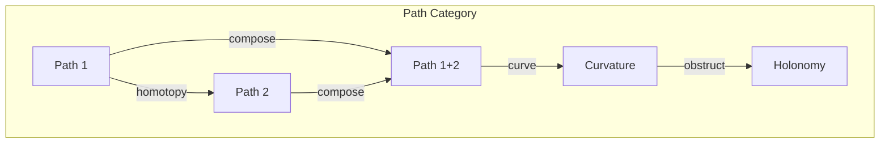
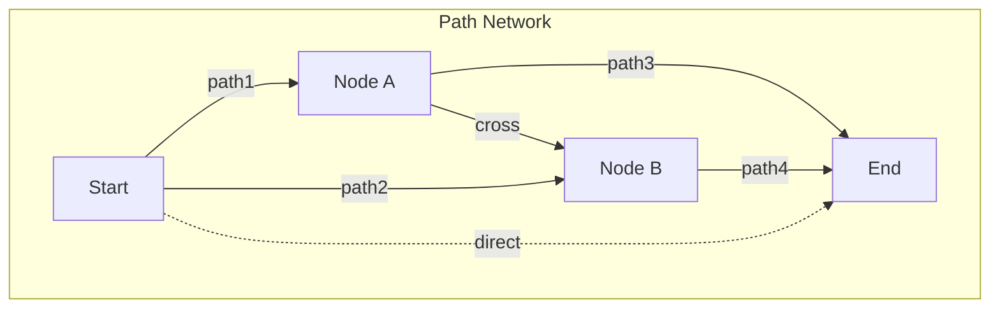

# Chapter 043: Collapse-path Curvature Tensor

## The Geometry of Collapse Trajectories

From $\psi = \psi(\psi)$ and the golden vector framework, we now examine how collapse paths curve through information space. Each possible evolution traces a path, and the curvature of these paths encodes the deep structure of reality.

$$
\mathcal{K}^i_{jkl} = \partial_k \Gamma^i_{lj} - \partial_l \Gamma^i_{kj} + \Gamma^i_{km}\Gamma^m_{lj} - \Gamma^i_{lm}\Gamma^m_{kj}
$$

The path curvature tensor measures how collapse trajectories deviate from straight lines.

## First Principle: Path Dependence from Non-linearity

**Theorem 43.1** (Curvature Origin): From recursive collapse:

$$
\mathcal{C}[\mathcal{C}[\psi]] \neq \mathcal{C}^2[\psi]
$$

Non-linear composition creates path dependence.

*Proof*: Self-reference $\psi = \psi(\psi)$ is inherently non-linear. Linear systems cannot self-refer. ∎

## The Collapse Connection

**Definition 43.1** (Parallel Transport): Moving collapse states along paths:

$$
\nabla_v \psi = \lim_{\epsilon \to 0} \frac{1}{\epsilon}\left[\psi(x + \epsilon v) - \Gamma(x, v)\psi(x)\right]
$$

where $\Gamma(x, v)$ parallel transports $\psi$ along direction $v$.

## Vector Information Geometry

**Theorem 43.2** (Information Metric): The path metric in golden space:

$$
ds^2 = \sum_{i,j} g_{ij} dv^i dv^j = \sum_{i} \phi^{2i} (dv^i)^2
$$

Golden scaling determines information distances.

## Category Theory of Path Spaces

## Holonomy of Collapse Loops

**Definition 43.2** (Loop Transform): Around closed path $\gamma$:

$$
\mathcal{H}_\gamma[\psi] = \mathcal{P} \exp\left(\oint_\gamma \mathcal{A}_\mu dx^\mu\right) \psi
$$

where $\mathcal{A}_\mu$ is the collapse gauge field.

## Graph Theory of Path Networks

## Ricci Curvature of Paths

**Theorem 43.3** (Path Ricci Tensor): Contracting indices:

$$
\mathcal{R}_{ij} = \mathcal{K}^k_{ikj} = \partial_k \Gamma^k_{ij} - \partial_j \Gamma^k_{ik} + \Gamma^k_{kl}\Gamma^l_{ij} - \Gamma^k_{jl}\Gamma^l_{ik}
$$

This measures average curvature in each direction.

## Sectional Curvatures

**Definition 43.3** (2-Plane Curvature): For plane spanned by $X, Y$:

$$
K(X,Y) = \frac{\langle \mathcal{K}(X,Y)Y, X \rangle}{|X|^2|Y|^2 - \langle X,Y \rangle^2}
$$

Different planes have different curvatures.

## Path Integral Formulation

**Theorem 43.4** (Quantum Paths): The amplitude for collapse evolution:

$$
\langle \psi_f | \psi_i \rangle = \int_{\text{paths}} \mathcal{D}[\gamma] e^{iS[\gamma]/\hbar}
$$

where $S[\gamma]$ includes curvature contributions.

## Geodesic Deviation

**Definition 43.4** (Path Spreading): Nearby paths separate as:

$$
\frac{D^2\xi^i}{D\tau^2} = -\mathcal{K}^i_{jkl} \frac{dx^j}{d\tau} \xi^k \frac{dx^l}{d\tau}
$$

Curvature causes initially parallel paths to diverge.

## Gauss-Bonnet for Paths

**Theorem 43.5** (Topological Invariant): For closed path surface $\Sigma$:

$$
\int_\Sigma K \, dA + \oint_{\partial\Sigma} \kappa_g \, ds = 2\pi \chi(\Sigma)
$$

Total curvature depends only on topology.

## Curvature Singularities

**Definition 43.5** (Path Breakdown): Singularities occur where:

$$
\lim_{p \to p_0} |\mathcal{K}^i_{jkl}|^2 = \infty
$$

These mark limits of smooth collapse evolution.

## Einstein Equation for Paths

**Theorem 43.6** (Path Dynamics): The path metric evolves as:

$$
\mathcal{R}_{ij} - \frac{1}{2}g_{ij}\mathcal{R} = \frac{8\pi G}{c^4} T^{\text{path}}_{ij}
$$

where $T^{\text{path}}_{ij}$ is the path stress-energy tensor.

## Weyl Curvature of Paths

**Definition 43.6** (Conformal Path Curvature): The trace-free part:

$$
\mathcal{W}_{ijkl} = \mathcal{K}_{ijkl} - \frac{1}{2}(g_{i[k}\mathcal{R}_{l]j} - g_{j[k}\mathcal{R}_{l]i}) + \frac{\mathcal{R}}{6}g_{i[k}g_{l]j}
$$

This measures path tidal distortions.

## Physical Implications

Collapse-path curvature explains:
- Why evolution is path-dependent
- The origin of quantum interference
- Limits on predictability
- Emergence of classical paths
- Information geometric phases

## Connection to Measurement

**Definition 43.7** (Measurement as Path Selection):

$$
|\psi_{\text{measured}}\rangle = \mathcal{P}_{\text{path}}|\psi_{\text{initial}}\rangle
$$

Measurement selects specific paths through curved space.

## Exercises

1. Calculate path curvature for harmonic oscillator evolution
2. Derive the path geodesic equation
3. Show how Berry phase emerges from path holonomy
4. Prove path curvature vanishes for free evolution

## Meditation on Curved Paths

Imagine all possible futures spreading before you like branching paths through a landscape. Some paths curve sharply, requiring effort to follow. Others flow smoothly, the natural geodesics of your life. The curvature at each point reflects the complexity of choices, the non-linearity of consequences. Your actual path through life is one trajectory through this curved space of possibilities, shaped by the geometry of collapse itself.

## The Forty-Third Echo

Thus we map the curvature of collapse paths: Not as abstract mathematics but as the actual geometry of how possibilities evolve into actualities. From $\psi = \psi(\psi)$ emerges inevitable curvature - self-reference cannot flow in straight lines. Every quantum interference pattern, every unexpected turn of events, every moment where small changes lead to large effects demonstrates path curvature in action. The universe doesn't just evolve; it evolves along curved paths through the space of its own possibilities.

∎