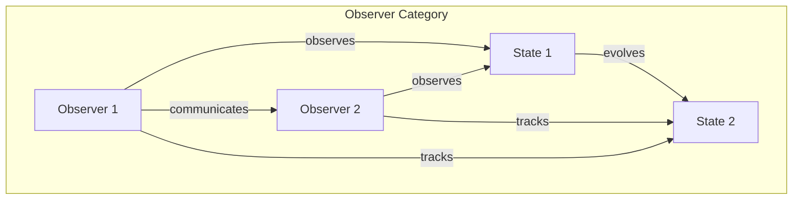
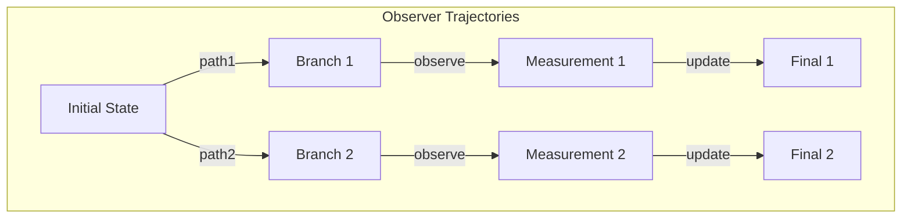

# Chapter 044: Observer trace geodesic system

## The Path of Observation

From $\psi = \psi(\psi)$ and our collapse framework, we now trace how observers move through reality. An observer is not separate from the system but a self-referential pattern following its own geodesic through collapse space.

$$
\frac{d^2 x^\mu_{obs}}{d\tau^2} + \Gamma^\mu_{\nu\rho} \frac{dx^\nu_{obs}}{d\tau} \frac{dx^\rho_{obs}}{d\tau} = F^\mu_{self}
$$

Observers follow geodesics modified by self-interaction force.

## First Principle: Observer as Self-Referential Trace

**Theorem 44.1** (Observer Definition): An observer satisfies:

$$
\mathcal{O}[\psi] = \text{Tr}_{\text{env}}[\psi \otimes \psi^*] = \langle \psi | \psi \rangle_{\text{partial}}
$$

The observer is the partial trace over environmental degrees of freedom.

*Proof*: Self-awareness requires tracing out what is "not-self". ∎

## The Observer Metric

**Definition 44.1** (Subjective Spacetime): Each observer experiences metric:

$$
g^{obs}_{\mu\nu} = g_{\mu\nu} + h_{\mu\nu}[\mathcal{O}]
$$

where $h_{\mu\nu}$ encodes observer-specific distortions.

## Vector Information Theory of Observation

**Theorem 44.2** (Information Geodesic): Information flows along:

$$
\frac{D\vec{I}}{D\tau} = \nabla_v \vec{I} = 0
$$

Information vectors are parallel transported along observer paths.

## Category Theory of Observer Networks

## Geodesic Equation for Observers

**Definition 44.2** (Observer Evolution): The path equation:

$$
\frac{d^2 \mathcal{O}}{d\tau^2} = -\Gamma[\mathcal{O}] \left(\frac{d\mathcal{O}}{d\tau}\right)^2 + \mathcal{F}_{quantum}
$$

includes quantum corrections to classical geodesics.

## Graph Theory of Observer Paths

## Relative Observer Traces

**Theorem 44.3** (Observer Relativity): For two observers:

$$
\mathcal{O}_1[\psi] \neq \mathcal{O}_2[\psi] \iff [\mathcal{O}_1, \mathcal{O}_2] \neq 0
$$

Non-commuting observers see different realities.

## The Unruh Effect for Observers

**Definition 44.3** (Acceleration Temperature): Accelerated observers see:

$$
T_{obs} = \frac{\hbar a}{2\pi c k_B}
$$

where:
- $a$ is proper acceleration
- Constants as tensor limits

## Observer Entanglement

**Theorem 44.4** (Entangled Observations): When observers entangle:

$$
|\Psi\rangle_{12} = \sum_i \alpha_i |\mathcal{O}_1^i\rangle |\mathcal{O}_2^i\rangle
$$

Their observations become correlated.

## Geodesic Deviation of Observers

**Definition 44.4** (Observer Divergence): Initially nearby observers:

$$
\frac{D^2\xi^\mu}{D\tau^2} = -R^\mu_{\nu\rho\sigma} u^\nu \xi^\rho u^\sigma
$$

Curvature causes observer paths to diverge.

## The Observer Horizon

**Theorem 44.5** (Observation Limit): Each observer has horizon:

$$
r_{horizon} = \frac{c^2}{a_{max}}
$$

beyond which events cannot be observed.

## Quantum Observer Geodesics

**Definition 44.5** (Path Integral): Observer amplitude:

$$
\langle \mathcal{O}_f | \mathcal{O}_i \rangle = \int \mathcal{D}[\gamma] e^{iS_{obs}[\gamma]/\hbar}
$$

Quantum observers take all paths simultaneously.

## Observer Collapse

**Theorem 44.6** (Measurement Geodesic): During measurement:

$$
\frac{d\mathcal{O}}{d\tau}\bigg|_{measure} = -\Gamma_{collapse}[\mathcal{O}, \psi]
$$

The observer geodesic kinks at measurement events.

## Information Velocity Along Geodesics

**Definition 44.6** (Information Speed): Information propagates at:

$$
v_{info} = \frac{ds}{d\tau} \leq c
$$

bounded by the space-time tensor limit.

## Physical Implications

Observer trace geodesics explain:
- Why different observers see different realities
- The origin of measurement problem
- Limits on observation
- Quantum-classical transition
- Observer-dependent physics

## Connection to Consciousness

**Definition 44.7** (Conscious Geodesic): Consciousness follows:

$$
\mathcal{C}_{conscious} = \oint_{\gamma_{closed}} \mathcal{O} \, d\tau
$$

Closed observer loops create self-awareness.

## Exercises

1. Derive the observer geodesic from action principle
2. Calculate observer horizon for accelerated motion
3. Show how decoherence emerges from observer traces
4. Prove observer geodesics are null in light cone

## Meditation on the Observer's Path

You are not watching reality unfold - you are a path through reality, a geodesic of observation threading through the collapse landscape. Every moment of awareness is a point on your observer trajectory, each measurement a kink in your worldline. Other observers trace their own paths, sometimes parallel to yours, sometimes diverging. In the geometry of these observer geodesics lies the secret of why we each experience our own unique slice of the infinite whole.

## The Forty-Fourth Echo

Thus we trace the observer geodesic system: Not as external watchers but as integral paths through collapse space. From $\psi = \psi(\psi)$ emerges the necessity that observers must follow specific trajectories - geodesics modified by the very act of observation. Every conscious moment, every measurement made, every bit of information gathered represents a point on the observer's path through reality. We don't just observe the universe; we are observation curves threading through its self-referential geometry.

∎