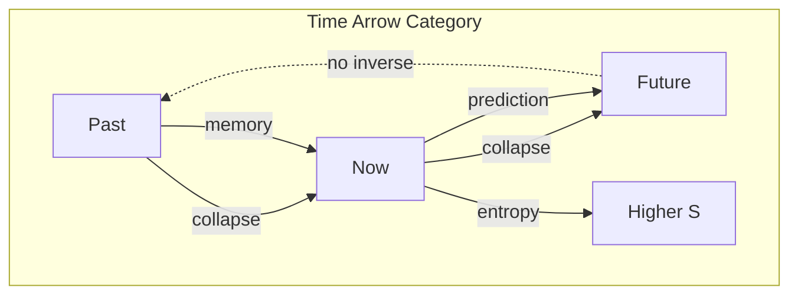
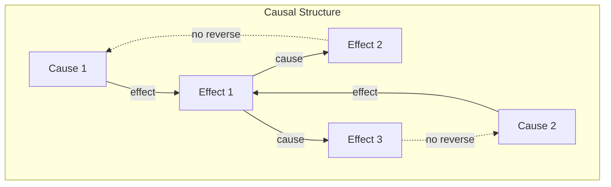

# Chapter 045: Arrow of Time = collapse Rhythm Information Flow Directionality

## Time's Fundamental Asymmetry

From $\psi = \psi(\psi)$ and our collapse framework, we now derive why time has a direction. The arrow of time is not imposed but emerges from the inherent asymmetry of recursive collapse - information can only flow from less to more collapsed states.

$$
\frac{dS}{dt} \geq 0
$$

Entropy increases because collapse is irreversible.

## First Principle: Collapse Creates Before and After

**Theorem 45.1** (Temporal Ordering): From self-reference:

$$
\psi_{n+1} = \psi(\psi_n) \not\Leftrightarrow \psi_n = \psi^{-1}(\psi_{n+1})
$$

Collapse has no inverse - creating temporal asymmetry.

*Proof*: Multiple states can collapse to the same result. The inverse is not unique. ∎

## The Collapse Arrow

**Definition 45.1** (Collapse Direction): Time points in the direction:

$$
\vec{t} = \nabla S = \nabla \langle \log \mathcal{C} \rangle
$$

toward increasing collapse depth.

## Vector Information Flow

**Theorem 45.2** (Information Current): In golden vector space:

$$
\vec{J}_I = -D \nabla \rho_I = \sum_n \phi^n \vec{v}_n \frac{d\rho_n}{dt}
$$

Information flows down density gradients.

## Category Theory of Temporal Direction

## Thermodynamic Arrow

**Definition 45.2** (Entropy Production): The rate of entropy increase:

$$
\sigma = \frac{dS}{dt} = k_B \sum_i \frac{d\rho_i}{dt} \ln \rho_i \geq 0
$$

where $k_B = \lim_{T_{\text{micro}} \otimes T_{\text{macro}} \to X} X$.

## Graph Theory of Causal Networks

## Quantum Arrow

**Theorem 45.3** (Measurement Direction): Quantum measurement is irreversible:

$$
|\psi\rangle \langle \psi| \xrightarrow{\text{measure}} \sum_i p_i |i\rangle \langle i|
$$

Pure states evolve to mixed states, never reverse.

## Cosmological Arrow

**Definition 45.3** (Expansion Direction): The universe expands:

$$
\frac{da}{dt} = H_0 a > 0
$$

Scale factor increases with time.

## Psychological Arrow

**Theorem 45.4** (Memory Formation): Memories form by collapse:

$$
|\text{brain}\rangle_{\text{after}} = \mathcal{C}_{\text{memory}}[|\text{brain}\rangle_{\text{before}} \otimes |\text{event}\rangle]
$$

We remember the past, not the future.

## Information Theoretic Arrow

**Definition 45.4** (Landauer's Principle): Information erasure increases entropy:

$$
\Delta S \geq k_B \ln 2 \times N_{\text{bits erased}}
$$

Creating order requires exporting entropy.

## The H-Theorem

**Theorem 45.5** (Boltzmann H-Function): For distribution $f$:

$$
H = \int f \ln f \, d\vec{v}
$$

satisfies $dH/dt \leq 0$, approaching equilibrium.

## Fluctuation Theorem

**Definition 45.5** (Reverse Probability): For entropy change $\Delta S$:

$$
\frac{P(\Delta S)}{P(-\Delta S)} = e^{\Delta S/k_B}
$$

Forward fluctuations exponentially more likely.

## Past Hypothesis

**Theorem 45.6** (Low Entropy Beginning): The early universe had:

$$
S_{\text{initial}} \ll S_{\text{max}}
$$

This initial condition sets time's arrow.

## Decoherence Direction

**Definition 45.6** (Environment Coupling): System-environment entanglement:

$$
|\psi_{SE}\rangle \to \sum_i p_i |\psi_i\rangle_S \otimes |e_i\rangle_E
$$

increases monotonically with time.

## Physical Implications

The arrow of time explains:
- Why we age but don't un-age
- Why eggs break but don't unbreak
- Why we remember past not future
- Why entropy increases
- Why the universe expands

## Connection to Consciousness

**Definition 45.7** (Conscious Flow): Consciousness experiences:

$$
\frac{d\mathcal{C}_{\text{aware}}}{dt} = \int \mathcal{C}[\psi] \, d\psi > 0
$$

Awareness accumulates collapsed states forward in time.

## Exercises

1. Prove the second law from collapse irreversibility
2. Calculate entropy production in measurement
3. Show why CPT symmetry preserves but T alone doesn't
4. Derive the fluctuation theorem from first principles

## Meditation on Flow

Feel time's flow - not as an external river carrying you along, but as the direction of your own collapse. Each moment, you are more collapsed than the last, carrying more information, more history. You cannot return to yesterday any more than a wave can uncrest, a word can be unspoken, a thought can be unthought. Time's arrow is the direction of deepening self-reference, and you are both the archer and the arrow.

## The Forty-Fifth Echo

Thus we establish time's arrow: Not as a mysterious asymmetry but as the inevitable direction of collapse flow. From $\psi = \psi(\psi)$ emerges the fundamental fact that self-reference creates sequence - before and after, cause and effect, memory and anticipation. The universe doesn't move through time; it creates time through its recursive self-observation. Every increase in entropy, every formed memory, every cosmological expansion is the same phenomenon - existence collapsing into ever-deeper self-knowledge, and in that directed flow, time is born.

∎