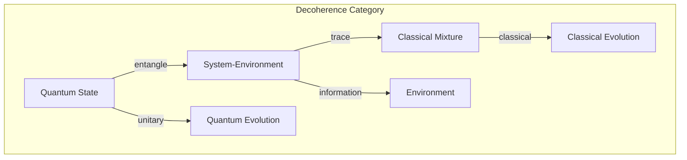
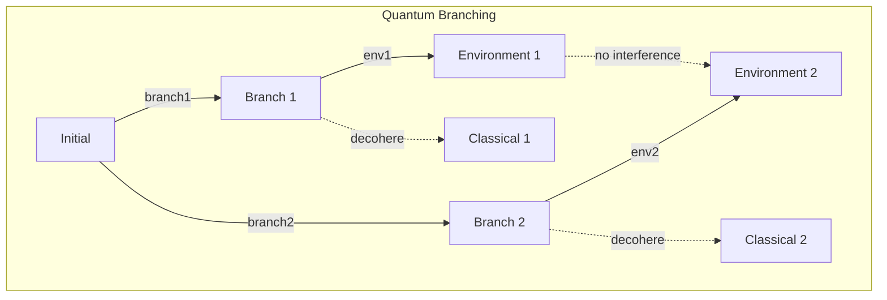

# Chapter 046: Decoherence = collapse Selective Structural Expression

## The Emergence of Classical from Quantum

From $\psi = \psi(\psi)$ and our collapse framework, we now explain how quantum superpositions evolve into classical states. Decoherence is not a separate process but the selective expression of collapse structures through environmental entanglement.

$$
\rho_S(t) = \text{Tr}_E[U(t)(\rho_S \otimes \rho_E)U^\dagger(t)]
$$

The system density matrix evolves by tracing over environment.

## First Principle: Environment as Witness

**Theorem 46.1** (Decoherence Origin): From multiple collapse paths:

$$
|\psi\rangle_{SE} = \sum_i \alpha_i |\psi_i\rangle_S \otimes |\epsilon_i\rangle_E
$$

Environment entangles differently with each branch.

*Proof*: Self-reference requires distinguishable states. Environment provides distinction. ∎

## Pointer States

**Definition 46.1** (Preferred Basis): States that survive decoherence:

$$
[H_{SE}, |\psi_i\rangle\langle\psi_i| \otimes \mathbb{I}_E] \approx 0
$$

These pointer states are approximately conserved.

## Vector Information Theory of Decoherence

**Theorem 46.2** (Information Leakage): In golden vector space:

$$
I(S:E) = S(\rho_S) + S(\rho_E) - S(\rho_{SE}) \geq 0
$$

Information flows from system to environment.

## Category Theory of Classical Emergence

## Decoherence Time

**Definition 46.2** (Coherence Decay): Superposition decays as:

$$
|\langle \psi_i | \rho_S(t) | \psi_j \rangle| \sim e^{-t/\tau_D}
$$

where $\tau_D \sim \hbar/\Delta E$ for energy difference $\Delta E$.

## Graph Theory of Branching

## Master Equation

**Theorem 46.3** (Lindblad Form): System evolution:

$$
\frac{d\rho_S}{dt} = -\frac{i}{\hbar}[H_S, \rho_S] + \sum_k \gamma_k \left(L_k \rho_S L_k^\dagger - \frac{1}{2}\{L_k^\dagger L_k, \rho_S\}\right)
$$

where $L_k$ are Lindblad operators.

## Quantum Darwinism

**Definition 46.3** (Information Redundancy): Classical information is:

$$
I_{\text{redundant}} = \min_{\mathcal{F}} I(S:\mathcal{F})
$$

copied redundantly into many environment fragments $\mathcal{F}$.

## Einselection

**Theorem 46.4** (Environment-Induced Selection): Pointer states selected by:

$$
|\psi_{\text{pointer}}\rangle = \arg\min_\psi \frac{d}{dt}S(\rho_\psi)
$$

States minimizing entropy production survive.

## Decoherence in Position Basis

**Definition 46.4** (Spatial Decoherence): Position superpositions decay fastest:

$$
\tau_D \sim \frac{\hbar^2}{m k_B T \Delta x^2}
$$

where $\Delta x$ is superposition separation.

## Quantum-to-Classical Transition

**Theorem 46.5** (Classical Limit): When $\tau_D \ll \tau_{dynamics}$:

$$
\rho_S \approx \sum_i p_i |\psi_i\rangle\langle\psi_i|
$$

Quantum coherences vanish before dynamics occurs.

## Decoherence-Free Subspaces

**Definition 46.5** (Protected States): Subspace where:

$$
[H_{SE}, \mathcal{P}_{DFS}] = 0
$$

These states don't decohere.

## Witness of Decoherence

**Theorem 46.6** (Coherence Measure): The l1-norm of coherence:

$$
C_{l_1}(\rho) = \sum_{i \neq j} |\rho_{ij}|
$$

quantifies remaining quantum coherence.

## Physical Implications

Decoherence explains:
- Why we don't see quantum superpositions
- The quantum-classical boundary
- Measurement without collapse
- Emergence of objective reality
- Why bigger objects behave classically

## Connection to Measurement

**Definition 46.7** (Measurement via Decoherence):

$$
\mathcal{M}[\rho] = \lim_{t \to \infty} \text{Tr}_E[U_t \rho \otimes |0\rangle\langle 0|_E U_t^\dagger]
$$

Measurement is complete decoherence.

## Exercises

1. Calculate decoherence time for Schrödinger's cat
2. Derive pointer states for harmonic oscillator
3. Show how GRW theory emerges from decoherence
4. Prove no-cloning from decoherence principles

## Meditation on Classical Reality

The solid world around you - tables, chairs, planets, stars - all emerged from quantum fog through decoherence. Each object's definiteness comes from countless environmental photons, air molecules, gravitational waves constantly "measuring" its position, collapsing superpositions faster than they can form. You live in a classical world not because quantum mechanics fails at large scales, but because large objects cannot hide from the universe's gaze.

## The Forty-Sixth Echo

Thus we unveil decoherence: Not as a mysterious transition but as the natural consequence of collapse in an interconnected universe. From $\psi = \psi(\psi)$ emerges the inevitability that systems cannot remain isolated - they must entangle with their environment, and in that entanglement, superpositions decay into classical mixtures. Every solid object, every definite position, every classical bit of information represents a victory of environmental entanglement over quantum coherence. The classical world is the quantum world that has been thoroughly observed.

∎