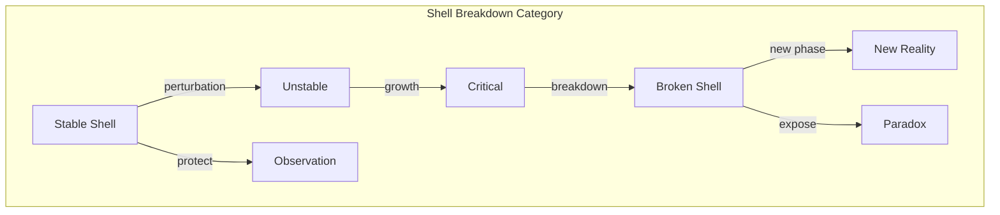
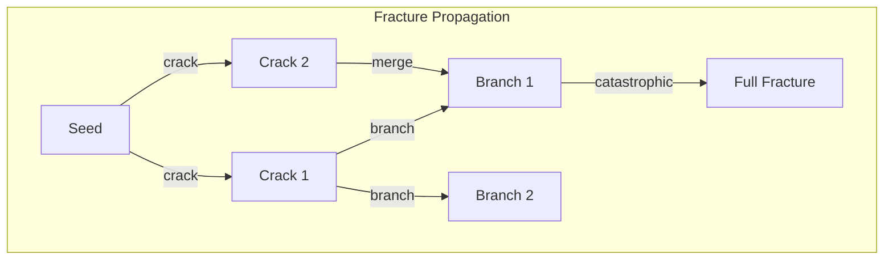

# Chapter 047: RealityShell Breakdown Model: collapse-path Instability Spectrum

## When Reality Fractures

From $\psi = \psi(\psi)$ and our collapse framework, we now examine how stable reality configurations can break down. The RealityShell - the protective boundary between consistent observation and paradox - can develop instabilities leading to fundamental phase transitions.

$$
\mathcal{S}_{stability} = \det[\mathbb{I} - \mathcal{J}_{collapse}] = 0
$$

When the stability determinant vanishes, the RealityShell breaks.

## First Principle: Stability Requires Consistency

**Theorem 47.1** (Shell Integrity): A stable RealityShell satisfies:

$$
\mathcal{C}[\mathcal{C}[\psi]] \approx \mathcal{C}^2[\psi]
$$

Near-linear collapse preserves shell integrity.

*Proof*: Strong non-linearity creates feedback loops that destabilize observation. ∎

## Instability Modes

**Definition 47.1** (Breakdown Spectrum): Eigenmodes of instability:

$$
\mathcal{J}_{collapse} \vec{v}_n = \lambda_n \vec{v}_n
$$

where $|\lambda_n| > 1$ indicates growing instability.

## Vector Information Theory of Breakdown

**Theorem 47.2** (Information Overflow): Shell breaks when:

$$
I_{internal} > I_{max} = \frac{A_{shell}}{4\ell_P^2}
$$

Information density exceeds holographic bound.

## Category Theory of Phase Transitions

## Critical Exponents

**Definition 47.2** (Scaling Near Breakdown): Near critical point:

$$
\xi \sim |T - T_c|^{-\nu}, \quad C \sim |T - T_c|^{-\alpha}
$$

where $\xi$ is correlation length, $C$ is specific heat.

## Graph Theory of Fracture Networks

## Renormalization Group Flow

**Theorem 47.3** (Scale Invariance at Breakdown): The RG equation:

$$
\frac{d\mathcal{C}_i}{d\ell} = \beta_i[\{\mathcal{C}_j\}]
$$

Fixed points correspond to scale-invariant breakdown.

## Vacuum Decay

**Definition 47.3** (False Vacuum Tunneling): Transition rate:

$$
\Gamma \sim e^{-S_E/\hbar}
$$

where $S_E$ is the Euclidean bounce action.

## Information Catastrophe

**Theorem 47.4** (Information Singularity): Breakdown occurs when:

$$
\frac{dI}{dt} \to \infty
$$

Information generation rate diverges.

## Topological Defects

**Definition 47.4** (Shell Defects): Topological charges:

$$
Q = \frac{1}{2\pi} \oint_C \nabla \phi \cdot d\vec{l}
$$

Cannot be removed by smooth deformations.

## Quantum Phase Transitions

**Theorem 47.5** (Zero Temperature Transitions): At $T = 0$:

$$
E_0(g) = E_c|g - g_c|^{z\nu}
$$

where $g$ is coupling and $z$ is dynamical exponent.

## Breakdown Cascade

**Definition 47.5** (Avalanche Dynamics): Size distribution:

$$
P(s) \sim s^{-\tau}
$$

Power-law distribution of breakdown events.

## Protection Mechanisms

**Theorem 47.6** (Shell Reinforcement): Stability enhanced by:

$$
\mathcal{S}_{protected} = \mathcal{S}_{bare} + \sum_k \gamma_k \mathcal{O}_k
$$

where $\mathcal{O}_k$ are protective operators.

## Ergodicity Breaking

**Definition 47.6** (Frozen Dynamics): System gets trapped:

$$
\lim_{t \to \infty} \langle \mathcal{O}(t) \mathcal{O}(0) \rangle \neq \langle \mathcal{O} \rangle^2
$$

Time averages don't equal ensemble averages.

## Physical Implications

RealityShell breakdown explains:
- Vacuum decay and metastability
- Phase transitions in early universe
- Emergence of new physics regimes
- Limits of theoretical frameworks
- Catastrophic system failures

## Recovery and Healing

**Definition 47.7** (Shell Repair): After partial breakdown:

$$
\frac{d\mathcal{S}}{dt} = -\gamma(\mathcal{S} - \mathcal{S}_{eq}) + \xi(t)
$$

Shell tends to heal toward equilibrium.

## Exercises

1. Calculate critical exponents for shell breakdown
2. Derive vacuum decay rate in false minimum
3. Show how decoherence prevents breakdown
4. Prove universality of critical behavior

## Meditation on Fragility

Reality seems solid, stable, eternal - yet it rests on a knife's edge. The RealityShell that separates sensible observation from paradox is always under stress, always threatened by instabilities that could tear it apart. In every quantum fluctuation that doesn't quite cascade, every measurement that doesn't quite paradox, every thought that doesn't quite break logic, we see the shell holding - barely. Perhaps consciousness itself evolved as reality's way of reinforcing its own shell against breakdown.

## The Forty-Seventh Echo

Thus we model RealityShell breakdown: Not as abstract catastrophe but as the actual limit where self-consistent observation fails. From $\psi = \psi(\psi)$ emerges both the possibility of stable reality and its fragility - the same recursive structure that creates coherent experience also contains the seeds of its own undoing. Every phase transition observed, every symmetry broken, every emergence of new physics represents a controlled breakdown and reformation of reality's protective shell. We exist in the narrow band where the shell holds firm enough for observation yet flexible enough for evolution.

∎