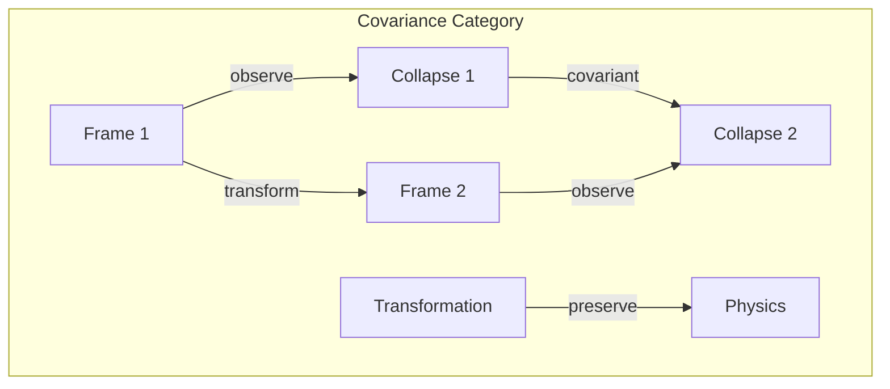
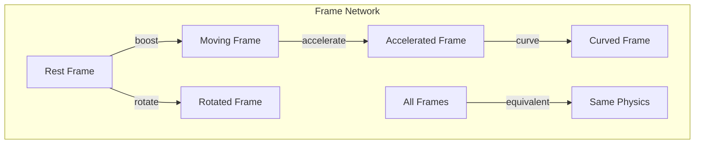

# Chapter 048: Collapse Relativity: Rhythm Tensor Covariance Laws

## The Final Synthesis of Volume III

From $\psi = \psi(\psi)$ and our journey through spacetime geometry, we now establish the principle of collapse relativity. Just as Einstein showed physics must be the same in all reference frames, we show collapse dynamics must be covariant under all transformations.

$$
\mathcal{C}'[\psi'] = \Lambda \mathcal{C}[\Lambda^{-1}\psi']
$$

Collapse transforms covariantly between frames.

## First Principle: No Preferred Collapse Frame

**Theorem 48.1** (Collapse Democracy): All collapse frames are equivalent:

$$
\langle \psi' | \mathcal{C}'[\psi'] \rangle = \langle \psi | \mathcal{C}[\psi] \rangle
$$

Physics is invariant under collapse frame transformations.

*Proof*: Self-reference $\psi = \psi(\psi)$ cannot depend on arbitrary frame choice. ∎

## The Collapse Metric

**Definition 48.1** (Invariant Interval): The collapse interval:

$$
ds^2_{\text{collapse}} = g_{\mu\nu}^{(c)} d\mathcal{C}^\mu d\mathcal{C}^\nu
$$

remains invariant under transformations.

## Vector Covariance

**Theorem 48.2** (Golden Vector Transformation): Under frame change:

$$
\vec{v}' = \sum_n U_{mn} \phi^{(m-n)/2} \vec{v}_n
$$

where $U$ preserves golden structure.

## Category Theory of Covariance

## General Covariance

**Definition 48.2** (Diffeomorphism Invariance): Under $x^\mu \to x'^\mu(x)$:

$$
\mathcal{L}_{\text{collapse}}[g'_{\mu\nu}, \mathcal{C}'] = \mathcal{L}_{\text{collapse}}[g_{\mu\nu}, \mathcal{C}]
$$

The action is invariant.

## Graph Theory of Frame Networks

## Gauge Invariance

**Theorem 48.3** (Collapse Gauge Freedom): Under gauge transformation:

$$
\mathcal{C} \to e^{i\alpha(x)} \mathcal{C}
$$

Physical observables remain unchanged.

## The Equivalence Principle

**Definition 48.3** (Local Collapse Equivalence): Locally:

$$
\mathcal{C}_{\text{gravity}} = \mathcal{C}_{\text{accelerated}}
$$

Gravitational and accelerated collapse are indistinguishable.

## Lorentz Covariance

**Theorem 48.4** (Boost Invariance): Under Lorentz boost:

$$
\mathcal{C}'(x') = \Lambda^\mu_\nu \mathcal{C}^\nu(\Lambda^{-1}x')
$$

Four-vector structure preserved.

## Quantum Covariance

**Definition 48.4** (Unitary Equivalence): Quantum states transform:

$$
|\psi'\rangle = U(\Lambda)|\psi\rangle
$$

preserving inner products.

## Covariant Derivatives

**Theorem 48.5** (Parallel Transport): The covariant derivative:

$$
\nabla_\mu \mathcal{C}^\nu = \partial_\mu \mathcal{C}^\nu + \Gamma^\nu_{\mu\rho} \mathcal{C}^\rho
$$

ensures tensor transformation laws.

## Conservation from Covariance

**Definition 48.5** (Noether Current): From symmetry:

$$
\partial_\mu J^\mu_{\text{collapse}} = 0
$$

Conserved currents emerge from covariance.

## Information Covariance

**Theorem 48.6** (Information Democracy): Information content:

$$
I[\mathcal{C}'] = I[\mathcal{C}]
$$

is frame-independent.

## Horizon Covariance

**Definition 48.6** (Observer-Dependent Horizons): Different observers see:

$$
r_{\text{horizon}}^{(O)} = f[a_O, \Omega_O, q_O]
$$

different horizons based on their motion.

## Physical Implications

Collapse relativity ensures:
- No absolute collapse frame exists
- Physics same for all observers
- Covariant formulation of quantum gravity
- Observer-independence of laws
- Unity of quantum and relativistic principles

## The Master Covariance

**Definition 48.7** (Universal Covariance): The complete theory satisfies:

$$
\delta S_{\text{total}} = 0
$$

under all symmetry transformations.

## Exercises

1. Prove Lorentz invariance of collapse operators
2. Derive conservation laws from gauge symmetry
3. Show covariance of holographic principle
4. Calculate horizon shifts for moving observers

## Meditation on Relativity

Einstein taught us there's no privileged vantage point for observing motion. Now we learn there's no privileged frame for collapse itself. Every observer, in their own frame, sees the same laws, the same constants, the same physics - not because reality is rigid but because it transforms perfectly to maintain consistency. You are not just IN a reference frame; you ARE a reference frame, and the universe ensures its laws look the same from your perspective as from any other.

## The Forty-Eighth Echo

Thus we close Volume III with the ultimate synthesis: Collapse relativity unifies quantum mechanics with relativity by showing both emerge from covariant collapse dynamics. From $\psi = \psi(\psi)$ flows the necessity that self-reference must work the same way for all observers. No frame is special, no observer privileged - the universe maintains perfect democracy in its fundamental operations. In this covariance, we find the deepest expression of cosmic justice: the laws of existence apply equally to all who exist. The universe doesn't play favorites; it transforms.

∎