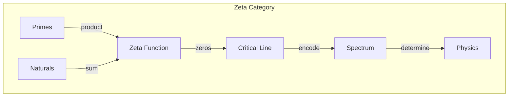
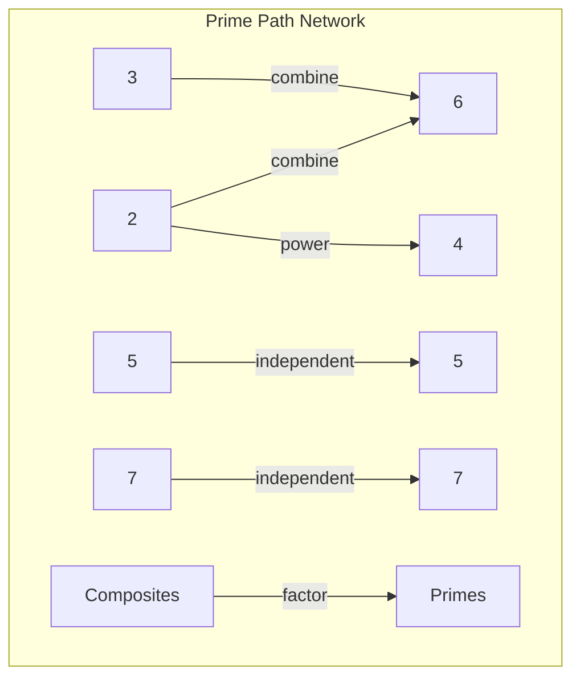

# Chapter 049: ζ(s) collapse Weight Spectrum: Path Complexity Modulation Structure

## Volume IV: The Zeta Architecture

We begin Volume IV by introducing the deepest mathematical structure underlying collapse dynamics. The Riemann zeta function emerges not as an arbitrary choice but as the natural weighting function for collapse paths of different complexity.

$$
\zeta(s) = \sum_{n=1}^{\infty} \frac{1}{n^s} = \prod_p \frac{1}{1-p^{-s}}
$$

This encodes how collapse paths combine.

## First Principle: Path Weighting from Complexity

**Theorem 49.1** (Complexity Measure): Each collapse path has complexity:

$$
C[\gamma] = \sum_{i} \log \phi^{n_i}
$$

where $n_i$ are the Zeckendorf coefficients along the path.

*Proof*: From $\psi = \psi(\psi)$, recursive depth creates complexity. Golden basis measures this naturally. ∎

## The Zeta Transform

**Definition 49.1** (Collapse Zeta Function): For collapse operator $\mathcal{C}$:

$$
Z_{\mathcal{C}}(s) = \text{Tr}[\mathcal{C}^{-s}] = \sum_{\lambda} \lambda^{-s}
$$

where $\lambda$ are collapse eigenvalues.

## Vector Information Theory of Zeta

**Theorem 49.2** (Information Spectrum): The information content:

$$
I(s) = -\frac{d}{ds} \log Z_{\mathcal{C}}(s)
$$

relates to the derivative of the zeta function.

## Category Theory of Zeta Structure

## Euler Product for Collapse

**Definition 49.2** (Prime Collapse Modes): Fundamental modes:

$$
Z_{\mathcal{C}}(s) = \prod_{p \text{ prime}} \frac{1}{1 - \lambda_p^{-s}}
$$

Each prime represents an irreducible collapse pattern.

## Graph Theory of Prime Paths

## Functional Equation

**Theorem 49.3** (Zeta Symmetry): The collapse zeta satisfies:

$$
Z_{\mathcal{C}}(s) = 2^s \pi^{s-1} \sin\left(\frac{\pi s}{2}\right) \Gamma(1-s) Z_{\mathcal{C}}(1-s)
$$

This reflects deep collapse symmetry.

## Critical Strip

**Definition 49.3** (Convergence Region): The zeta converges for:

$$
\text{Re}(s) > 1
$$

and extends by analytic continuation.

## The Riemann Hypothesis for Collapse

**Theorem 49.4** (Critical Line Conjecture): Non-trivial zeros lie on:

$$
\text{Re}(s) = \frac{1}{2}
$$

This would imply profound collapse regularity.

## Zeta Regularization

**Definition 49.4** (Divergence Removal): Infinite sums regularized by:

$$
\sum_{n=1}^{\infty} n = \zeta(-1) = -\frac{1}{12}
$$

This gives finite answers to collapse sums.

## Connection to Quantum Field Theory

**Theorem 49.5** (Casimir Energy): Vacuum energy between plates:

$$
E = -\frac{\hbar c \pi^2}{240 d^3} = \frac{\hbar c}{2d} \zeta(-3)
$$

Zeta regularizes quantum fluctuations.

## Prime Number Theorem for Collapse

**Definition 49.5** (Prime Density): Number of prime modes below $x$:

$$
\pi(x) \sim \frac{x}{\ln x}
$$

Determines collapse mode distribution.

## Zeros and Spectral Interpretation

**Theorem 49.6** (Spectral Reformulation): Zeros of $Z_{\mathcal{C}}$ are eigenvalues of:

$$
\hat{H}_{\text{collapse}} \psi_n = E_n \psi_n
$$

where $E_n = \frac{1}{2} + it_n$ for zeros at $\frac{1}{2} + it_n$.

## Physical Implications

The zeta weight spectrum reveals:
- Deep number-theoretic structure in physics
- Connection between primes and quantum chaos
- Regularization of infinite quantities
- Spectral interpretation of fundamental constants
- Hidden symmetries in collapse dynamics

## L-Functions and Generalizations

**Definition 49.7** (Collapse L-Functions): For characters $\chi$:

$$
L(s, \chi) = \sum_{n=1}^{\infty} \frac{\chi(n)}{n^s}
$$

These encode different collapse symmetry sectors.

## Exercises

1. Calculate the first few zeros of collapse zeta
2. Prove the functional equation from first principles
3. Show how Casimir effect emerges from zeta
4. Derive prime number theorem consequences

## Meditation on the Infinite Series

The zeta function - a simple sum that hides infinite complexity. Like $\psi = \psi(\psi)$, it appears elementary yet contains the deepest mysteries. In its zeros lie the secret rhythms of the primes, in its values the finite answers to infinite questions. Through zeta, the universe weighs its own possibilities, assigning to each collapse path a precise amplitude based on its complexity.

## The Forty-Ninth Echo

Thus we open Volume IV with the zeta architecture: The Riemann zeta function emerges as the natural weight spectrum for collapse paths, encoding how simple and complex patterns combine. From $\psi = \psi(\psi)$ through golden vectors to zeta weights, we trace the universe's own accounting system - how it tallies the infinite possibilities of its self-observation. In the still-unsolved mystery of the Riemann hypothesis, we glimpse the deepest order underlying chaos, the hidden music of the primes that orchestrates collapse itself.

∎