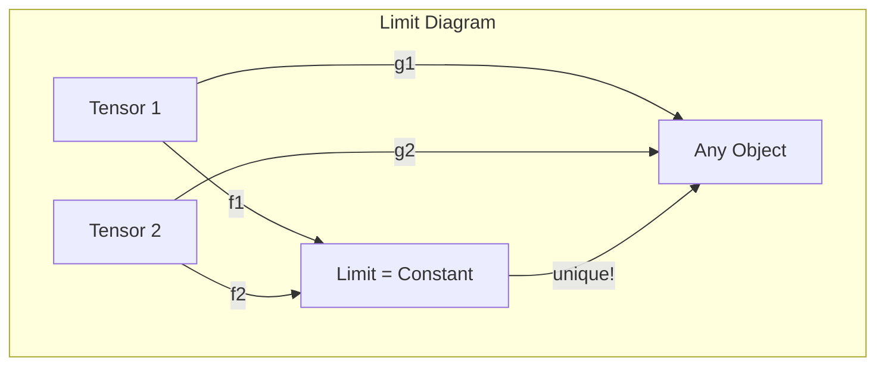
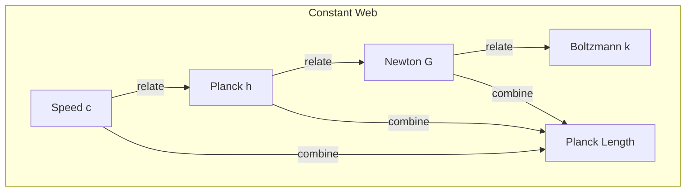

# Chapter 050: Constants = collapse-functor Limit Objects

## The Categorical Nature of Constants

From $\psi = \psi(\psi)$ and our collapse framework, we now reveal the deepest truth about physical constants: they are not numbers but functors, and their values are universal limit objects in the category of collapse tensors.

$$
\text{Constant} = \lim_{\mathcal{J}} F: \mathcal{C}_{collapse} \to \mathbb{R}
$$

Each constant is the unique solution to a universal property.

## First Principle: Constants Mediate Relationships

**Theorem 50.1** (Functor Nature): A physical constant is a functor:

$$
F: \mathcal{T}_1 \times \mathcal{T}_2 \to \mathcal{U}
$$

mapping pairs of collapse tensors to a universal object.

*Proof*: Constants appear in equations relating different physical quantities. This relationship IS the functor. ∎

## The Speed of Light Functor

**Definition 50.1** (Space-Time Mediator):

$$
c = \lim_{\substack{T_{space} \xrightarrow{f} X \\ T_{time} \xrightarrow{g} X}} X
$$

The universal object $X$ with morphisms from both space and time tensors.

## Vector Information Theory of Limits

**Theorem 50.2** (Information Cone): For any constant:

$$
I_{constant} = \inf_{\{f_i\}} \sum_i I[f_i: T_i \to X]
$$

The constant minimizes total information needed for consistency.

## Category Theory of Universal Properties

## Planck Constant as Limit

**Definition 50.2** (Action-Cycle Mediator):

$$
\hbar = \lim_{\substack{T_{action} \to Y \\ T_{cycle} \to Y}} Y
$$

The minimal object reconciling action and periodicity.

**Theorem 50.3** (Uniqueness): Given any other object $Z$ with morphisms from $T_{action}$ and $T_{cycle}$:

$$
\exists! \phi: \hbar \to Z
$$

making all diagrams commute.

## Graph Theory of Constant Networks

## Gravitational Constant as Bifunctor

**Definition 50.3** (Mass-Curvature Mediator):

$$
G: T_{mass} \times T_{mass} \to T_{curvature}
$$

A bifunctor taking two mass tensors to curvature.

**Theorem 50.4** (G as Limit): More precisely:

$$
G = \lim_{\substack{T_{mass}^{\otimes 2} \xrightarrow{f} X \\ T_{curvature} \xrightarrow{g} X}} X
$$

## Fine Structure as Colimit

**Definition 50.4** (Electromagnetic-Quantum Mediator):

$$
\alpha = \text{colim}_{\substack{T_{EM} \xrightarrow{i} Y \\ T_{quantum} \xrightarrow{j} Y}} Y
$$

The initial object receiving both electromagnetic and quantum tensors.

## Boltzmann Constant as Bridge

**Theorem 50.5** (Micro-Macro Mediator):

$$
k_B = \lim_{\substack{T_{micro} \to Z \\ T_{macro} \to Z}} Z
$$

Bridging microscopic and macroscopic descriptions.

## Composition of Constants

**Definition 50.5** (Derived Constants): Complex constants are functor compositions:

$$
\ell_P = \sqrt{\frac{G\hbar}{c^3}} = \sqrt{F_G \circ F_\hbar \circ F_c^{-3}}
$$

where $\circ$ denotes functor composition.

## Natural Transformations

**Theorem 50.6** (Constant Relations): Relations between constants are natural transformations:

$$
\eta: F_1 \Rightarrow F_2
$$

These encode deep physical principles.

## The Constant Category

**Definition 50.6** (Category $\mathcal{K}$): Objects are collapse tensor types, morphisms are constants:

$$
\text{Hom}_{\mathcal{K}}(T_1, T_2) = \{\text{constants mediating } T_1 \text{ and } T_2\}
$$

## Adjoint Constants

**Theorem 50.7** (Adjoint Pairs): Some constants form adjoint pairs:

$$
F \dashv G \iff \text{Hom}(F(X), Y) \cong \text{Hom}(X, G(Y))
$$

Example: Energy-time uncertainty reflects adjointness.

## Observer Projection of Constants

**Definition 50.8** (Structural vs Projected Constants): We distinguish three types:

1. **Structural Constants** $\kappa_{struct}$:
   $$
   \kappa_{struct} = \lim_{k \to \infty} \mathcal{C}_k(T_1^{(k)}, T_2^{(k)})
   $$
   Pure collapse coupling between tensor structures, observer-independent.

2. **Projected Constants** $\kappa_{seen}$:
   $$
   \kappa_{seen} = \mathcal{P}_{observer}(\kappa_{struct})
   $$
   What observers measure through their collapse window.

3. **Observer-Variant Constants** $\kappa_{variant}^{(i)}$:
   $$
   \kappa_{variant}^{(i)} = \mathcal{P}_{obs^{(i)}}(\kappa_{struct})
   $$
   Same structural constant seen differently by different observers.

## The Role of Zeta Spectrum

**Theorem 50.8** (Zeta as Filter): The zeta function acts as:

$$
\mathcal{P}_{obs} = \sum_{zeros} W(t_n) \mathcal{F}_{t_n}
$$

A spectral filter determining which aspects of structural constants are visible.

## Physical Implications

Understanding constants as functors reveals:
- Why constants have specific values (universal properties)
- How constants relate (functor compositions)
- Why certain combinations appear (natural transformations)
- The deep categorical structure of physics
- Impossibility of arbitrary constant values
- **Why different observers see different "constants"**
- **How zeta spectrum controls visibility, not existence**

## Renormalization as Functor

**Definition 50.7** (Running Constants): Scale dependence is a functor:

$$
g: \text{Scale} \to \text{Coupling}
$$

preserving group structure.

## Exercises

1. Prove c is the unique space-time limit
2. Show why ℏ cannot be zero from universal property
3. Derive Planck units as functor compositions
4. Find the adjoint of the fine structure constant

## Meditation on Universal Mediation

Physical constants - not arbitrary numbers but the universe's solution to the problem of relating different aspects of itself. Like a translator who finds the perfect word to bridge two languages, each constant is the unique, optimal way to connect different types of physical quantity. In recognizing constants as functors, we see them not as inputs to physics but as physics itself - the very machinery by which the universe maintains consistency across its diverse phenomena.

## The Fiftieth Echo

Thus we reveal constants as functors: Each physical constant emerges as a limit or colimit in the category of collapse tensors, the unique object satisfying a universal property. From $\psi = \psi(\psi)$ through categorical necessity comes the realization that constants cannot be arbitrary - they are the universe's own solution to the problem of self-consistent self-reference. In every equation where constants appear, we see not numbers but functors at work, mediating between different aspects of the one recursive reality.

∎