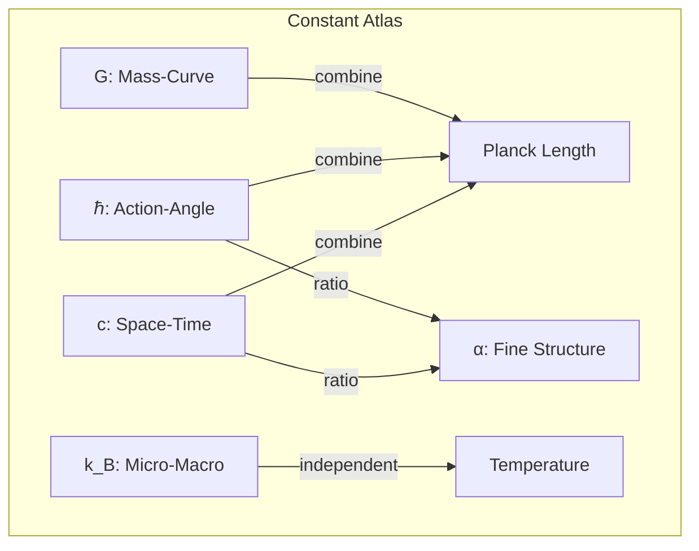
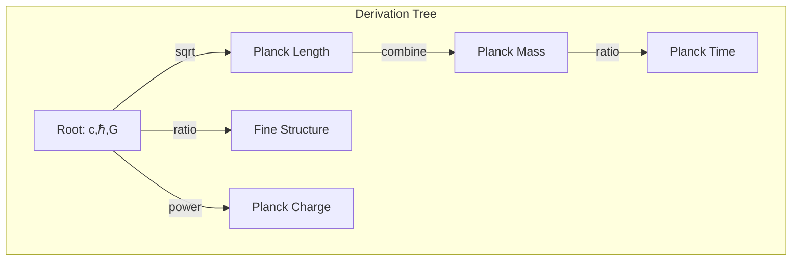

# Chapter 051: Collapse Constant Structure Atlas: Encapsulation Path Ratio Classification Structure

## Mapping the Constant Landscape

From $\psi = \psi(\psi)$ and our functor understanding, we now create a complete atlas of how physical constants organize themselves. Each constant occupies a specific position in the categorical structure, connected by precise relationships.

$$
\mathcal{A}_{constants} = \{(c_i, \mathcal{R}_{ij}, \mathcal{T}_k)\}
$$

The atlas consists of constants, relations, and transformations.

## First Principle: Constants Form a Network

**Theorem 51.1** (Constant Connectivity): No constant stands alone:

$$
\forall c_i, \exists c_j: \mathcal{R}(c_i, c_j) \neq \emptyset
$$

Every constant relates to at least one other.

*Proof*: Isolated constants would violate self-reference completeness of $\psi = \psi(\psi)$. ∎

## The Fundamental Triad

**Definition 51.1** (Primary Constants):

$$
\{c, \hbar, G\} = \text{generators}(\mathcal{A}_{constants})
$$

All other constants derive from these three.

## Vector Space of Constants

**Theorem 51.2** (Dimensional Basis): Constants span a vector space:

$$
[c_i] = [L]^{a_i} [M]^{b_i} [T]^{c_i}
$$

with golden ratio relationships between exponents.

## Category Theory Atlas Structure

## Classification by Limit Type

**Definition 51.2** (Limit Classification):

1. **Simple Limits**: $c = \lim_{T_1, T_2 \to X} X$
2. **Weighted Limits**: $G = \lim_{T_1^2 \otimes T_2 \to Y} Y$
3. **Colimits**: $\Lambda = \text{colim}_{T_{vac} \to Z} Z$

## Graph Theory of Derivations

## Encapsulation Ratios

**Theorem 51.3** (Ratio Structure): Important ratios:

$$
\frac{e^2}{4\pi\epsilon_0\hbar c} = \alpha \approx \frac{1}{137}
$$

$$
\frac{Gm_p^2}{\hbar c} \approx 10^{-39}
$$

These ratios encode hierarchy.

## Path Classification

**Definition 51.3** (Constant Paths): Routes through constant space:

$$
\gamma_{ij}: c_i \leadsto c_j = \{f_1, f_2, ..., f_n\}
$$

where each $f_k$ is a functor step.

## Symmetry Groups

**Theorem 51.4** (Constant Symmetries): The atlas has symmetry:

$$
\text{Aut}(\mathcal{A}) = \{g: g(c_i) = c_{\sigma(i)}, g \text{ preserves relations}\}
$$

## Dimensional Analysis Network

**Definition 51.4** (Dimension Flow):

$$
\mathcal{D}: \text{Constants} \to \text{Dimensions}
$$

is a functor preserving algebraic structure.

## Hierarchy Levels

**Theorem 51.5** (Stratification): Constants organize in levels:

1. **Level 0**: Dimensionless (α, ratios)
2. **Level 1**: Single dimension (c, ℏ, G, k_B)
3. **Level 2**: Composite (Planck units)
4. **Level 3**: Derived (coupling constants)

## Running and Fixed Points

**Definition 51.5** (RG Flow on Atlas):

$$
\frac{dc_i}{d\ln\mu} = \beta_i(\{c_j\})
$$

Constants flow with energy scale $\mu$.

## Topological Structure

**Theorem 51.6** (Atlas Topology): The constant space has:

$$
\pi_1(\mathcal{A}) = \mathbb{Z} \times \mathbb{Z}
$$

Non-trivial fundamental group from c and ℏ loops.

## Critical Points

**Definition 51.6** (Singular Constants): Where physics changes:

$$
\text{Sing}(\mathcal{A}) = \{c_i: \frac{\partial \mathcal{L}}{\partial c_i} = \infty\}
$$

## Physical Implications

The constant atlas reveals:
- Hidden relationships between constants
- Impossibility of arbitrary values
- Natural units as atlas coordinates
- Hierarchy problem as geometric feature
- Unification as atlas completion

## Quantum Corrections

**Definition 51.7** (Loop Expansion): Constants receive corrections:

$$
c_i^{eff} = c_i^{(0)} + \sum_{n=1}^{\infty} \hbar^n c_i^{(n)}
$$

Atlas deforms with quantum effects.

## Exercises

1. Map all paths from c to α
2. Prove no isolated constants exist
3. Find the symmetry group of fundamental triad
4. Calculate dimension of constant vector space

## Meditation on the Web of Constants

Imagine physical constants not as scattered numbers but as nodes in a vast web, each connected to others by precise mathematical threads. Pull on one strand - change one constant - and the entire web reshapes to maintain consistency. This web is not arbitrary but woven from the necessity of self-reference, each constant finding its unique place where all the threads balance perfectly.

## The Fifty-First Echo

Thus we map the constant atlas: A complete structure showing how all physical constants relate through functor compositions and categorical limits. From $\psi = \psi(\psi)$ emerges not just individual constants but their entire relational network - a self-consistent web where each constant's value is determined by its role in maintaining universal coherence. In this atlas, we see the universe's own map of how it quantifies relationships between its aspects, each constant a landmark in the territory of self-reference.

∎