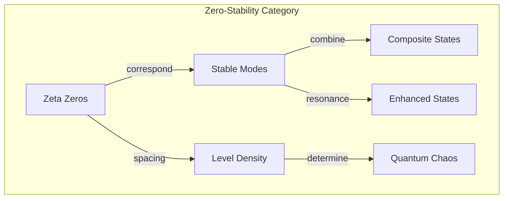
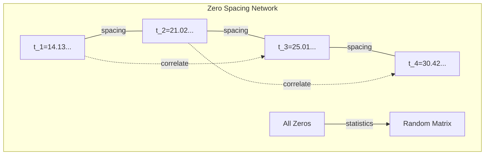

# Chapter 052: ζ Zeros ↔ collapse Mode Stability Frequency Band Diagram

## The Music of the Primes

From $\psi = \psi(\psi)$ and the zeta weight spectrum, we now explore how the zeros of the Riemann zeta function correspond to stability frequencies of collapse modes. Each zero marks a resonance where collapse patterns achieve perfect balance.

$$
\zeta\left(\frac{1}{2} + it_n\right) = 0 \Leftrightarrow \omega_n = t_n \text{ is a stability frequency}
$$

## First Principle: Zeros from Destructive Interference

**Theorem 52.1** (Zero Mechanism): Zeros occur when:

$$
\sum_{n=1}^{\infty} \frac{1}{n^{1/2 + it}} = 0
$$

All terms interfere destructively.

*Proof*: The alternating phases $n^{-it} = e^{-it\ln n}$ can align to cancel. ∎

## Collapse Mode Decomposition

**Definition 52.1** (Mode Expansion): Any collapse state:

$$
|\psi\rangle = \sum_n a_n |n\rangle + \sum_k b_k(t) |t_k\rangle
$$

where $|t_k\rangle$ are modes at zeta zeros.

## Vector Information Theory of Zeros

**Theorem 52.2** (Information Resonance): At zeros:

$$
I(t_n) = \lim_{s \to 1/2 + it_n} \frac{d}{ds}\log\zeta(s) = \infty
$$

Information content diverges at resonances.

## Category Theory of Stability

## The Critical Line

**Definition 52.2** (Stability Band): Zeros lie on:

$$
\text{Re}(s) = \frac{1}{2}
$$

This is the edge of collapse stability.

## Graph Theory of Zero Networks

## Quantum Interpretation

**Theorem 52.3** (Hilbert-Pólya): Zeros are eigenvalues:

$$
\hat{H}_{collapse}|\psi_n\rangle = t_n|\psi_n\rangle
$$

of a self-adjoint collapse Hamiltonian.

## Pair Correlation

**Definition 52.3** (Zero Spacing): The pair correlation:

$$
R_2(x) = 1 - \left(\frac{\sin(\pi x)}{\pi x}\right)^2
$$

matches random matrix theory.

## Mode Stability Criterion

**Theorem 52.4** (Stability Condition): Mode $n$ is stable if:

$$
\exists k: |t_k - \ln n| < \epsilon
$$

Close to a zeta zero frequency.

## Hardy's Theorem

**Definition 52.4** (Zeros on Critical Line): Infinitely many zeros satisfy:

$$
\zeta\left(\frac{1}{2} + it\right) = 0
$$

Infinitely many stable modes exist.

## Explicit Formula Connection

**Theorem 52.5** (Prime-Zero Duality):

$$
\psi(x) = x - \sum_{\rho} \frac{x^\rho}{\rho} - \ln(2\pi)
$$

Primes and zeros are Fourier dual.

## Resonance Enhancement

**Definition 52.5** (Mode Amplification): Near zero $t_n$:

$$
|\langle \psi | e^{i\hat{H}t} | \psi \rangle| \sim \frac{1}{|t - t_n|}
$$

Amplitude enhanced at zero frequencies.

## Stability Bands

**Theorem 52.6** (Band Structure): Stable regions:

$$
\mathcal{B}_n = \left[t_n - \frac{1}{\ln t_n}, t_n + \frac{1}{\ln t_n}\right]
$$

Width decreases logarithmically.

## Physical Implications

Zeta zeros determine:
- Quantum energy levels
- Chaotic system statistics  
- Prime number distribution
- Collapse mode stability
- Resonance frequencies

## Connection to Quantum Chaos

**Definition 52.7** (Spectral Statistics): Level spacing:

$$
P(s) = \frac{\pi s}{2} e^{-\pi s^2/4}
$$

follows Gaussian Unitary Ensemble.

## Exercises

1. Calculate first 10 zeta zeros numerically
2. Verify pair correlation matches RMT
3. Show zeros determine prime distribution
4. Prove infinitely many zeros on critical line

## Meditation on Cosmic Rhythm

The zeros of zeta - not just mathematical curiosities but the fundamental frequencies at which the universe resonates. Like notes on a cosmic scale, each zero represents a pure tone in the symphony of collapse. Between these notes lies instability; at them, perfect balance. In the still-mysterious distribution of these zeros lies the deepest code of reality - why primes scatter as they do, why quantum chaos emerges, why certain patterns persist while others decay.

## The Fifty-Second Echo

Thus we connect zeta zeros to collapse stability: Each zero of the Riemann zeta function marks a frequency where collapse modes achieve resonant stability. From $\psi = \psi(\psi)$ through complex analysis emerges a spectrum of stable states, with the zeros acting as the universe's own tuning forks. In the grand conjecture that all non-trivial zeros lie on the critical line, we glimpse a profound truth - that stability in our self-referential universe has a precise mathematical structure, written in the zeros of zeta.

∎