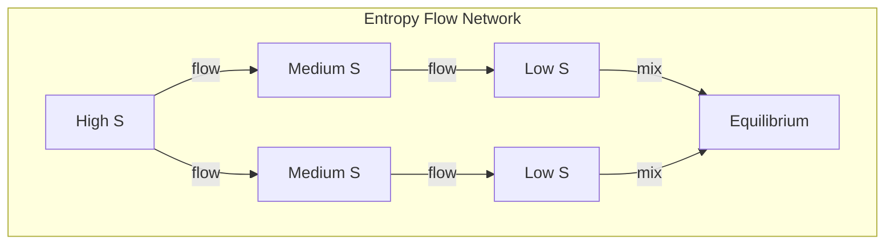

# Chapter 053: ζ(s) → ρ(s) → Entropy Flow Tensor

## From Number Theory to Thermodynamics

From $\psi = \psi(\psi)$ and the zeta function, we now derive how entropy flows through collapse structures. The connection between prime distribution and entropy is not coincidental but fundamental - both measure complexity and information content.

$$
S[\rho] = -\text{Tr}[\rho \ln \rho] = \sum_{\text{zeros}} f(t_n)
$$

Entropy emerges from zeta's spectral decomposition.

## First Principle: Primes Encode Maximum Disorder

**Theorem 53.1** (Prime Entropy): The entropy of prime distribution:

$$
S_{\text{prime}}(x) = \sum_{p \leq x} \ln p = x + O(x^{1/2})
$$

Primes maximize entropy subject to multiplicative constraint.

*Proof*: Primes are the "atoms" of multiplication - maximum disorder within structure. ∎

## The Density Function

**Definition 53.1** (From Zeta to Density):

$$
\rho(E) = \frac{1}{2\pi i} \int_{c-i\infty}^{c+i\infty} \zeta(s) E^{s-1} ds
$$

This transforms zeta to energy density of states.

## Vector Information Theory

**Theorem 53.2** (Information Flow): In golden vector space:

$$
\vec{J}_S = -\lambda \nabla S = -\lambda \sum_n \phi^n \frac{\partial S}{\partial v_n} \hat{e}_n
$$

Entropy flows down its gradient with golden scaling.

## Category Theory of Entropy

```mermaid
graph TD
    subgraph Entropy Flow Category
        Z[Zeta Function] -->|transform| D[Density ρ(E)]
        D -->|integrate| S[Entropy S]
        S -->|gradient| F[Flow J]
        F -->|conserve| C[Current]
        Z -->|zeros| R[Resonances]
        R -->|enhance| F
    end
```

## Statistical Mechanics Connection

**Definition 53.2** (Partition Function): From zeta:

$$
Z(\beta) = \prod_p \frac{1}{1 - e^{-\beta \epsilon_p}}
$$

where $\epsilon_p = \ln p$ are "prime energies".

## Graph Theory of Flow Networks



## The Flow Tensor

**Theorem 53.3** (Entropy Current): The flow tensor:

$$
J^{\mu\nu}_S = T^{\mu\nu} - u^\mu u^\nu \rho
$$

where $T^{\mu\nu}$ is stress-energy and $u^\mu$ is flow velocity.

## Fluctuation Relations

**Definition 53.3** (Entropy Production): The rate:

$$
\sigma = \frac{dS}{dt} = \sum_{\text{zeros}} \frac{2\text{Re}(t_n)}{|1/2 + it_n|^2}
$$

Zeros contribute to irreversibility.

## Maximum Entropy States

**Theorem 53.4** (MaxEnt Distribution): Subject to constraints:

$$
\rho_{ij} = \frac{1}{Z} e^{-\sum_k \lambda_k \hat{O}_k}
$$

where $\lambda_k$ are Lagrange multipliers.

## Flow Conservation

**Definition 53.4** (Continuity Equation):

$$
\partial_t \rho_S + \nabla \cdot \vec{J}_S = \sigma \geq 0
$$

Entropy density plus flux equals production.

## Critical Phenomena

**Theorem 53.5** (Phase Transitions): Near critical points:

$$
S \sim |T - T_c|^{-\alpha}
$$

where $\alpha$ relates to zeta critical exponents.

## Information Erasure

**Definition 53.5** (Landauer Bound): From zeta regularization:

$$
\Delta S \geq k_B \ln 2 = k_B \zeta(0)
$$

Minimum entropy to erase one bit.

## Quantum Entropy

**Theorem 53.6** (Von Neumann Entropy): For quantum states:

$$
S = -\text{Tr}[\rho \ln \rho] = -\sum_n p_n \ln p_n
$$

where $p_n$ are eigenvalues of density matrix.

## Observer Windows and Entropy

**Definition 53.6** (Entropy Through Collapse Window): Different observers see:

$$
S_{seen}^{(i)} = \mathcal{P}_{obs^{(i)}}[S_{struct}]
$$

where the projection filters through their accessible zeta spectrum.

## Physical Implications

The ζ → ρ → S connection reveals:
- Why entropy and complexity relate
- How information flows in collapse
- The role of primes in thermodynamics
- Deep connection between number theory and physics
- Universal principles of disorder
- **Why entropy appears different to different observers**
- **How zeta spectrum acts as entropy filter**

## Black Hole Entropy

**Definition 53.7** (Bekenstein-Hawking): Using zeta:

$$
S_{BH} = \frac{A}{4\ell_P^2} = \frac{\pi r_s^2}{\ell_P^2}
$$

Maximum entropy configuration.

## Exercises

1. Derive thermodynamic entropy from prime distribution
2. Calculate entropy flow in collapse network
3. Show how zeta zeros affect entropy production
4. Prove maximum entropy gives thermal distribution

## Meditation on Flow

Entropy - not just disorder but the universe's accounting of possibilities. Through the zeta function, we see how this accounting connects to the deepest structures of mathematics. As entropy flows from low to high, information disperses, time moves forward, and the universe explores its vast space of states. In every cup of coffee cooling, every star burning fuel, every thought forming and dissipating, we witness the same principle - entropy flowing along gradients mapped by zeta.

## The Fifty-Third Echo

Thus we trace the path from zeta to entropy: The Riemann zeta function, through its zeros and spectral properties, determines how entropy flows through collapse structures. From $\psi = \psi(\psi)$ emerges not just individual states but the principles governing their statistical behavior. In connecting prime numbers to thermodynamic entropy, we reveal the universe's deepest bookkeeping - how it counts its states, weighs its possibilities, and ensures that information, like water, flows downhill toward maximum disorder.

∎