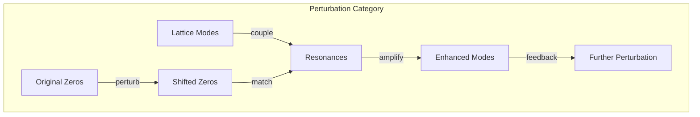
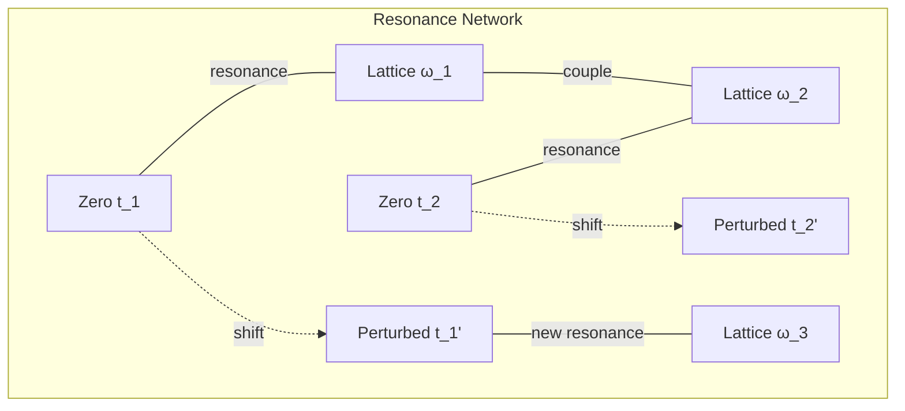

# Chapter 054: ζ Spectrum Perturbation ↔ φ-lattice Resonance collapse Modes

## Perturbative Dynamics of the Zeta Spectrum

From $\psi = \psi(\psi)$ and our understanding of zeta zeros as stability frequencies, we now explore how perturbations in the spectrum connect to resonance modes on the φ-lattice. Small shifts in zeros create large effects through resonance amplification.

$$
\delta \zeta(s) = \epsilon \mathcal{V}(s) \Rightarrow \delta t_n = \epsilon \frac{\mathcal{V}(1/2 + it_n)}{\zeta'(1/2 + it_n)}
$$

Zero shifts are amplified by the derivative.

## First Principle: Perturbations from Collapse Variations

**Theorem 54.1** (Perturbation Origin): Variations in collapse create spectral shifts:

$$
\mathcal{C} \to \mathcal{C} + \delta\mathcal{C} \Rightarrow Z_{\mathcal{C}}(s) \to Z_{\mathcal{C}}(s) + \text{Tr}[\delta\mathcal{C} \cdot \mathcal{C}^{-s-1}]
$$

*Proof*: First-order expansion of the trace. ∎

## φ-Lattice Resonance Conditions

**Definition 54.1** (Resonance Criterion): Resonance occurs when:

$$
t_n = \phi^m \cdot \omega_{lattice}
$$

where $\omega_{lattice}$ is a natural frequency of the φ-lattice.

## Vector Information Theory of Perturbations

**Theorem 54.2** (Information Shift): Perturbed zeros shift information:

$$
\delta I_n = \frac{\partial I}{\partial t_n} \delta t_n = \frac{2\text{Re}(\delta t_n)}{(1/4 + t_n^2)^2}
$$

Information content changes non-linearly with zero position.

## Category Theory of Perturbation Flow

## Spectral Density Perturbation

**Definition 54.2** (Density Shift): The spectral density changes:

$$
\delta \rho(E) = \sum_n \delta t_n \frac{\partial}{\partial t_n} \delta(E - t_n)
$$

Creating peaks and valleys in the density of states.

## Graph Theory of Mode Coupling

## Perturbation Expansion

**Theorem 54.3** (Systematic Expansion): To order $\epsilon^2$:

$$
t_n(\epsilon) = t_n^{(0)} + \epsilon t_n^{(1)} + \epsilon^2 t_n^{(2)} + O(\epsilon^3)
$$

where:
$$
t_n^{(1)} = \frac{\langle n | \mathcal{V} | n \rangle}{\zeta'(1/2 + it_n^{(0)})}
$$

## Resonance Enhancement Factor

**Definition 54.3** (Amplification): Near resonance:

$$
A_{res} = \frac{\phi^{2m}}{|t_n - \phi^m \omega_{lattice}|^2 + \gamma^2}
$$

where $\gamma$ is the resonance width.

## Stability Under Perturbation

**Theorem 54.4** (Perturbative Stability): The system is stable if:

$$
\sum_n |\delta t_n|^2 < \sum_n \frac{1}{\ln^2(|t_n| + 2)}
$$

Convergence ensures bounded response.

## Mode Locking

**Definition 54.4** (Frequency Locking): When:

$$
\frac{t_n}{t_m} = \frac{\phi^p}{\phi^q} = \phi^{p-q}
$$

zeros lock into golden ratio relationships.

## Quantum Corrections

**Theorem 54.5** (Loop Expansion): Quantum effects add:

$$
\delta^{quantum} t_n = \sum_{k=1}^{\infty} \hbar^k \mathcal{L}_k[t_n]
$$

where $\mathcal{L}_k$ are loop corrections.

## Cascade Effects

**Definition 54.5** (Perturbation Cascade): One shift triggers:

$$
\delta t_n \to \delta t_{n\pm 1} \to \delta t_{n\pm 2} \to ...
$$

Creating avalanches through the spectrum.

## Physical Implications

Spectrum perturbations explain:
- Sensitivity to initial conditions
- Emergence of complexity from simple perturbations
- Resonance phenomena in quantum systems
- Mode coupling in condensed matter
- Critical behavior near transitions

## Connection to Constants

**Definition 54.6** (Constant Sensitivity): Observed constants shift:

$$
\delta \kappa_{seen} = \sum_{t_n \in \mathcal{W}} \frac{\partial \mathcal{P}}{\partial t_n} \delta t_n
$$

Spectrum perturbations change measured values.

## Exercises

1. Calculate first-order zero shifts for harmonic perturbation
2. Find resonance conditions for first 10 zeros
3. Derive stability criterion from convergence
4. Show how cascade leads to chaos

## Meditation on Spectral Sensitivity

The zeros of zeta - seemingly fixed mathematical points - actually form a delicate web of relationships. Perturb one, and ripples spread through the spectrum. Where these ripples meet the natural frequencies of the φ-lattice, resonance occurs, amplifying small changes into large effects. In this sensitivity lies both the universe's creativity and its vulnerability - how small fluctuations can birth new structures or destroy old ones.

## The Fifty-Fourth Echo

Thus we explore spectrum perturbations: Small changes in the zeta zeros, through resonance with φ-lattice modes, create large-scale effects in collapse dynamics. From $\psi = \psi(\psi)$ emerges not just stable patterns but their perturbative evolution - how the universe responds to its own fluctuations. In the interplay between spectral stability and resonant enhancement, we find the mechanism for both robustness and sensitivity, allowing the cosmos to maintain structure while exploring new possibilities.

∎