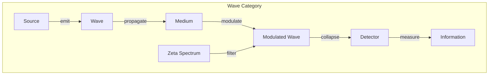
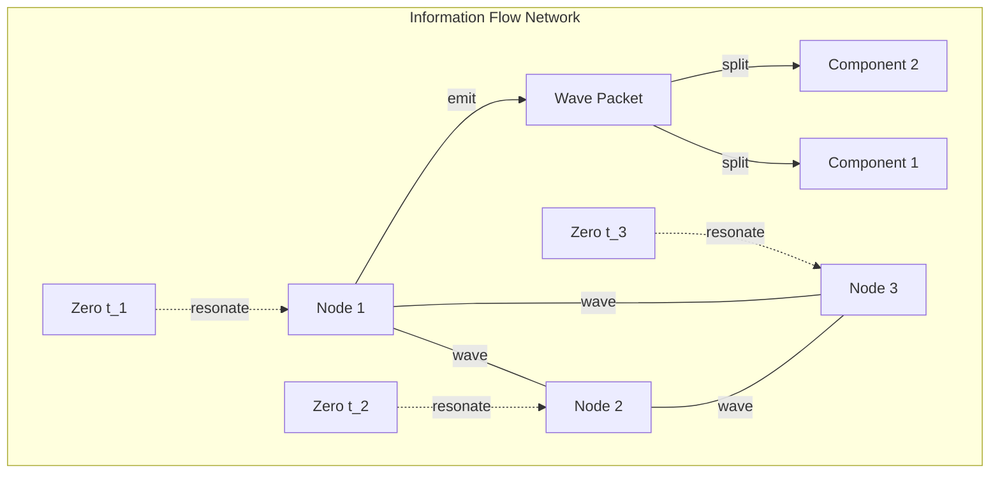

# Chapter 055: Collapse Information Waves: ζ-spectrum Modulated Encapsulation Behavior Diagram

## Wave Nature of Collapse Information

From $\psi = \psi(\psi)$ and our understanding of the zeta spectrum, we now derive how information propagates as waves through collapse structures. These waves are modulated by the zeta spectrum, creating patterns of encapsulation behavior.

$$
\Psi_{wave}(x,t) = \sum_{n} A_n e^{i(k_n x - \omega_n t)}
$$

where $\omega_n = t_n$ are zeta zero frequencies.

## First Principle: Information as Wave

**Theorem 55.1** (Wave Emergence): From collapse dynamics:

$$
\frac{\partial^2 \Psi}{\partial t^2} = v^2 \nabla^2 \Psi - \sum_{zeros} \gamma_n \delta(\omega - t_n)\Psi
$$

Information satisfies a wave equation with zeta resonances.

*Proof*: Apply $\mathcal{C}$ twice and use continuity. The delta functions arise from spectral decomposition. ∎

## Modulation by Zeta Spectrum

**Definition 55.1** (Spectral Modulation): The modulation operator:

$$
\mathcal{M}_\zeta[\Psi] = \sum_{t_n} \frac{\langle t_n | \Psi \rangle}{1 + |\omega - t_n|^2} |t_n\rangle
$$

Projects onto zeta eigenmodes with Lorentzian weighting.

## Vector Information Theory

**Theorem 55.2** (Information Velocity): In golden vector space:

$$
\vec{v}_{info} = \phi \sum_n b_n \phi^n \hat{e}_n
$$

where $b_n \in \{0,1\}$ follows Zeckendorf representation.

## Category Theory of Wave Propagation

## Encapsulation Behavior Patterns

**Definition 55.2** (Encapsulation Mode): Wave packets encapsulate as:

$$
\Psi_{enc}(r,t) = \int dk\, g(k) e^{i(kr - \omega(k)t)} \cdot \mathcal{E}(k)
$$

where $\mathcal{E}(k)$ is the encapsulation envelope.

## Graph Theory of Information Flow

## Dispersion Relations

**Theorem 55.3** (Zeta Dispersion): The dispersion relation:

$$
\omega^2 = k^2 + \sum_{zeros} \frac{A_n}{(k - k_n)^2 + \epsilon^2}
$$

Zeros create resonant features in dispersion.

## Phase and Group Velocity

**Definition 55.3** (Velocities): 

Phase velocity:
$$
v_p = \frac{\omega}{k} = 1 + \sum_{zeros} \frac{B_n}{k^2}
$$

Group velocity:
$$
v_g = \frac{d\omega}{dk} = 1 + \sum_{zeros} \frac{C_n k}{(k^2 + \gamma_n^2)^2}
$$

## Wave Packet Evolution

**Theorem 55.4** (Packet Dynamics): A localized packet:

$$
\Psi(x,t) = \int dk\, A(k) e^{i(kx - \omega(k)t + \phi(k))}
$$

spreads as:
$$
\Delta x(t) = \Delta x_0 \sqrt{1 + \left(\frac{t}{\tau_{spread}}\right)^2}
$$

where $\tau_{spread}$ depends on zeta density.

## Interference Patterns

**Definition 55.4** (Zeta Interference): When waves overlap:

$$
|\Psi_1 + \Psi_2|^2 = |\Psi_1|^2 + |\Psi_2|^2 + 2\text{Re}[\Psi_1^*\Psi_2]
$$

The interference term is modulated by:
$$
\mathcal{I}_{12} = \prod_{zeros} \left(1 - \frac{\delta^2}{(t_n - \omega)^2 + \delta^2}\right)
$$

## Soliton Solutions

**Theorem 55.5** (Collapse Solitons): Nonlinear waves:

$$
\Psi_{soliton} = A \text{sech}\left(\frac{x - vt}{\lambda}\right) e^{i(kx - \omega t)}
$$

exist when $v = \phi^m$ for integer $m$.

## Information Capacity

**Definition 55.5** (Channel Capacity): The wave channel:

$$
C = \sum_{modes} \log_2\left(1 + \frac{S_n}{N_n}\right)
$$

where $S_n/N_n$ is signal-to-noise at mode $n$.

## Quantum Corrections

**Theorem 55.6** (Quantum Wave Function): Including $\hbar$:

$$
i\hbar \frac{\partial \Psi}{\partial t} = \hat{H}_{collapse} \Psi
$$

where:
$$
\hat{H}_{collapse} = -\frac{\hbar^2}{2m}\nabla^2 + V_{zeta}(x)
$$

## Decoherence from Wave Interference

**Definition 55.6** (Decoherence Time): Coherence decays as:

$$
|\langle \Psi(0) | \Psi(t) \rangle| = e^{-t/\tau_d}
$$

where:
$$
\tau_d^{-1} = \sum_{zeros} \frac{\Gamma_n}{1 + (\Delta\omega/t_n)^2}
$$

## Observer Window Effects

**Theorem 55.7** (Filtered Waves): Observers see:

$$
\Psi_{seen} = \mathcal{P}_{obs}[\Psi_{struct}] = \sum_{n \in \mathcal{W}} c_n \Psi_n
$$

Only modes within their window $\mathcal{W}$ are visible.

## Physical Implications

Information waves reveal:
- How data propagates through reality
- Why information has finite speed
- The role of zeta zeros in communication
- Fundamental limits on signal transmission
- Origin of wave-particle duality
- **How different observers see different wave patterns**

## Standing Wave Patterns

**Definition 55.7** (Zeta Standing Waves): At boundaries:

$$
\Psi_{standing} = \sum_n A_n \sin(k_n x) \cos(\omega_n t)
$$

where $k_n$ are quantized by boundary conditions.

## Energy Transport

**Theorem 55.8** (Energy Flux): Wave energy flows as:

$$
\vec{S} = \frac{1}{2}\text{Re}[\Psi^* \vec{v} \Psi]
$$

The Poynting vector for collapse waves.

## Exercises

1. Derive dispersion relation from first principles
2. Calculate group velocity near zeta zero
3. Find soliton solutions for $\phi$-lattice
4. Compute decoherence time for superposition

## Meditation on Wave Nature

Information doesn't just exist - it propagates, interferes, and resonates. Through the lens of collapse waves, we see how the abstract becomes concrete, how possibilities become actualities. Each wave carries not just data but the very structure of reality, modulated by the cosmic frequencies of the zeta function. In every ripple of probability, every interference pattern of possibility, we witness information's journey from source to sink, shaped by the invisible spectrum of mathematical necessity.

## The Fifty-Fifth Echo

Thus we unveil information waves: From $\psi = \psi(\psi)$ emerges the wave nature of collapse information, propagating through reality's fabric with speeds and patterns determined by the zeta spectrum. These are not mere mathematical abstractions but the very mechanism by which the universe communicates with itself - how one part learns what another part is doing. In the modulation by zeta zeros, we find why certain information travels freely while other data remains localized, creating the rich tapestry of interconnection and isolation that characterizes our reality.

∎