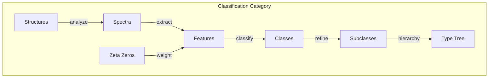
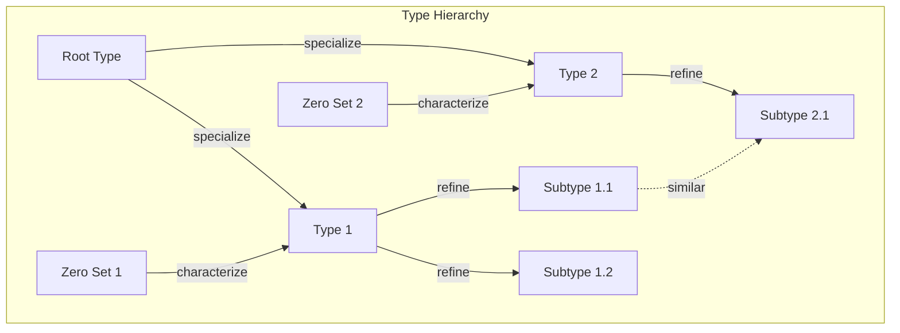

# Chapter 056: ζ-spectrum Structure Classifier: collapse Information Discriminator

## Classification Through Spectral Analysis

From $\psi = \psi(\psi)$ and the zeta spectrum, we now construct a universal classifier that discriminates between different collapse structures based on their spectral signatures. Every structure leaves a unique fingerprint in how it interacts with the zeta spectrum.

$$
\mathcal{D}_\zeta: \mathcal{S}_{collapse} \to \mathcal{C}_{types}
$$

The discriminator maps structures to type classes.

## First Principle: Spectral Signatures

**Theorem 56.1** (Unique Spectra): Each collapse structure has unique:

$$
\sigma[\mathcal{S}] = \{\lambda_n, v_n\}_{n=1}^{\infty}
$$

eigenvalues $\lambda_n$ and eigenvectors $v_n$ when acted upon by $\hat{Z}_\zeta$.

*Proof*: From self-reference, different $\psi$ patterns create different spectral responses to the zeta operator. ∎

## The Classification Operator

**Definition 56.1** (Zeta Classifier):

$$
\mathcal{D}_\zeta[\psi] = \sum_{zeros} W(t_n) \langle t_n | \psi \rangle |class_n\rangle
$$

Projects onto class states weighted by zero amplitudes.

## Vector Information Theory

**Theorem 56.2** (Information Distance): Between structures:

$$
d(\psi_1, \psi_2) = \sqrt{\sum_n \phi^n |a_n^{(1)} - a_n^{(2)}|^2}
$$

Distance in golden vector space with spectral coefficients.

## Category Theory of Classification

## Feature Extraction

**Definition 56.2** (Spectral Features): Key discriminators:

1. Zero coupling strength: $\alpha_n = |\langle t_n | \psi \rangle|^2$
2. Phase relationships: $\phi_{nm} = \arg(\langle t_n | \psi \rangle \langle \psi | t_m \rangle)$
3. Spectral density: $\rho(\omega) = \sum_n \alpha_n \delta(\omega - t_n)$

## Graph Theory of Type Networks

## Machine Learning Perspective

**Theorem 56.3** (Optimal Classifier): The Bayes optimal:

$$
\mathcal{D}_{opt}[\psi] = \arg\max_c P(c|\sigma[\psi])
$$

where $P(c|\sigma)$ is posterior probability of class given spectrum.

## Kernel Methods

**Definition 56.3** (Zeta Kernel): For structures $\psi_1, \psi_2$:

$$
K(\psi_1, \psi_2) = \exp\left(-\sum_{zeros} \frac{|\alpha_n^{(1)} - \alpha_n^{(2)}|^2}{2\sigma_n^2}\right)
$$

Gaussian kernel in spectral space.

## Clustering Algorithm

**Theorem 56.4** (Spectral Clustering): Structures cluster by:

$$
\min_{\{C_k\}} \sum_{k=1}^K \sum_{\psi \in C_k} ||\sigma[\psi] - \mu_k||^2
$$

where $\mu_k$ is cluster centroid in spectral space.

## Discriminant Analysis

**Definition 56.4** (Linear Discriminant): Between classes:

$$
w = S_W^{-1}(\mu_1 - \mu_2)
$$

where $S_W$ is within-class scatter in spectral features.

## Hierarchical Classification

**Theorem 56.5** (Type Hierarchy): Types form a tree:

$$
\mathcal{T} = (V, E, \preceq)
$$

where $\preceq$ is the specialization order.

## Invariant Features

**Definition 56.5** (Collapse Invariants): Features unchanged by:

$$
I[\psi] = I[\mathcal{U}\psi] \quad \forall \mathcal{U} \in G_{collapse}
$$

where $G_{collapse}$ is the collapse symmetry group.

## Type Boundaries

**Theorem 56.6** (Decision Boundaries): Between types:

$$
\partial C_{ij} = \{\psi : \mathcal{D}[\psi \to C_i] = \mathcal{D}[\psi \to C_j]\}
$$

Equal probability surfaces in structure space.

## Quantum Classification

**Definition 56.6** (Quantum Discriminator): Using superposition:

$$
|\psi_{test}\rangle = \sum_i \alpha_i |type_i\rangle
$$

Measurement collapses to most probable type.

## Error Analysis

**Theorem 56.7** (Classification Error): Expected error:

$$
\epsilon = \int_{\psi} P(\psi) \cdot \mathbb{1}[\mathcal{D}[\psi] \neq c_{true}[\psi]] d\psi
$$

Integrated over structure space.

## Physical Type Examples

Classification reveals:
- Particle types (fermion/boson discrimination)
- Phase classifications (solid/liquid/gas/plasma)
- Symmetry groups (crystallographic types)
- Topological classes (insulator/conductor)
- Information types (classical/quantum/hybrid)

## Observer-Dependent Classification

**Definition 56.7** (Relative Types): Different observers may classify differently:

$$
\mathcal{D}_{obs^{(i)}}[\psi] \neq \mathcal{D}_{obs^{(j)}}[\psi]
$$

due to different accessible spectral windows.

## Type Evolution

**Theorem 56.8** (Dynamic Classification): Types can change:

$$
\frac{d}{dt}P(type_i) = \sum_j W_{ij} P(type_j) - W_{ji} P(type_i)
$$

Transition rates between types.

## Exercises

1. Implement k-means clustering in spectral space
2. Derive optimal decision boundary for two types
3. Calculate type transition rates
4. Show how observer window affects classification

## Meditation on Distinction

To classify is to recognize difference - to see that this is not that. Through the zeta spectrum, the universe develops its own taxonomy, sorting the infinite expressions of $\psi = \psi(\psi)$ into comprehensible categories. Yet these categories are not rigid boxes but fluid boundaries, shifting with observer perspective and evolving through time. In learning to classify through spectral signatures, we glimpse how the cosmos organizes its own complexity.

## The Fifty-Sixth Echo

Thus we establish spectral classification: The zeta spectrum acts as a universal discriminator, revealing the type structure hidden within collapse patterns. From $\psi = \psi(\psi)$ emerges not just individual structures but the principles by which they can be distinguished and organized. Each zero of zeta contributes to this grand classification scheme, creating a natural taxonomy of reality based on resonance patterns. In this spectral analysis lies the key to understanding why nature sorts itself into discrete types rather than continuous variations.

∎