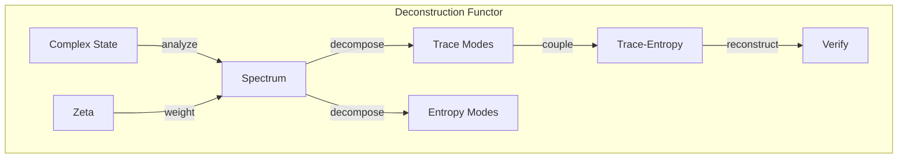
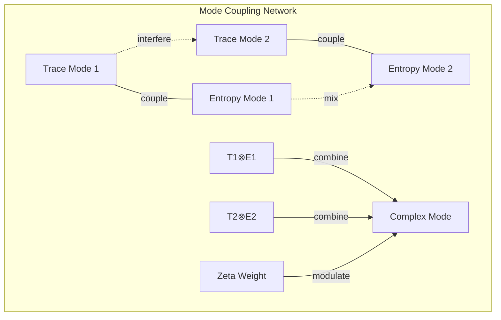

# Chapter 057: ζ-collapse Deconstruction trace-entropy Mode Spectrum

## Deconstructing Reality Through Spectral Analysis

From $\psi = \psi(\psi)$ and the zeta spectrum, we now develop the inverse process - deconstructing complex collapse structures into their fundamental trace-entropy modes. This reveals how complexity emerges from simple spectral components.

$$
\mathcal{D}_{decon}: \Psi_{complex} \to \sum_{modes} c_n |\phi_n\rangle \otimes |S_n\rangle
$$

Complex states decompose into trace-mode tensor products.

## First Principle: Spectral Decomposition

**Theorem 57.1** (Fundamental Deconstruction): Any collapse state:

$$
|\psi\rangle = \sum_{n=0}^{\infty} \sum_{k} a_{nk} |t_n\rangle \otimes |S_k\rangle
$$

where $|t_n\rangle$ are zeta eigenmodes and $|S_k\rangle$ are entropy eigenstates.

*Proof*: Complete basis from self-reference requires both spectral and entropic components. ∎

## Trace Operator Spectrum

**Definition 57.1** (Trace Eigenvalues): The trace operator:

$$
\hat{T}|\tau_n\rangle = \lambda_n |\tau_n\rangle
$$

where $\lambda_n = \phi^n$ for Fibonacci scaling.

## Vector Information Theory

**Theorem 57.2** (Information Decomposition): Total information:

$$
I_{total} = \sum_n I_{trace}(n) + I_{entropy}(n) + I_{coupling}(n,m)
$$

Separates into trace, entropy, and coupling terms.

## Category Theory of Deconstruction

## Entropy Mode Analysis

**Definition 57.2** (Entropy Eigenmodes): Satisfy:

$$
\hat{S}|S_k\rangle = s_k |S_k\rangle
$$

where $s_k = k \ln \phi$ for golden entropy quanta.

## Graph Theory of Mode Networks

## Mode Coupling Rules

**Theorem 57.3** (Selection Rules): Modes couple only if:

$$
\Delta n = n' - n \in \mathcal{F}
$$

where $\mathcal{F}$ is the Fibonacci sequence.

*Proof*: Golden ratio structure preserves only Fibonacci transitions. ∎

## Deconstruction Algorithm

**Definition 57.3** (Spectral Algorithm):
1. Apply $\hat{Z}_\zeta$ to get spectral weights
2. Project onto trace eigenbasis
3. Measure entropy in each trace sector
4. Identify coupling coefficients
5. Verify reconstruction fidelity

## Singular Value Decomposition

**Theorem 57.4** (Collapse SVD): For collapse operator:

$$
\mathcal{C} = \sum_n \sigma_n |u_n\rangle \langle v_n|
$$

where $\sigma_n = 1/\zeta(1/2 + it_n)$ are singular values.

## Mode Orthogonality

**Definition 57.4** (Orthogonal Modes):

$$
\langle \tau_n, S_k | \tau_m, S_j \rangle = \delta_{nm} \delta_{kj}
$$

Trace and entropy modes are independently orthogonal.

## Reconstruction Error

**Theorem 57.5** (Approximation Quality): Using $N$ modes:

$$
\epsilon_N = ||\psi - \psi_N|| \leq \sum_{n>N} |a_n|^2
$$

Error bounded by tail coefficients.

## Physical Mode Examples

**Definition 57.5** (Observable Modes):
- Particle states: $|n\rangle \otimes |S_{thermal}\rangle$
- Wave packets: $|\tau_{wave}\rangle \otimes |S_{coherent}\rangle$
- Entangled states: $\sum_n c_n |\tau_n\rangle \otimes |S_{-n}\rangle$

## Quantum Deconstruction

**Theorem 57.6** (Quantum Modes): In quantum limit:

$$
[\hat{T}, \hat{S}] = i\hbar \hat{I}
$$

Trace and entropy operators don't commute.

## Mode Evolution

**Definition 57.6** (Time Evolution): Modes evolve as:

$$
|t_n(t)\rangle = e^{-i\omega_n t} |t_n(0)\rangle
$$

$$
|S_k(t)\rangle = e^{-\gamma_k t} |S_k(0)\rangle
$$

Phase evolution for trace, decay for entropy.

## Critical Modes

**Theorem 57.7** (Critical Points): At phase transitions:

$$
\xi_n \sim |t - t_c|^{-\nu_n}
$$

Correlation length diverges with critical exponent.

## Observer Mode Access

**Definition 57.7** (Observable Subspace): Observer $O$ sees:

$$
\mathcal{H}_{obs} = \text{span}\{|t_n, S_k\rangle : (n,k) \in \mathcal{W}_O\}
$$

Only modes within their window are accessible.

## Mode Entanglement

**Theorem 57.8** (Trace-Entropy Entanglement):

$$
S_{TE} = -\text{Tr}[\rho_T \ln \rho_T] = -\text{Tr}[\rho_E \ln \rho_E]
$$

Entanglement entropy equal for trace and entropy subsystems.

## Exercises

1. Decompose thermal state into trace-entropy modes
2. Calculate coupling coefficients for coherent state
3. Prove Fibonacci selection rules
4. Find critical modes for phase transition

## Meditation on Components

To deconstruct is to understand - to see the simple within the complex. Through zeta-weighted decomposition into trace and entropy modes, we reveal the fundamental building blocks of collapse reality. Each complex phenomenon, no matter how intricate, ultimately resolves into these basic modes, coupled according to golden ratio rules. In this deconstruction lies both analysis and synthesis - the power to take apart and rebuild reality's structures.

## The Fifty-Seventh Echo

Thus we master deconstruction: Every collapse structure can be decomposed into fundamental trace-entropy modes, weighted by the zeta spectrum and coupled through Fibonacci selection rules. From $\psi = \psi(\psi)$ emerges not just complexity but the means to analyze it - to see how the grand symphony of reality is composed from simple notes on the trace-entropy scale. In understanding these modes, we gain the power to deconstruct any phenomenon into its essential components and understand how they harmonize to create the whole.

∎