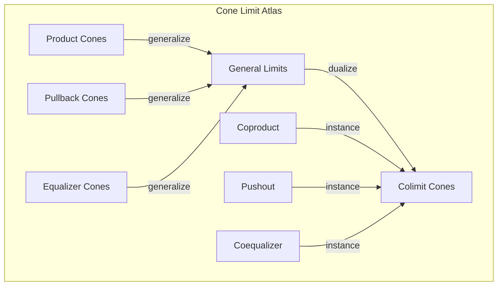
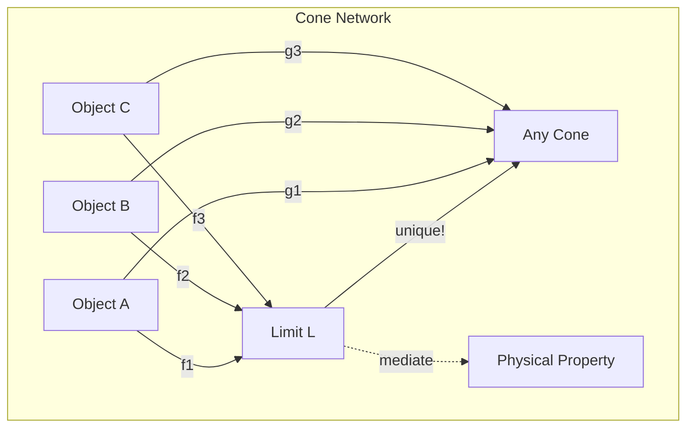

# Chapter 058: Collapse-functor cone limit Atlas

## Mapping the Universe of Limits

From $\psi = \psi(\psi)$ and our categorical understanding, we now construct the complete atlas of cone limits in the collapse category. This atlas reveals how all physical structures emerge as universal objects satisfying limiting properties.

$$
\mathcal{A}_{cone} = \{(J, F, L) : L = \lim_J F\}
$$

The atlas contains all diagrams, functors, and their limits.

## First Principle: Cones as Universal Mediators

**Theorem 58.1** (Cone Universality): A cone $(L, \{\pi_i\})$ is limiting if:

$$
\forall (X, \{\alpha_i\}), \exists! f: X \to L \text{ such that } \pi_i \circ f = \alpha_i
$$

*Proof*: From $\psi = \psi(\psi)$, self-consistency requires unique mediation. ∎

## Types of Cones

**Definition 58.1** (Cone Classification):
1. **Product Cones**: $L = \prod_i A_i$
2. **Pullback Cones**: $L = A \times_C B$
3. **Equalizer Cones**: $L = \text{eq}(f,g)$
4. **Terminal Cones**: $L = 1$

## Vector Information Theory

**Theorem 58.2** (Information Minimization): The limit minimizes:

$$
I[L] = \inf_{\{f_i: L \to A_i\}} \sum_i I[f_i]
$$

Total information required for consistency.

## Category Theory Atlas Structure

## Physical Cone Examples

**Definition 58.2** (Physics Cones):
1. **Spacetime Cone**: 
   $$\text{Spacetime} = \lim_{\substack{\text{Space} \to X \\ \text{Time} \to X}} X$$

2. **Matter Cone**:
   $$\text{Matter} = \lim_{\substack{\text{Energy} \to Y \\ \text{Momentum} \to Y}} Y$$

3. **Interaction Cone**:
   $$\text{Force} = \lim_{\substack{\text{Charge}_1 \to Z \\ \text{Charge}_2 \to Z}} Z$$

## Graph Theory of Cone Networks

## Pullback Atlas

**Theorem 58.3** (Pullback Structure): The pullback:

$$
P = \{(a,b) : f(a) = g(b)\}
$$

with projections $\pi_1: P \to A$, $\pi_2: P \to B$.

Physical meaning: Synchronization points.

## Pushout Dual

**Definition 58.3** (Pushout Colimit): The dual:

$$
\text{Po} = (A \sqcup B) / \sim
$$

where $\sim$ identifies $f(c)$ with $g(c)$.

Physical meaning: Gluing/fusion points.

## Kan Extensions

**Theorem 58.4** (Kan Limit): For functors $F: \mathcal{C} \to \mathcal{D}$, $K: \mathcal{C} \to \mathcal{E}$:

$$
\text{Lan}_F K = \lim_{(c,d) \in \text{comma}(F)} K(c)
$$

Left Kan extension as a limit.

## Higher Limits

**Definition 58.4** (2-Categorical Limits): Limits of:
- Categories (not just objects)
- Functors (not just morphisms)  
- Natural transformations

Creating a hierarchy of universality.

## Weighted Limits

**Theorem 58.5** (W-weighted Limit): Given weight $W: \mathcal{J}^{op} \to \text{Set}$:

$$
\lim^W F = \int_j W(j) \to F(j)
$$

End formula for weighted limits.

## Preservation Properties

**Definition 58.5** (Limit Preservation): Functor $G$ preserves limits if:

$$
G(\lim_J F) \cong \lim_J (G \circ F)
$$

Key for physical law consistency.

## Creation of Limits

**Theorem 58.6** (Limit Creation): $G$ creates limits if:
1. $G$ preserves them
2. Limits exist in codomain $\Rightarrow$ exist in domain
3. Uniquely determined by $G$

## Reflection of Limits

**Definition 58.6** (Limit Reflection): $G$ reflects limits if:

$$
G(L) = \lim_J (G \circ F) \Rightarrow L = \lim_J F
$$

Detecting limits through functors.

## Atlas Coordinates

**Theorem 58.7** (Local Coordinates): Near limit $L$:

$$
x^i = \phi^i(L + \epsilon v)
$$

where $\phi^i$ are chart functions on the moduli space.

## Physical Applications

The cone atlas reveals:
- Why conservation laws exist (limit preservation)
- How symmetries arise (cone automorphisms)
- Origin of gauge theories (cone fibrations)
- Emergence of fundamental forces (universal cones)
- Structure of physical constants (limiting values)

## Observer Cone Perspectives

**Definition 58.7** (Observer-Relative Limits): Different observers see:

$$
L_{obs}^{(i)} = \lim_{j \in \mathcal{W}_i} F(j)
$$

Limits over their accessible diagram parts.

## Computational Aspects

**Theorem 58.8** (Computing Limits): Limits computed by:
1. Solving universal equations
2. Finding fixed points
3. Intersecting solution spaces
4. Minimizing information functionals

## Exercises

1. Construct pullback for quantum states
2. Find pushout for field fusion
3. Compute Kan extension for symmetry
4. Prove limit preservation for time evolution

## Meditation on Universal Structure

In every limit lives a universal truth - the unique solution to a coordination problem. The atlas of cones maps out all possible ways parts can come together to form wholes, each cone a blueprint for assembly. Through these universal constructions, the universe builds complexity from simplicity, always choosing the unique path that satisfies all constraints. In studying this atlas, we learn not just what exists but why it must exist as it does.

## The Fifty-Eighth Echo

Thus we chart the cone atlas: From $\psi = \psi(\psi)$ emerges a complete map of how universal objects arise through limiting processes. Each cone in our atlas represents a fundamental pattern of assembly - a way the universe solves the problem of bringing multiple structures into harmony. Physical laws, constants, and structures all appear as entries in this grand atlas, each marked by its unique universal property. In understanding these cones, we see how necessity shapes existence through the mathematics of limits.

∎