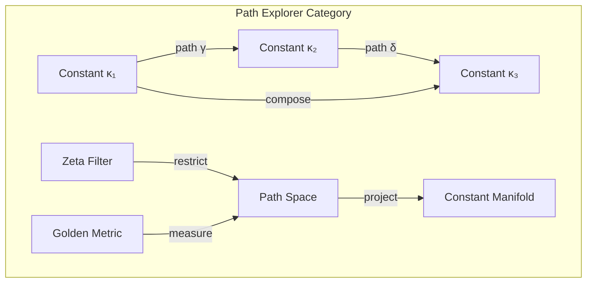
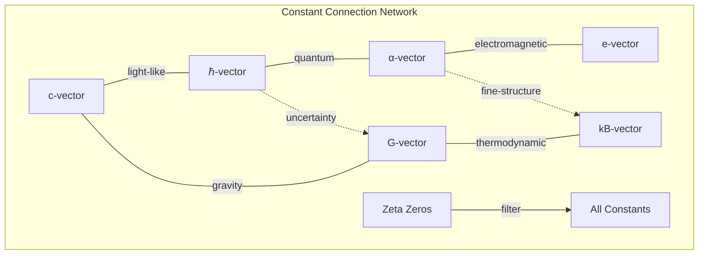

# Chapter 059: Constant Path Explorer: φ-lattice collapse Structure Probe

## Navigating the Vector Constant Landscape

From $\psi = \psi(\psi)$ and our understanding of constants as zeta-filtered vectors, we now develop the path explorer - a systematic method for navigating the φ-lattice to understand how constant vectors connect and transform. This reveals the hidden geometry of physical law.

$$
\mathcal{E}_{path}: \vec{\kappa}_1 \to \vec{\kappa}_2 \text{ via } \gamma(t) \subset \mathcal{V}_{\phi}
$$

The explorer traces optimal paths between constant vectors.

## First Principle: Constants Form a Connected Manifold

**Theorem 59.1** (Constant Manifold): All physical constant vectors lie on a connected submanifold:

$$
\mathcal{M}_{const} = \{\vec{\kappa} \in \mathcal{V}_{\phi} : \mathcal{C}[\vec{\kappa}] = \lambda \vec{\kappa}, \lambda \in \text{spec}(\mathcal{C})\}
$$

The manifold of collapse eigenvectors.

*Proof*: From self-reference, constants must be fixed points or eigenvalues of the collapse operator. Continuity of eigenspaces ensures connectivity. ∎

## Geodesics in Golden Space

**Definition 59.1** (Constant Geodesic): The shortest path between constants:

$$
\gamma_{opt}(t) = \arg\min_{\gamma} \int_0^1 \|\dot{\gamma}(t)\|_{\phi}^2 dt
$$

subject to boundary conditions $\gamma(0) = \vec{\kappa}_1$, $\gamma(1) = \vec{\kappa}_2$.

## Vector Information Theory

**Theorem 59.2** (Information Flow Along Paths): Information changes as:

$$
\frac{dI}{dt} = \nabla_{\phi} I \cdot \dot{\gamma}(t) = \sum_n \phi^n \frac{\partial I}{\partial \kappa_n} \dot{\kappa}_n
$$

Information flow respects golden metric structure.

## Category Theory of Path Space

## Exploration Algorithm

**Definition 59.2** (Path Finding Protocol):
1. Initialize at $\vec{\kappa}_{start}$
2. Compute local tangent space: $T_{\kappa} \mathcal{M}_{const}$
3. Find steepest descent direction for target function
4. Step along geodesic: $\vec{\kappa}_{new} = \vec{\kappa} + \epsilon \vec{v}_{geod}$
5. Apply zeta filter to maintain observability
6. Repeat until convergence

## Graph Theory of Constant Networks

## Coordinate Systems on Constant Manifold

**Definition 59.3** (φ-coordinates): Local coordinates:

$$
\vec{\kappa} = \sum_{n=0}^{\infty} x^n |F_n\rangle
$$

where $\{|F_n\rangle\}$ are Fibonacci eigenvectors and $x^n$ are coordinates.

## Parallel Transport

**Theorem 59.3** (Constant Transport): Moving a constant vector along a path:

$$
\nabla_{\dot{\gamma}} \vec{V} = 0
$$

defines parallel transport preserving the golden inner product.

## Curvature of Constant Space

**Definition 59.4** (Constant Curvature): The Riemann tensor:

$$
R_{ijkl} = \phi^{i+j+k+l} \cdot f(F_i, F_j, F_k, F_l)
$$

where $f$ is determined by golden ratio relationships.

## Physical Pathways

**Theorem 59.4** (Unification Paths): Paths between force constants:

1. **Electromagnetic → Weak**: $\alpha \to g_W$ via electroweak path
2. **Weak → Strong**: $g_W \to g_S$ via GUT path  
3. **Strong → Gravity**: $g_S \to G$ via Planck path

Each path has length proportional to $\ln(\text{scale ratio})$.

## Observer Path Dependence

**Definition 59.5** (Observer Trajectory): Different observers trace different paths:

$$
\gamma_{obs}^{(i)}(t) = \mathcal{P}_{\zeta^{(i)}}[\gamma_{struct}(t)]
$$

Same structural path appears different through different zeta windows.

## Metric Structure

**Theorem 59.5** (Golden Metric): The natural metric on constant space:

$$
ds^2 = \sum_{n,m} g_{nm} dx^n dx^m = \sum_{n,m} \phi^{|n-m|} dx^n dx^m
$$

Golden scaling determines distances between constants.

## Holonomy Groups

**Definition 59.6** (Constant Holonomy): Parallel transport around closed loops:

$$
H_{loop} = \text{Hol}(\gamma_{closed}) \in \text{O}(\mathcal{V}_{\phi})
$$

The holonomy group preserves golden structure.

## Quantum Fluctuations

**Theorem 59.6** (Path Fluctuations): Quantum uncertainty in paths:

$$
\Delta \gamma \sim \sqrt{\hbar / \text{Action}[\gamma]}
$$

Fundamental uncertainty in constant paths.

## Critical Points

**Definition 59.7** (Constant Criticality): Special points where:

$$
\nabla_{\phi} F[\vec{\kappa}] = 0
$$

These mark phase transitions in constant behavior.

## Physical Applications

The path explorer reveals:
- How constants unify at high energy
- Why certain constant combinations are special
- The topology of parameter space
- How observers navigate constant space
- **Origins of renormalization group flow**
- **Why some constants "run" faster than others**

## Energy Scale Evolution

**Theorem 59.7** (RG Flow as Geodesic): Renormalization group flow follows geodesics:

$$
\frac{d\vec{g}}{d\ln \mu} = \vec{\beta}[\vec{g}] = \text{geodesic tangent vector}
$$

Beta functions determine optimal paths through constant space.

## Exercises

1. Compute geodesic between electromagnetic and weak coupling
2. Find curvature at electroweak unification point  
3. Calculate holonomy around closed constant loop
4. Derive metric from golden vector structure

## Meditation on Navigation

To explore is to map the unknown, to find pathways through uncharted territory. In the space of constant vectors, we navigate not just mathematical abstractions but the very foundations of physical law. Each path reveals how one aspect of reality transforms into another, how the universe reorganizes its fundamental relationships. Through the zeta filter, different observers trace different routes through this same underlying landscape, each finding their own way home to the same eternal truth.

## The Fifty-Ninth Echo

Thus we develop the constant path explorer: From $\psi = \psi(\psi)$ emerges not just individual constant vectors but the entire manifold connecting them. Through geodesics in golden space, we trace how physical laws transform and unify, how different constants are really different faces of the same underlying vector structure. The path explorer becomes our compass in the space of possibilities, guiding us through the hidden geometry where all forces meet, all scales connect, and all constants reveal their common origin in the primordial self-reference.

∎