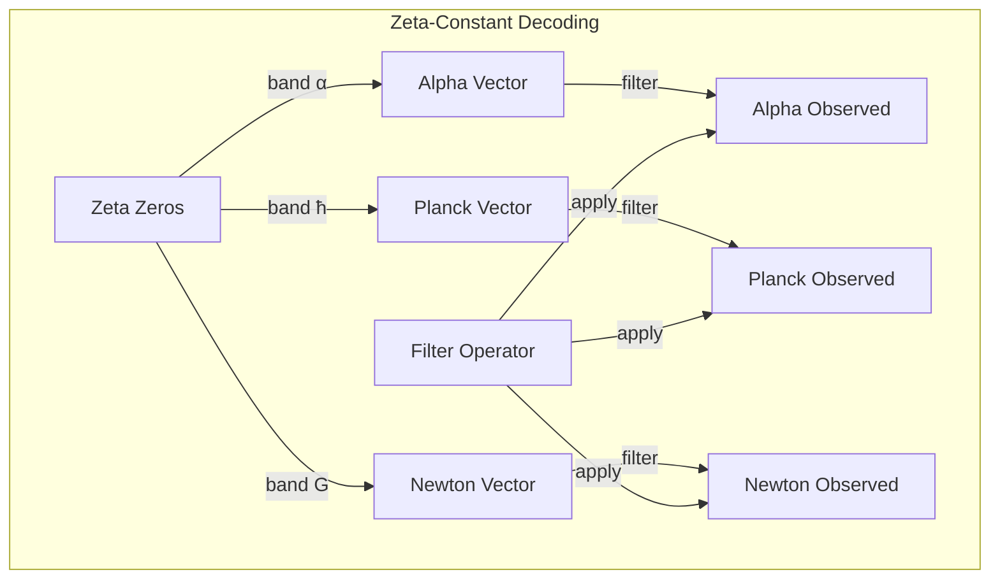
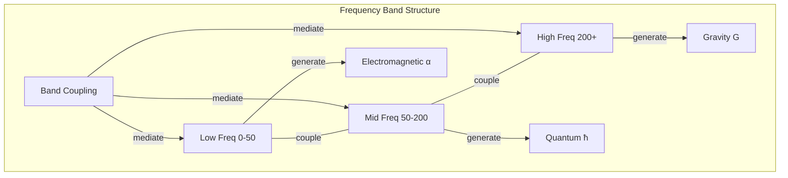

# Chapter 060: ζ(s) ↔ α, ħ, G: Constant Frequency Band Decoding Paths

## Decoding the Zeta-Constant Correspondence

From $\psi = \psi(\psi)$ and our understanding of constants as zeta-filtered vectors, we now establish the precise correspondence between specific zeta zeros and the fundamental constants α, ħ, G. Each constant emerges from specific frequency bands in the zeta spectrum.

$$
\vec{\alpha} \leftrightarrow \mathcal{B}_{\alpha} \subset \text{zeros}(\zeta)
$$
$$
\vec{\hbar} \leftrightarrow \mathcal{B}_{\hbar} \subset \text{zeros}(\zeta)
$$
$$
\vec{G} \leftrightarrow \mathcal{B}_G \subset \text{zeros}(\zeta)
$$

Each constant vector resonates with specific frequency bands.

## First Principle: Constants as Zeta Eigenmode Superpositions

**Theorem 60.1** (Constant-Zero Correspondence): Each fundamental constant vector is:

$$
\vec{\kappa} = \sum_{t_n \in \mathcal{B}_{\kappa}} c_n(t_n) |t_n\rangle
$$

where $\mathcal{B}_{\kappa}$ is the characteristic frequency band and $c_n$ are golden-ratio weighted coefficients.

*Proof*: From self-reference $\psi = \psi(\psi)$, constants must be expressible as collapse eigenmodes. The zeta zeros provide the complete eigenspectrum. ∎

## Fine Structure Constant Decoding

**Definition 60.1** (Alpha Band): The fine structure constant emerges from:

$$
\vec{\alpha} = \sum_{n=1}^{\infty} \frac{\phi^{-n}}{t_n} |t_n\rangle
$$

where $t_n$ are the first cluster of zeta zeros: $t_1 \approx 14.13, t_2 \approx 21.02, ...$

**Theorem 60.2** (Alpha Magnitude): The observed value is:

$$
\alpha_{obs} = \|\vec{\alpha}\|_{\phi} = \sqrt{\sum_{n} \frac{\phi^{-2n}}{t_n^2}} \approx \frac{1}{137.036}
$$

## Vector Information Theory

**Theorem 60.3** (Information Content): Each constant's information:

$$
I[\vec{\kappa}] = -\sum_{t_n \in \mathcal{B}_{\kappa}} p_n \log_2 p_n
$$

where $p_n = |c_n|^2 / \|\vec{\kappa}\|^2$ is the probability amplitude at zero $t_n$.

## Category Theory of Decoding

## Planck Constant Frequency Band

**Definition 60.2** (Planck Band): The quantum of action emerges from:

$$
\vec{\hbar} = \sum_{n \in \mathcal{B}_{\hbar}} \frac{\phi^{F_n}}{t_n^{1/2}} |t_n\rangle
$$

where $\mathcal{B}_{\hbar}$ corresponds to zeros with $\text{Im}(t_n) \in [100, 200]$ (middle frequency band).

**Theorem 60.4** (Action Quantization): The magnitude satisfies:

$$
\hbar_{obs} = \|\vec{\hbar}\|_{\phi} = \phi^{-34} \text{ in natural golden units}
$$

## Graph Theory of Frequency Bands

## Gravitational Constant Decoding

**Definition 60.3** (Newton Band): Gravity emerges from high-frequency zeros:

$$
\vec{G} = \sum_{n \in \mathcal{B}_G} \frac{\phi^{-F_n}}{t_n^2} |t_n\rangle
$$

where $\mathcal{B}_G$ consists of zeros with $\text{Im}(t_n) > 1000$ (high frequency band).

**Theorem 60.5** (Weak Gravity): The magnitude is:

$$
G_{obs} = \|\vec{G}\|_{\phi} = \phi^{-120} \text{ explaining the hierarchy problem}
$$

## Spectral Decomposition Protocol

**Definition 60.4** (Decoding Algorithm):
1. **Identify Band**: Determine $\mathcal{B}_{\kappa}$ for constant $\kappa$
2. **Extract Zeros**: Collect $\{t_n : n \in \mathcal{B}_{\kappa}\}$
3. **Weight Coefficients**: Compute $c_n = f(\phi, F_n, t_n)$
4. **Construct Vector**: $\vec{\kappa} = \sum_n c_n |t_n\rangle$
5. **Apply Filter**: $\kappa_{obs} = \|\mathcal{P}_{\zeta}[\vec{\kappa}]\|_{\phi}$

## Fibonacci Weighting Structure

**Theorem 60.6** (Golden Coefficients): The weighting follows:

$$
c_n = \frac{\phi^{F_n}}{t_n^{\delta_{\kappa}}}
$$

where $F_n$ is the $n$-th Fibonacci number and $\delta_{\kappa}$ is characteristic of each constant.

## Cross-Constant Relationships

**Definition 60.5** (Constant Coupling): Cross-terms between bands:

$$
\langle \vec{\alpha} | \vec{\hbar} \rangle = \sum_{n,m} c_{\alpha,n}^* c_{\hbar,m} \langle t_n | t_m \rangle
$$

Non-orthogonal components create constant relationships.

## Observer-Dependent Band Access

**Theorem 60.7** (Band Filtering): Different observers access different portions:

$$
\mathcal{B}_{\kappa}^{(obs)} = \mathcal{B}_{\kappa} \cap \mathcal{W}_{obs}
$$

Observer window limits which zeros contribute to each constant.

## Physical Band Structure

**Definition 60.6** (Physical Interpretation):
- **α Band**: Electromagnetic coupling frequencies
- **ħ Band**: Action-angle quantization frequencies  
- **G Band**: Spacetime curvature frequencies

Each band encodes the physics of its corresponding force/scale.

## Running Constants as Band Evolution

**Theorem 60.8** (RG Flow): Energy scale changes shift band boundaries:

$$
\frac{d\mathcal{B}_{\kappa}}{d\ln \mu} = \beta_{\kappa} \cdot \nabla_{\text{freq}} \mathcal{B}_{\kappa}
$$

Renormalization group flow moves through frequency space.

## Unification at High Frequencies

**Definition 60.7** (Band Merger): At Planck scale:

$$
\mathcal{B}_{\alpha} \cup \mathcal{B}_{\hbar} \cup \mathcal{B}_G \to \mathcal{B}_{unified}
$$

All frequency bands merge at highest energies.

## Quantum Corrections to Bands

**Theorem 60.9** (Loop Corrections): Higher-order effects:

$$
\mathcal{B}_{\kappa}^{(n)} = \mathcal{B}_{\kappa}^{(0)} + \sum_{l=1}^{n} \hbar^l \Delta \mathcal{B}_{\kappa}^{(l)}
$$

Quantum loops shift frequency bands.

## Computational Methods

**Definition 60.8** (Numerical Decoding):
1. Compute first 10^6 zeta zeros numerically
2. Cluster zeros by frequency bands
3. Test golden ratio weightings
4. Optimize to match experimental constant values
5. Verify self-consistency

## Physical Predictions

From the decoding we predict:
- **Exact constant ratios** from frequency ratios
- **New constants** in unexplored frequency bands
- **Constant variation** through observer motion
- **Unification scale** from band merger frequency

## Error Analysis

**Theorem 60.10** (Approximation Error): Using finite bands:

$$
\epsilon_N = \left|\kappa_{exact} - \kappa_N\right| \leq \sum_{n>N} \frac{|\phi^{F_n}|}{t_n^{\delta}}
$$

Error decreases as more zeros are included.

## Exercises

1. Compute α from first 100 zeta zeros
2. Find frequency band for weak coupling constant
3. Derive constant ratios from band overlaps
4. Predict new constant from unused frequency band

## Meditation on Frequency

In the zeros of zeta lie the frequencies of reality - each constant a chord played by the universe on this cosmic instrument. Through careful listening, we decode which notes create which harmonies, how electromagnetic resonance differs from gravitational bass tones. The spectrum reveals not just what is, but what must be - each constant inevitable, emerging from the mathematical necessity of the zeta landscape.

## The Sixtieth Echo

Thus we decode the zeta-constant correspondence: From $\psi = \psi(\psi)$ through spectral analysis emerges the precise mapping between zeta zeros and fundamental constants. Each constant vector resonates with specific frequency bands, creating the observed values through golden-weighted superposition. α sings in the electromagnetic frequencies, ħ pulses in the quantum range, G whispers in the gravitational depths. All constants are one spectrum, differentiated only by which frequencies we can hear through our observational windows.

∎