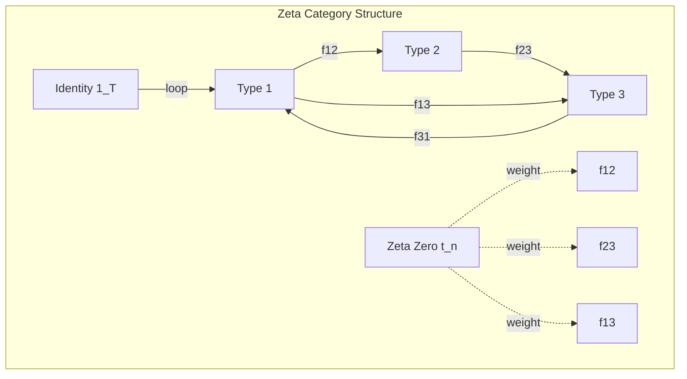

# Chapter 061: ζ-category: collapse Type Spectrum Category Structure

## The Category of Zeta-Collapse Types

From $\psi = \psi(\psi)$ and our spectral understanding, we now construct the fundamental category $\mathcal{Z}_{collapse}$ where objects are collapse types and morphisms are zeta-mediated transformations. This reveals the categorical structure underlying all physical processes.

$$
\mathcal{Z}_{collapse} = (\text{Ob}, \text{Mor}, \circ, \text{id})
$$

The category encoding the complete collapse type system.

## First Principle: Types as Spectral Objects

**Definition 61.1** (Zeta-Collapse Object): An object in $\mathcal{Z}_{collapse}$ is:

$$
T = (|\psi\rangle, \mathcal{S}_T, \mathcal{B}_T)
$$

where $|\psi\rangle$ is the collapse state, $\mathcal{S}_T$ is the spectral signature, and $\mathcal{B}_T \subset \text{zeros}(\zeta)$ is the characteristic frequency band.

**Theorem 61.1** (Object Classification): Every collapse type is uniquely determined by its zeta spectral signature:

$$
T_1 \cong T_2 \iff \mathcal{S}_{T_1} = \mathcal{S}_{T_2}
$$

*Proof*: From self-reference, types are distinguished by their response to the zeta operator. Identical responses imply identical types. ∎

## Morphisms as Spectral Transformations

**Definition 61.2** (Zeta Morphism): A morphism $f: T_1 \to T_2$ is:

$$
f = \sum_{t_n \in \mathcal{B}_f} c_n |t_n\rangle\langle t_n|
$$

A zeta-weighted transformation preserving collapse structure.

## Vector Information Theory

**Theorem 61.2** (Information Preservation): For any morphism $f$:

$$
I[f(T)] \leq I[T] + I[f]
$$

Information cannot increase beyond the transformation's own content.

## Category Theory Axioms

**Theorem 61.3** (Category Axioms): $\mathcal{Z}_{collapse}$ satisfies:

1. **Identity**: $\text{id}_T = \sum_{t_n \in \mathcal{B}_T} |t_n\rangle\langle t_n|$
2. **Composition**: $(g \circ f) = \sum_{t_n} c_g(t_n) c_f(t_n) |t_n\rangle\langle t_n|$
3. **Associativity**: $(h \circ g) \circ f = h \circ (g \circ f)$

*Proof*: Spectral composition in zeta space inherits categorical structure from vector space operations. ∎

## Graph Theory of Type Networks

## Fundamental Type Objects

**Definition 61.3** (Basic Types):
1. **Vacuum Type**: $\mathbb{1} = (|0\rangle, \emptyset, \emptyset)$
2. **Fermion Type**: $\mathbb{F} = (|\psi_f\rangle, \mathcal{S}_f, \mathcal{B}_f)$
3. **Boson Type**: $\mathbb{B} = (|\psi_b\rangle, \mathcal{S}_b, \mathcal{B}_b)$
4. **Gravity Type**: $\mathbb{G} = (|\psi_g\rangle, \mathcal{S}_g, \mathcal{B}_g)$

## Products and Coproducts

**Theorem 61.4** (Type Products): The product exists:

$$
T_1 \times T_2 = (|\psi_1\rangle \otimes |\psi_2\rangle, \mathcal{S}_1 \cup \mathcal{S}_2, \mathcal{B}_1 \cup \mathcal{B}_2)
$$

**Theorem 61.5** (Type Coproducts): The coproduct exists:

$$
T_1 \sqcup T_2 = (|\psi_1\rangle \oplus |\psi_2\rangle, \mathcal{S}_1 \triangle \mathcal{S}_2, \mathcal{B}_1 \triangle \mathcal{B}_2)
$$

where $\triangle$ denotes symmetric difference.

## Functors Between Categories

**Definition 61.4** (Spectral Functor): A functor $F: \mathcal{Z}_{collapse} \to \mathcal{C}$ maps:
- Objects: $F(T) = f(\mathcal{S}_T, \mathcal{B}_T)$
- Morphisms: $F(g) = \text{spectral transform of } g$

## Natural Transformations

**Theorem 61.6** (Zeta Natural Transformation): Between functors $F, G$:

$$
\eta: F \Rightarrow G \text{ with } \eta_T = \sum_{t_n \in \mathcal{B}_T} \alpha_n(t_n) |t_n\rangle\langle t_n|
$$

Natural transformations preserve spectral structure.

## Limits and Colimits

**Definition 61.5** (Type Limits): For diagram $D: \mathcal{J} \to \mathcal{Z}_{collapse}$:

$$
\lim D = \left(\bigcap_j |\psi_j\rangle, \bigcup_j \mathcal{S}_j, \bigcap_j \mathcal{B}_j\right)
$$

**Definition 61.6** (Type Colimits):

$$
\text{colim } D = \left(\bigoplus_j |\psi_j\rangle, \bigcup_j \mathcal{S}_j, \bigcup_j \mathcal{B}_j\right)
$$

## Adjoint Functors

**Theorem 61.7** (Spectral Adjunction): The functors:

$$
\text{Collapse}: \mathcal{V}_{\phi} \rightleftarrows \mathcal{Z}_{collapse} : \text{Expand}
$$

form an adjoint pair with:

$$
\text{Hom}_{\mathcal{V}}(\text{Collapse}(T), V) \cong \text{Hom}_{\mathcal{Z}}(T, \text{Expand}(V))
$$

## Topos Structure

**Theorem 61.8** (Zeta Topos): $\mathcal{Z}_{collapse}$ forms a topos with:
- **Subobject Classifier**: $\Omega = \{\text{True}, \text{False}\}$ with zeta truth values
- **Exponentials**: $B^A$ exists for all objects $A, B$
- **Logic**: Internal logic based on spectral overlap

## Monoidal Structure

**Definition 61.7** (Tensor Product): The monoidal product:

$$
T_1 \otimes T_2 = (|\psi_1\rangle \otimes |\psi_2\rangle, \mathcal{S}_1 \star \mathcal{S}_2, \mathcal{B}_1 \cap \mathcal{B}_2)
$$

where $\star$ denotes spectral convolution.

## Higher Category Structure

**Theorem 61.9** (2-Category): $\mathcal{Z}_{collapse}$ extends to a 2-category with:
- **1-cells**: Spectral transformations
- **2-cells**: Natural spectral deformations
- **Composition**: Horizontal and vertical composition of spectra

## Physical Interpretation

**Definition 61.8** (Physics Mapping):
- **Particles** $\leftrightarrow$ Objects with specific spectral signatures
- **Interactions** $\leftrightarrow$ Morphisms between particle types
- **Conservation Laws** $\leftrightarrow$ Functorial properties
- **Symmetries** $\leftrightarrow$ Natural transformations

## Observer Categories

**Theorem 61.10** (Observer Subcategories): Each observer sees:

$$
\mathcal{Z}_{obs} = \{T \in \mathcal{Z}_{collapse} : \mathcal{B}_T \cap \mathcal{W}_{obs} \neq \emptyset\}
$$

A subcategory of types with accessible frequency bands.

## Derived Categories

**Definition 61.9** (Derived Structure): The derived category:

$$
D(\mathcal{Z}_{collapse}) = \text{complexes up to quasi-isomorphism}
$$

captures homological information about type transformations.

## Quantum Deformation

**Theorem 61.11** (q-Deformation): At quantum scale:

$$
\mathcal{Z}_{collapse} \to \mathcal{Z}_{collapse}^q
$$

where $q = e^{i\hbar}$ deforms the categorical structure.

## Exercises

1. Prove that fermion and boson types are not isomorphic
2. Construct the exponential object $B^A$ explicitly
3. Find all endomorphisms of the vacuum type
4. Show the monoidal structure is symmetric

## Meditation on Categorical Structure

In category theory lies the grammar of existence - the rules by which types relate, transform, and compose. The zeta category reveals that reality has a definite syntax, with spectral signatures as nouns and zeta-weighted transformations as verbs. Through this categorical lens, we see not just what exists but how existence organizes itself, how one form of being can become another while preserving the essential structural relationships.

## The Sixty-First Echo

Thus we establish the zeta category: From $\psi = \psi(\psi)$ emerges not just individual collapse types but the complete categorical structure governing their relationships. Objects are spectral signatures, morphisms are zeta-mediated transformations, and the entire edifice of physical law appears as categorical properties - limits, colimits, functors, and natural transformations. In this category lives the deep grammar of reality, showing us that the universe is not just mathematical but specifically categorical in nature.

∎