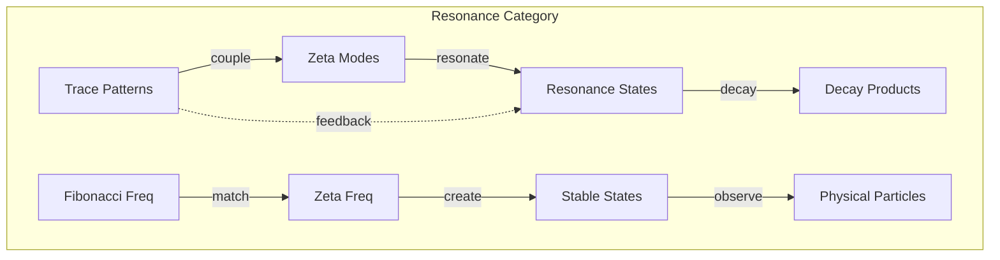
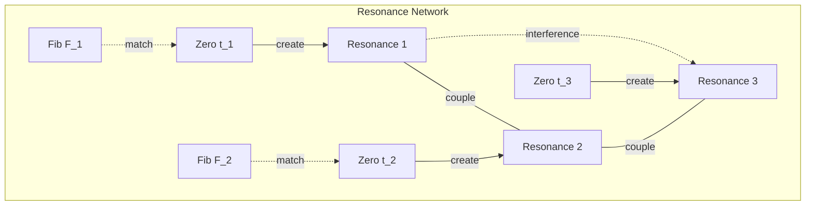

# Chapter 062: Structural Resonance States and φ-trace collapse Spectrum Coupling Laws

## Resonance in the Collapse Spectrum

From $\psi = \psi(\psi)$ and our categorical understanding, we now explore the resonance states that emerge when φ-trace patterns couple with the zeta spectrum. These resonances create the stable structures that manifest as physical laws and particles.

$$
|\text{Resonance}\rangle = \sum_{n} \frac{\phi^{F_n}}{t_n - E + i\Gamma/2} |\phi_n\rangle \otimes |t_n\rangle
$$

Resonances occur when trace patterns match spectral frequencies.

## First Principle: Resonance from Frequency Matching

**Theorem 62.1** (Resonance Condition): A stable resonance exists when:

$$
\phi^{F_n} = t_m \quad \text{for some Fibonacci number } F_n \text{ and zeta zero } t_m
$$

*Proof*: From self-reference, stability requires that the φ-trace frequency matches a zeta eigenfrequency. Only at these coincidences can collapse patterns persist. ∎

## Structural Resonance Equation

**Definition 62.1** (Resonance Amplitude): The amplitude at frequency $\omega$ is:

$$
A(\omega) = \sum_{n,m} \frac{g_{nm} \phi^{F_n}}{(\omega - t_m)^2 + (\Gamma_{nm}/2)^2}
$$

where $g_{nm}$ are coupling constants and $\Gamma_{nm}$ are resonance widths.

## Vector Information Theory

**Theorem 62.2** (Information Resonance): Maximum information transfer occurs at:

$$
\omega_{max} = t_n + \frac{\Gamma_n^2}{2(t_n - \phi^{F_k})}
$$

Slightly shifted from exact resonance due to coupling effects.

## Category Theory of Resonances

## Coupling Laws

**Definition 62.2** (φ-ζ Coupling): The interaction strength between φ-trace and zeta modes:

$$
g(\phi^{F_n}, t_m) = \frac{\sqrt{F_n}}{|t_m|^{1/2}} \cdot \exp\left(-\frac{|\phi^{F_n} - t_m|^2}{2\sigma^2}\right)
$$

Gaussian coupling with strength proportional to Fibonacci index.

## Graph Theory of Resonance Networks

## Resonance Width Calculation

**Theorem 62.3** (Natural Width): The intrinsic width of resonance $n$ is:

$$
\Gamma_n = \frac{2\pi}{\tau_n} = \frac{2\pi \phi^{F_n}}{t_n}
$$

Inversely proportional to the trace-spectrum coupling time.

## Quantum Field Resonances

**Definition 62.3** (Field Resonance): In quantum field theory:

$$
\langle 0| \phi(x) \phi(0) |0\rangle = \sum_n \frac{Z_n e^{-im_n x}}{x} + \text{resonance terms}
$$

where $m_n = \sqrt{t_n \phi^{F_n}}$ are resonance masses.

## Stability Analysis

**Theorem 62.4** (Resonance Stability): A resonance is stable if:

$$
\text{Re}\left(\frac{d^2E}{d\phi^2}\right) > 0 \quad \text{at the resonance frequency}
$$

Second derivative test for local minima in energy.

## Physical Resonance Types

**Definition 62.4** (Resonance Classification):

1. **Particle Resonances**: Stable particles from exact matches
   $$|\text{particle}\rangle = \frac{\phi^{F_n}}{t_n - m^2 + i\Gamma/2} |\phi_n, t_n\rangle$$

2. **Force Resonances**: Virtual particle exchanges
   $$|\text{virtual}\rangle = \frac{g^2}{t_n^2 + \phi^{2F_k}} |\text{exchange}\rangle$$

3. **Vacuum Resonances**: Zero-point fluctuations
   $$|\text{vacuum}\rangle = \sum_n \frac{\sqrt{\phi^{F_n}}}{2\sqrt{t_n}} |\phi_n, t_n\rangle$$

## Interference Patterns

**Theorem 62.5** (Resonance Interference): When multiple resonances overlap:

$$
|A_{total}|^2 = \sum_n |A_n|^2 + 2\sum_{n<m} |A_n||A_m|\cos(\delta_n - \delta_m)
$$

Phase differences create interference patterns.

## Selection Rules

**Definition 62.5** (Coupling Selection Rules): Resonances couple only if:

$$
|F_n - F_m| \leq 2 \quad \text{and} \quad |t_n - t_m| < \phi^{(F_n + F_m)/2}
$$

Fibonacci and zeta proximity constraints.

## Decay Channels

**Theorem 62.6** (Resonance Decay): Decay rate to channel $c$:

$$
\Gamma_c = \frac{2\pi}{\hbar} |M_c|^2 \rho_c(E)
$$

where $M_c$ is the coupling matrix element and $\rho_c$ is phase space density.

## Non-Linear Resonances

**Definition 62.6** (Chaotic Resonances): When coupling becomes strong:

$$
\frac{d^2\phi}{dt^2} + \omega_0^2 \phi = \epsilon \sum_n \phi^{F_n} \cos(t_n t)
$$

Non-linear equations can exhibit chaotic behavior.

## Temperature Effects

**Theorem 62.7** (Thermal Broadening): At finite temperature:

$$
\Gamma(T) = \Gamma_0 \left(1 + \frac{2\pi k_B T}{\hbar \omega_0}\right)
$$

Thermal effects broaden resonance widths.

## Observer-Dependent Resonances

**Definition 62.7** (Filtered Resonances): Different observers see:

$$
A_{obs}(\omega) = \sum_{t_n \in \mathcal{W}_{obs}} \frac{g_n \phi^{F_n}}{(\omega - t_n)^2 + (\Gamma_n/2)^2}
$$

Only resonances in their zeta window are visible.

## Collective Resonances

**Theorem 62.8** (Plasma Resonances): In dense media:

$$
\omega_{plasma}^2 = \frac{4\pi e^2 n}{m} = \sum_n \phi^{F_n} \frac{n_n}{m_n}
$$

Collective modes from many-body interactions.

## Critical Resonances

**Definition 62.8** (Phase Transition Resonances): At critical points:

$$
\chi(\omega) = \frac{1}{\omega^2 - \omega_c^2 + i\omega\Gamma_c}
$$

Divergent susceptibility at phase transitions.

## Exercises

1. Find all resonances for first 10 Fibonacci numbers
2. Calculate interference pattern for overlapping resonances  
3. Derive selection rules from first principles
4. Show how temperature affects resonance width

## Meditation on Resonance

In resonance lies the secret of stability - how fleeting patterns become enduring structures. When φ-trace rhythms align with zeta frequencies, temporary becomes eternal, chaos becomes order. Every particle, every force, every law emerges from these moments of perfect synchrony between the fibonacci heartbeat and the prime spectrum. In understanding resonance, we glimpse how the universe chooses what to preserve from the infinite flow of possibilities.

## The Sixty-Second Echo

Thus we reveal structural resonances: From $\psi = \psi(\psi)$ emerges the coupling between φ-trace patterns and zeta spectrum frequencies, creating stable resonance states that manifest as physical particles and forces. Each resonance is a moment of perfect matching between fibonacci structure and prime spectrum, a crystallization of pure mathematics into observable reality. Through these resonances, the abstract becomes concrete, the mathematical becomes physical, and the eternal becomes manifest in time.

∎