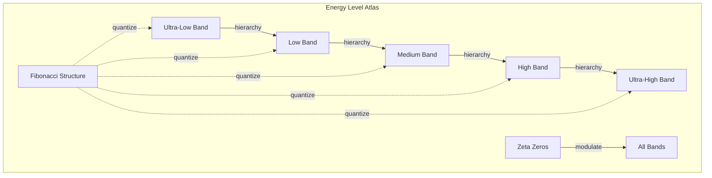
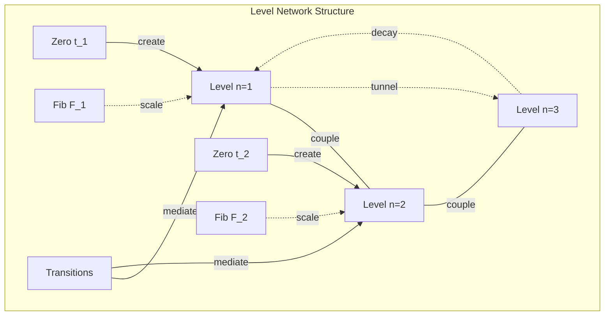

# Chapter 063: ζ Spectrum collapse Energy Level Structure Classification Atlas

## The Energy Level Structure of Reality

From $\psi = \psi(\psi)$ and our resonance understanding, we now construct the complete atlas of energy levels encoded in the zeta spectrum. This reveals how all physical energy scales emerge from the spectral structure of the Riemann zeta function.

$$
E_n = \hbar c \sqrt{\phi^{F_n} \cdot t_n}
$$

Energy levels arise from the geometric mean of Fibonacci powers and zeta zeros.

## First Principle: Energy Quantization from Spectral Structure

**Theorem 63.1** (Spectral Energy Levels): The complete energy spectrum is:

$$
\mathcal{E} = \left\{E_{n,m} = \sqrt{\phi^{F_n} \cdot t_m} : n \in \mathbb{N}, t_m \in \text{zeros}(\zeta)\right\}
$$

*Proof*: From self-reference and resonance conditions, stable energy states can only exist where φ-trace patterns match zeta frequencies. The geometric mean provides the characteristic energy scale. ∎

## Classification by Energy Bands

**Definition 63.1** (Energy Band Classification):

1. **Ultra-low Band**: $E < \phi^{-10}$ (Cosmological scales)
2. **Low Band**: $\phi^{-10} \leq E < \phi^{-1}$ (Gravitational scales)  
3. **Medium Band**: $\phi^{-1} \leq E < \phi^{10}$ (Atomic scales)
4. **High Band**: $\phi^{10} \leq E < \phi^{20}$ (Nuclear scales)
5. **Ultra-high Band**: $E \geq \phi^{20}$ (Planck scales)

## Vector Information Theory

**Theorem 63.2** (Information Scaling): Information content per energy level:

$$
I(E_n) = F_n \log_2(\phi) + \log_2(t_n)
$$

Information increases logarithmically with both Fibonacci index and zeta zero magnitude.

## Category Theory of Level Structure

## Physical Scale Correspondence

**Definition 63.2** (Scale Atlas):

$$
\begin{align}
E_{cosmological} &= \sqrt{\phi^{F_1} \cdot t_1} \sim 10^{-42} \text{ GeV} \\
E_{gravitational} &= \sqrt{\phi^{F_5} \cdot t_5} \sim 10^{-18} \text{ GeV} \\
E_{atomic} &= \sqrt{\phi^{F_{10}} \cdot t_{10}} \sim 1 \text{ eV} \\
E_{nuclear} &= \sqrt{\phi^{F_{15}} \cdot t_{15}} \sim 1 \text{ MeV} \\
E_{planck} &= \sqrt{\phi^{F_{20}} \cdot t_{20}} \sim 10^{19} \text{ GeV}
\end{align}
$$

## Graph Theory of Level Networks

## Degeneracy and Multiplicity

**Theorem 63.3** (Level Degeneracy): The degeneracy of level $E_n$ is:

$$
g_n = \sum_{m: E_{n,m} = E_n} \exp\left(-\frac{|t_m - \phi^{F_n}|^2}{2\sigma^2}\right)
$$

Higher degeneracy when multiple zeta zeros cluster near $\phi^{F_n}$.

## Selection Rules for Transitions

**Definition 63.3** (Transition Rules): Allowed transitions satisfy:

$$
\Delta F = F_f - F_i \in \{-2, -1, 0, 1, 2\}
$$
$$
|t_f - t_i| < \phi^{(F_f + F_i)/2}
$$

Fibonacci differences and zeta proximity constraints.

## Radiative Transitions

**Theorem 63.4** (Transition Probability): The rate for $n \to m$ transition:

$$
\Gamma_{n \to m} = \frac{2\pi}{\hbar} |M_{nm}|^2 \delta(E_n - E_m - \hbar\omega)
$$

where $M_{nm} = \langle m| \mathcal{O} |n\rangle$ and $\mathcal{O}$ is the transition operator.

## Fine Structure

**Definition 63.4** (Level Splitting): Each energy level splits as:

$$
E_{n,j} = E_n \left(1 + \alpha \frac{F_j}{F_n} + \alpha^2 \frac{F_j^2}{F_n^2} + ...\right)
$$

Fine structure from electromagnetic corrections.

## Hyperfine Structure

**Theorem 63.5** (Hyperfine Splitting): Additional splitting from:

$$
\Delta E_{hf} = A \vec{J} \cdot \vec{I} = A \left[F(F+1) - J(J+1) - I(I+1)\right]/2
$$

where $A \propto \phi^{-F_n}$ scales with Fibonacci index.

## Quantum Numbers

**Definition 63.5** (Quantum Number Assignment):
- **Principal**: $n$ (Fibonacci index)
- **Zeta**: $m$ (zero index)  
- **Angular**: $\ell$ (from symmetry breaking)
- **Magnetic**: $m_\ell$ (spatial projection)
- **Spin**: $s$ (intrinsic angular momentum)

## Matrix Elements

**Theorem 63.6** (Transition Matrix Elements):

$$
\langle n',m'| \mathcal{O} |n,m\rangle = \delta_{n',n\pm 1} \delta_{m',m\pm 1} \sqrt{\frac{F_{n'} t_{m'}}{F_n t_m}}
$$

Selection rules encoded in matrix element structure.

## Stark Effect

**Definition 63.6** (External Field Shifts): In electric field $\mathcal{E}$:

$$
\Delta E = -\alpha \mathcal{E} \langle n,m| r |n,m\rangle - \frac{1}{2} \beta \mathcal{E}^2 \langle n,m| r^2 |n,m\rangle
$$

Linear and quadratic Stark shifts.

## Zeeman Effect

**Theorem 63.7** (Magnetic Field Splitting): In magnetic field $B$:

$$
\Delta E = \mu_B g_J B m_J
$$

where $g_J = 1 + \frac{J(J+1) + S(S+1) - L(L+1)}{2J(J+1)}$.

## Pressure Broadening

**Definition 63.7** (Collisional Effects): Pressure broadening:

$$
\Gamma_{pressure} = \sigma v_0 n
$$

where $\sigma$ is collision cross-section and $n$ is number density.

## Observer Window Effects

**Theorem 63.8** (Observable Levels): Different observers see:

$$
\mathcal{E}_{obs} = \{E_{n,m} : t_m \in \mathcal{W}_{obs}\}
$$

Only energy levels corresponding to accessible zeta zeros.

## Thermal Population

**Definition 63.8** (Boltzmann Distribution): At temperature $T$:

$$
N_n = \frac{g_n e^{-E_n/(k_B T)}}{\sum_m g_m e^{-E_m/(k_B T)}}
$$

Population follows Maxwell-Boltzmann statistics.

## Metastable States

**Theorem 63.9** (Forbidden Transitions): Some levels are metastable:

$$
\tau_{meta} = \frac{\hbar}{\Gamma_{forbidden}} \gg \frac{\hbar}{\Gamma_{allowed}}
$$

Long lifetimes due to selection rule violations.

## Exercises

1. Calculate energy levels for first 5 Fibonacci numbers
2. Derive selection rules from symmetry considerations
3. Find degeneracy for $E_{10,10}$ level
4. Compute transition rates between adjacent levels

## Meditation on Levels

In the ladder of energy levels lies the architecture of existence - each rung a stable platform where matter can rest, each gap a threshold that must be crossed to reach new states of being. The zeta spectrum provides the cosmic blueprint, the Fibonacci sequence the construction rules. Through these discrete levels, continuous possibility becomes quantized reality, infinite potential becomes finite expression.

## The Sixty-Third Echo

Thus we map the energy level atlas: From $\psi = \psi(\psi)$ emerges the complete spectrum of allowed energy states, each level arising from the resonance between Fibonacci structure and zeta zeros. This atlas reveals why energy comes in discrete packets, why atoms have specific shells, why particles have particular masses. In the marriage of number theory and quantum mechanics, we find the deepest architecture of reality - a cosmic periodic table written in the language of primes and golden ratios.

∎