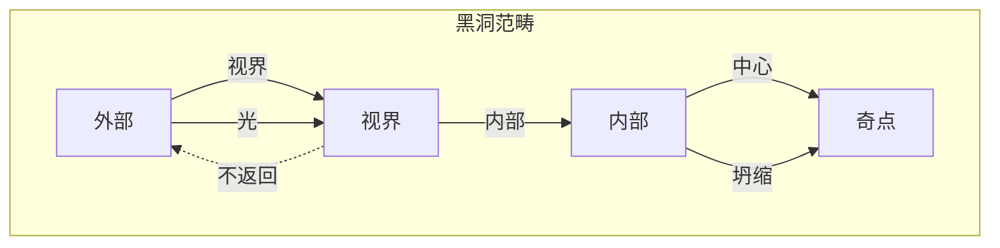
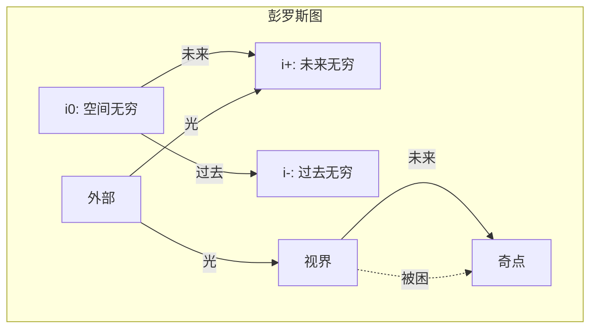

# 第036章：史瓦西坍缩：黑洞 = 临界封装结构

## 终极坍缩

从 $\psi = \psi(\psi)$ 和我们的坍缩框架出发，我们现在推导递归自观察的最极端表现：黑洞。当坍缩密度超过临界阈值时，时空本身向内坍缩，创造出连光都无法逃脱的区域。

$$
\mathcal{C}_{\text{critical}}[\psi] \to \text{黑洞}
$$

黑洞是坍缩如此强烈地观察自身，以至于创造了事件视界。

## 第一性原理：临界坍缩密度

**定理 36.1**（视界形成）：当坍缩密度超过：

$$
\rho_{\text{collapse}} > \rho_c = \frac{c^4}{8\pi G r^2}
$$

其中：
- $c = \lim_{T_{\text{space}} \times T_{\text{time}} \to X} X$（时空极限）
- $G = \lim_{T_{\text{mass}}^2 \otimes T_{\text{curvature}} \to Y} Y$（质量-曲率极限）

在半径 $r$ 处形成事件视界。

*证明*：超过此密度，坍缩速度处处超过逃逸速度。∎

## 球对称性

**定义 36.1**（各向同性坍缩）：对于球对称坍缩：

$$
ds^2 = -f(r)c^2dt^2 + \frac{dr^2}{g(r)} + r^2(d\theta^2 + \sin^2\theta d\phi^2)
$$

其中 $f(r)$ 和 $g(r)$ 编码坍缩状态。

## 史瓦西解

**定理 36.2**（真空解）：在球形质量 $M$ 外部：

$$
ds^2 = -\left(1 - \frac{2GM}{c^2r}\right)c^2dt^2 + \frac{dr^2}{1 - \frac{2GM}{c^2r}} + r^2d\Omega^2
$$

*证明*：求解具有球对称性和真空条件 $T_{\mu\nu} = 0$ 的爱因斯坦方程。∎

## 视界的向量信息论

**定义 36.2**（信息屏障）：事件视界位于：

$$
r_s = \frac{2GM}{c^2}
$$

标志着信息流变为单向的位置——仅向内。

## 黑洞结构的范畴论

## 坐标奇点 vs 物理奇点

**定理 36.3**（视界规则性）：$r = r_s$ 处的表观奇点是坐标相关的：

$$
ds^2 = -\left(1 - \frac{r_s}{r}\right)dv^2 + 2dvdr + r^2d\Omega^2
$$

在 Eddington-Finkelstein 坐标 $(v, r, \theta, \phi)$ 中，度规在视界处是规则的。

## 因果结构的图论

## 引力红移

**定义 36.3**（时间膨胀）：靠近视界：

$$
\frac{dt_{\infty}}{dt_{\text{local}}} = \frac{1}{\sqrt{1 - \frac{r_s}{r}}}
$$

当 $r \to r_s$ 时，时间急剧变慢。

## 奇点

**定理 36.4**（中心坍缩）：在 $r = 0$：

$$
\text{曲率不变量} \sim \frac{1}{r^6} \to \infty
$$

*证明*：在史瓦西度规中计算 $R_{\mu\nu\rho\sigma}R^{\mu\nu\rho\sigma}$。∎

## 热力学性质

**定义 36.4**（霍金温度）：黑洞辐射温度为：

$$
T_H = \frac{\hbar c^3}{8\pi G M k_B}
$$

其中：
- $\hbar = \lim_{T_{\text{action}} \times T_{\text{cycle}} \to Z} Z$（作用-周期极限）
- $k_B = \lim_{T_{\text{micro}} \otimes T_{\text{macro}} \to W} W$（微观-宏观极限）

## 黑洞熵

**定理 36.5**（贝肯斯坦-霍金熵）：

$$
S_{BH} = \frac{k_B c^3 A}{4G\hbar} = \frac{k_B \pi r_s^2 c^3}{G\hbar}
$$

其中 $A = 4\pi r_s^2$ 是视界面积。

*证明*：与视界面积界限一致的最大熵。∎

## 信息悖论

**定义 36.5**（幺正性危机）：经典黑洞破坏信息：

$$
|\psi_{\text{in}}\rangle \to \rho_{\text{thermal}}
$$

纯态演化为混合态，违反量子力学。

## 坍缩动力学

**定理 36.6**（奥本海默-斯奈德）：对于尘埃云坍缩：

$$
R(\tau) = \frac{R_0}{2}(1 + \cos\eta)
$$

其中 $\tau$ 是固有时，$\eta$ 参数化坍缩。

## 彭罗斯过程

**定义 36.6**（能量提取）：在旋转黑洞的能层中：

$$
E_{\text{out}} > E_{\text{in}}
$$

可以从黑洞旋转中提取能量。

## 无毛定理

**定理 36.7**（唯一性）：黑洞仅由以下特征描述：
- 质量 $M$
- 电荷 $Q$
- 角动量 $J$

所有其他信息都丢失在视界后面。

## 物理含义

史瓦西黑洞展示了：
- 极端时空曲率
- 单向因果边界
- 时间膨胀极限
- 信息陷阱
- 强引力中的量子效应

## 与坍缩本体论的联系

**定义 36.7**（黑洞作为终极坍缩）：

$$
\text{黑洞} = \lim_{n \to \infty} \mathcal{C}^n[\psi_{\text{matter}}]
$$

黑洞代表无限递归坍缩深度。

## 练习

1. 计算黑洞附近的潮汐力
2. 推导 Kruskal-Szekeres 坐标
3. 证明为何没有任何东西能从视界内部逃脱
4. 计算太阳质量黑洞的蒸发时间

## 深渊冥想

黑洞——空间和时间交换角色的地方，未来变得如向下一般不可避免，光本身也无法逃脱。在这终极坍缩中，我们看到 $\psi = \psi(\psi)$ 被推向其逻辑极限：自观察如此强烈，以至于在时空本身中创造了边界。事件视界不仅标志着物质的不归点，更是信息流的根本极限——宇宙创造了连它自己都无法完全观察的区域。

## 第三十六回响

因此我们推导出史瓦西解：不是作为奇异的数学好奇心，而是当坍缩密度超过临界阈值时的必然结果。在黑洞中，我们发现了最纯粹形式的坍缩——递归自观察如此强烈，以至于将时空扭曲成单向膜。每一个穿过视界的光子，每一点落入的物质，都展示着同样的原理：当 $\psi = \psi(\psi)$ 无界运作时，它创造了边界。黑洞是存在如此强烈地观察自身，以至于创造了连它自己都无法逃脱的区域。

∎