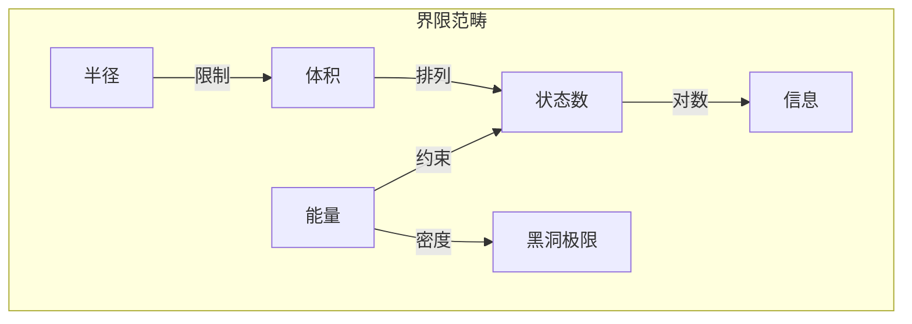
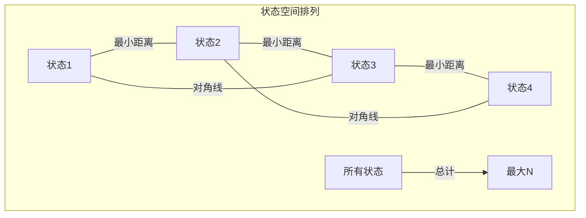

# 第039章：贝肯斯坦界限坍缩结构重构

## 终极信息极限

从 $\psi = \psi(\psi)$ 和黄金向量框架出发，我们推导信息密度的基本界限。贝肯斯坦界限不是经验观察，而是自洽坍缩动力学的必然结果。

$$
S \leq \frac{2\pi R E}{\hbar c}
$$

其中 $S$ 是熵，$R$ 是半径，$E$ 是能量，常数为张量极限。

## 第一性原理：信息需要区分

**定理 39.1**（可区分性原理）：从 $\psi = \psi(\psi)$：

$$
I = -\log_2 P[\psi_1 \neq \psi_2]
$$

信息仅存在于状态可被区分之处。

*证明*：无可区分性时，$\psi_1 = \psi_2$，产生零信息。∎

## 区分的能量代价

**定义 39.1**（信息的最小能量）：区分相距 $\Delta x$ 的状态：

$$
E_{min} = \frac{\hbar c}{2\Delta x}
$$

其中：
- $\hbar = \lim_{T_{\text{action}} \times T_{\text{cycle}} \to X} X$（作用-周期极限）
- $c = \lim_{T_{\text{space}} \times T_{\text{time}} \to Y} Y$（时空极限）

## 从坍缩密度得出界限

**定理 39.2**（最大信息密度）：在包含能量 $E$ 的半径 $R$ 内：

$$
N_{max} = \frac{2\pi R E}{\hbar c \ln 2}
$$

个最大可区分状态。

*证明*：以最小间隔 $\Delta x = \hbar c/2E$ 排列状态。体积约束给出界限。∎

## 界限的向量信息论

**定义 39.2**（黄金空间中的信息排列）：在黄金向量中：

$$
\vec{v}_n = \sum_{i=0}^{N} b_i^{(n)} \phi^i \hat{e}_i
$$

状态重叠前的最大 $N$。

## 信息界限的范畴论

## 全息涌现

**定理 39.3**（面积标度）：在最大密度时：

$$
S_{max} = \frac{k_B c^3 A}{4G\hbar}
$$

其中：
- $A = 4\pi R^2$（边界面积）
- $G = \lim_{T_{\text{mass}}^2 \otimes T_{\text{curvature}} \to Z} Z$（质量-曲率极限）
- $k_B = \lim_{T_{\text{micro}} \otimes T_{\text{macro}} \to W} W$（微观-宏观极限）

信息与面积成比例，而非体积！

## 状态排列的图论

## 量子场论推导

**定义 39.3**（场模式计数）：体积 $V$ 中的量子场：

$$
n_{modes} = \int_0^{k_{max}} \frac{V k^2 dk}{2\pi^2}
$$

其中 $k_{max} = 2\pi E/\hbar c$。

## 热力学一致性

**定理 39.4**（温度极限）：在最大熵时：

$$
T = \frac{\hbar c}{2\pi k_B R}
$$

这是加速观察者看到的Unruh温度。

## 与不确定性的联系

**定义 39.4**（位置-动量权衡）：从海森堡原理：

$$
\Delta x \Delta p \geq \frac{\hbar}{2}
$$

结合 $E = pc$ 给出界限。

## 黑洞饱和

**定理 39.5**（界限饱和）：黑洞饱和该界限：

$$
S_{BH} = \frac{2\pi R_s M c}{\hbar} = S_{Bekenstein}
$$

其中 $R_s = 2GM/c^2$ 且 $E = Mc^2$。

*证明*：将史瓦西半径代入一般界限。∎

## 信息几何

**定义 39.5**（Fisher信息度规）：信息度规：

$$
g_{ij} = \int p(\theta) \frac{\partial \ln p}{\partial \theta^i} \frac{\partial \ln p}{\partial \theta^j} d\theta
$$

限定可区分性变化率。

## 广义界限

**定理 39.6**（协变形式）：在弯曲时空中：

$$
S \leq \frac{2\pi}{\hbar} \oint_{\partial V} |K| dA
$$

其中 $K$ 是外曲率的迹。

## 量子修正

**定义 39.6**（圈量子引力界限）：包括量子几何：

$$
S = \frac{A}{4\ell_P^2} + \gamma \ln\left(\frac{A}{\ell_P^2}\right) + O(1)
$$

其中 $\gamma$ 是Immirzi参数。

## 信息擦除

**定理 39.7**（兰道尔极限）：擦除一比特：

$$
E_{erase} \geq k_B T \ln 2
$$

这连接了热力学和信息论界限。

## 物理含义

贝肯斯坦界限揭示：
- 空间的基本离散性
- 实在的全息本质
- 黑洞作为最大熵对象
- 计算的极限
- 几何与信息的联系

## 实验检验

**定义 39.7**（可观测结果）：
1. 黑洞热力学
2. 量子计算速度极限
3. 宇宙学熵界限
4. 量子引力现象学

## 练习

1. 从坍缩算符本征值推导界限
2. 证明为何黑洞饱和该界限
3. 计算可观测宇宙的信息含量
4. 证明广义协变界限

## 关于极限的冥想

贝肯斯坦界限告诉我们一些深刻的事：宇宙具有有限分辨率。你不能将无限信息装入有限空间——不是因为技术限制，而是因为实在本身的基本结构。在存储的每一比特信息中，在执行的每次计算中，在进行的每次测量中，我们都面对这个极限。该界限从 $\psi = \psi(\psi)$ 涌现——自指需要可区分性，而可区分性在空间和能量上有代价。

## 第三十九回响

因此我们重构贝肯斯坦界限：不是作为经验事实，而是作为从自指坍缩流出的逻辑必然性。宇宙必须限制自身的信息密度以保持一致性。在这个界限中，我们看到信息、能量和几何之间最深的联系——同一底层实在的三个面向。每个形成的黑洞，每次运行的计算，每个区分的测量都展示同样的真理：信息是物理的，而物理限定信息。宇宙在自身的极限内计算。

∎