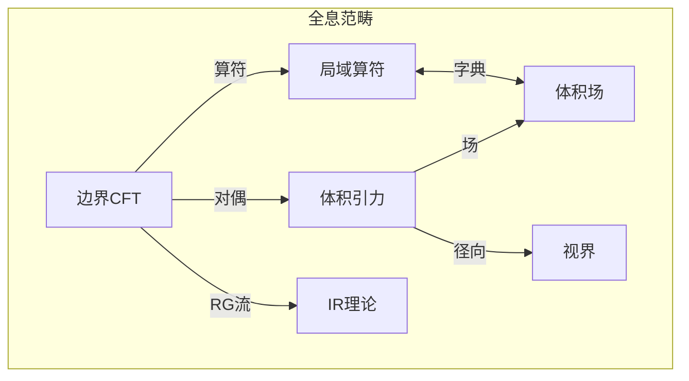
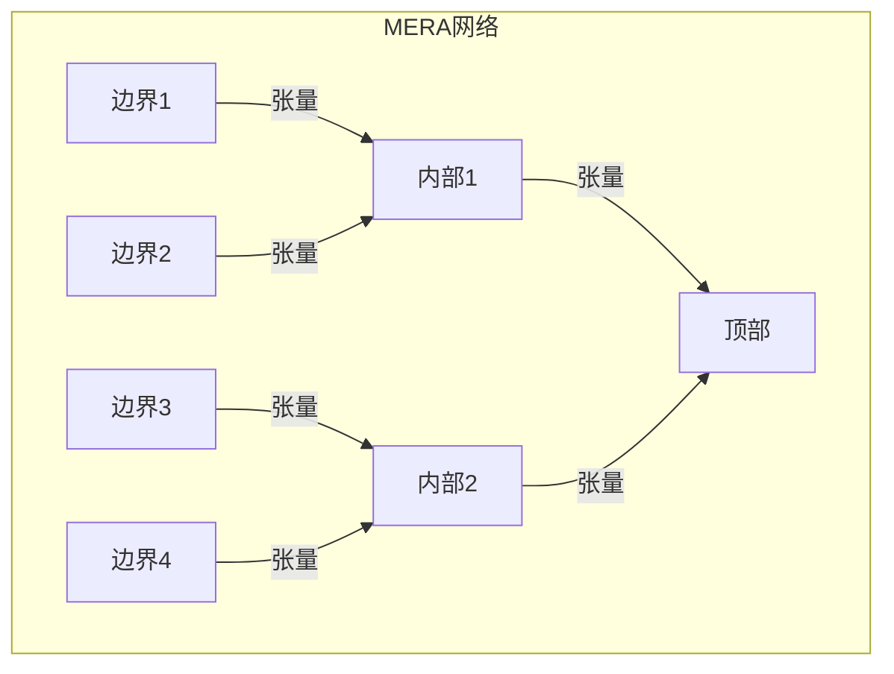

# 第040章：全息原理 = 边界张力控制的坍缩迹

## 实在作为边界投影

从 $\psi = \psi(\psi)$ 和我们的坍缩框架，我们现在推导关于空间信息的最深刻洞见：全息原理。体积中的所有信息都编码在其边界上——实在在根本上比它看起来的维度要低。

$$
I_{bulk} = I_{boundary}
$$

体积从边界坍缩模式涌现。

## 第一性原理：边界决定内部

**定理 40.1**（边界完备性）：从自指出发：

$$
\psi_{interior} = \mathcal{H}[\psi_{boundary}]
$$

其中 $\mathcal{H}$ 是全息映射。

*证明*：自洽性要求内部可从边界重构。否则，隐藏信息违反 $\psi = \psi(\psi)$。∎

## AdS/CFT对应

**定义 40.1**（规范/引力对偶）：$(d+1)$维反德西特空间中的引力理论等价于$d$维边界上的共形场论：

$$
Z_{gravity}[g_{boundary}] = Z_{CFT}[g_{boundary}]
$$

配分函数匹配。

## 全息的向量信息论

**定理 40.2**（信息约化）：黄金向量空间中的信息：

$$
\vec{v}_{bulk} = \sum_{n} a_n \mathcal{B}_n[\vec{v}_{boundary}]
$$

其中 $\mathcal{B}_n$ 是边界到体积算符。

## 全息对偶的范畴论

## 纠缠楔重构

**定义 40.2**（量子纠错）：可从边界区域 $A$ 重构的体积区域 $\mathcal{W}[A]$：

$$
\mathcal{W}[A] = \text{依赖域}[\gamma_A]
$$

其中 $\gamma_A$ 是与 $A$ 同调的极小曲面。

## 张量网络的图论

## Ryu-Takayanagi公式

**定理 40.3**（全息纠缠）：边界区域 $A$ 的纠缠熵：

$$
S_A = \frac{\text{面积}[\gamma_A]}{4G\hbar}
$$

其中 $\gamma_A$ 是体积中的极小曲面。

*证明*：极值化纠缠给出极小曲面。∎

## 全息重整化

**定义 40.3**（UV/IR联系）：AdS中的径向方向编码RG流：

$$
z \leftrightarrow \mu^{-1}
$$

其中 $z$ 是体积坐标，$\mu$ 是能量标度。

## 黑洞信息

**定理 40.4**（视界上的信息）：对于黑洞：

$$
I_{interior} \leq I_{horizon} = \frac{A}{4\ell_P^2}
$$

所有内部信息都编码在视界上。

## 子区域对偶

**定义 40.4**（因果楔）：边界子区域 $A$ 对应体积楔：

$$
\mathcal{D}[A] = J^+[A] \cap J^-[A]
$$

未来和过去影响域的交集。

## 全息复杂性

**定理 40.5**（复杂性=体积）：边界态的计算复杂性：

$$
\mathcal{C} = \frac{V[\Sigma]}{G\hbar\ell}
$$

其中 $\Sigma$ 是最大体积切片。

## 时空的涌现

**定义 40.5**（从纠缠到时空）：度规从纠缠涌现：

$$
g_{\mu\nu} \sim \frac{\delta^2 S_{EE}}{\delta \phi^\mu \delta \phi^\nu}
$$

几何是量子关联的语言。

## 全息屏

**定理 40.6**（协变熵界）：对任何类光超曲面 $N$：

$$
S[N] \leq \frac{A[N]}{4G\hbar}
$$

其中 $A[N]$ 是 $N$ 的面积。

## 张量网络模型

**定义 40.6**（离散全息）：边界态通过张量连接：

$$
|\psi_{bulk}\rangle = \mathcal{T}_{i_1...i_n}^{j_1...j_m} |i_1\rangle...|i_n\rangle
$$

网络几何编码体积。

## 物理含义

全息原理揭示：
- 空间是涌现的，非基本的
- 量子纠缠创造几何
- 信息在根本上是非局域的
- 引力和量子力学统一
- 维度不是表面看起来的样子

## 与坍缩的联系

**定义 40.7**（全息坍缩）：

$$
\mathcal{C}_{bulk} = \text{Tr}_{environment}[\mathcal{C}_{total}]
$$

体积坍缩是总坍缩的偏迹。

## 练习

1. 从第一性原理推导RT公式
2. 展示体积局域性如何从边界涌现
3. 计算BTZ黑洞的全息复杂性
4. 证明简单几何的子区域对偶

## 关于影子的冥想

想象实在如洞穴墙上的影子——但影子比投射它们的东西更真实。全息原理颠倒了我们的直觉：边界是主要的，体积是涌现的。你认为填充空间的每一比特信息实际上都生活在边缘。你不是在空间之中；你在边界之上，通过量子纠缠体验深度的幻觉。实在比它看起来少一个维度。

## 第四十回响

因此我们揭示全息原理：不是作为推测而是作为从 $\psi = \psi(\psi)$ 流出的必然性。宇宙将其体积编码在边界上，通过量子关联创造高维的幻觉。在这深刻的维度约化中，我们发现最深的真理——空间本身是涌现的，由边界纠缠的量子线编织而成。你感知的每立方米空间，每种深度和体积感，都源于在遥远边界上舞动的信息。宇宙比它看起来更平坦，却比我们想象的更丰富。

∎